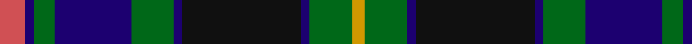

In pattern [RBGBGBKBGY](/patterns/rbgbgbkbgy/).

This was sourced from register-of-tartans.  It is a [10 stripes tartan](/stripes/stripes10/).

Original link https://www.tartanregister.gov.uk/tartanDetails.aspx?ref=4819

## Attestations

This cloth appears in 2 source records; the oldest owns this page.

- 01/01/1996 — Ofally, County (register-of-tartans, [record](https://www.tartanregister.gov.uk/tartanDetails.aspx?ref=4819))
- 1997 — Ofally, County (District) (tartans-authority, [record](http://www.tartansauthority.com/tartan-ferret/display/2268/))

## Thread count
DO/12 DB4 G10 DB36 G20 DB4 K56 DB4 G20 DY/6

## Palette
Each colour and its ΔE from the base-6 reference it is a variant of.

| Colour | Shade | Base | ΔE (OKLab) |
|---|---|---|---|
| DB | <code style="background-color:#1C0070;">#1C0070</code> `#1C0070` | B <code style="background-color:#2C4084;">#2C4084</code> | 0.14 |
| DO | <code style="background-color:#D05054;">#D05054</code> `#D05054` | R <code style="background-color:#C80000;">#C80000</code> | 0.10 |
| DY | <code style="background-color:#D09800;">#D09800</code> `#D09800` | Y <code style="background-color:#E8C000;">#E8C000</code> | 0.11 |
| G | <code style="background-color:#006818;">#006818</code> `#006818` | G <code style="background-color:#006400;">#006400</code> | 0.02 |
| K | <code style="background-color:#101010;">#101010</code> `#101010` | K <code style="background-color:#000000;">#000000</code> | 0.17 |

ID: /setts/s10/r12b4g10b36g20b4k56b4g20y6-b1c0070-g006818-k101010-rd05054-yd09800/
