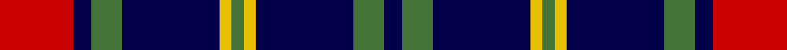

In pattern [BGBYGYBGBR](/stripes/bgbygybgbr/).

This was sourced from register-of-tartans.  It is a [10 stripe tartan](/stripes/stripes10/).

Original link https://www.tartanregister.gov.uk/tartanDetails.aspx?ref=1024

## Also known as

This cloth is also recorded under:

- Dunbog Primary
- Dunbog, Primary School

## Register references

External register numbers recorded for this tartan.

- Scottish Register of Tartans: [1024](https://www.tartanregister.gov.uk/tartanDetails.aspx?ref=1024)
- Scottish Tartans Authority (ITI): 954
- Scottish Tartans World Register: 954

## Thread count
R/24 DB6 G10 DB32 Y4 G4 Y4 DB32 G10 DB/6

## Palette
Each colour and the base-6 reference it is a variant of.

| Colour | Shade | Base |
|---|---|---|
| DB | <code style="background-color:#000048;">#000048</code> `oklch(18.2% 0.126 264.1)` <small>#000048</small> | B <code style="background-color:#2A418A;">#2A418A</code> |
| G | <code style="background-color:#447438;">#447438</code> `oklch(50.9% 0.104 139.6)` <small>#447438</small> | G <code style="background-color:#006100;">#006100</code> |
| R | <code style="background-color:#C80000;">#C80000</code> `oklch(52.3% 0.215 29.2)` <small>#C80000</small> | R <code style="background-color:#CC0000;">#CC0000</code> |
| Y | <code style="background-color:#E8C000;">#E8C000</code> `oklch(81.9% 0.168 93.7)` <small>#E8C000</small> | Y <code style="background-color:#F2BF00;">#F2BF00</code> |

## Nearest tartans

The nearest existing variants by ΔTartan distance.

1. [Australian Police](/setts/s8/k5w5k5t11k3y17k30t3~x2/) — ΔT 0.95
1. [MacLachlan, Gold Dress (Fashion)](/setts/s13/lo16k2lo2k2lo2db16db16r3db16db16lo16k2lo2~x2/) — ΔT 1.08
1. [Clark (Crook)](/setts/s11/k1t1lp7k8t1k8t1lp2t1k4t1~x4/) — ΔT 1.11
1. [St Andrews University Corporate Tartan Tartan Number: 2398. Earliest known date: pre 1998 Originally named St. Andrews International. Apparently a Gordon Paton MD, bought the company from North East Fife Enterprise Trust in 1997, the aim being to brand quality Scottish products for export worldwide. The company intended to set up a membership scheme but the company went into liquidation. The intended venue belonged to St Andrews University and it appears that the ownership of the tartan has fallen to the University and its name has been changed from 'International' to 'University' (Deirdre Kinloch Anderson, Aug 2004).No thread count given so this entry is based on an estimate from a small computer graphic. Has since been corrected to conform to the SRT (Scottish Register of Tartans) See products available Copyright © Blair Urquhart, Comrie, 2015](/setts/s10/k3db2ly3k2ly5db18g3k3g2db3~x2/) — ΔT 1.12
1. [Clergy (Mackinlay)](/setts/s11/k1w1db8k9w1k9w1db2w1k4w1~x2/) — ΔT 1.15
1. [Murray of Elibank](/setts/s13/db56k6g24k6db8k21ly6k21db8k6g24k6db56/) — ΔT 1.19
1. [Kells Irish Pubs](/setts/s12/k17lr2k3g2k3g2k24b8g4b4g3b8~x2/) — ΔT 1.21
1. [Hawick Rugby Club](/setts/s10/db2ly1db7w1k7w2~x6/) — ΔT 1.23
1. [Montgomerie of Eglinton](/setts/s7/k4r5k4db28k4g5k4~x2/) — ΔT 1.27
1. [Shalom (Fashion)](/setts/s11/k15lb3k3w4k3lb3k15db4k4db30k4~x2/) — ΔT 1.28

## Neighbour map

Every grey dot is one of 14299 variants placed by the first two principal components of the ΔTartan feature space (44% of its variance). Red is this tartan; blue dots are its nearest — click one to open its page.

<svg viewBox="0 0 640 380" role="img" style="max-width:100%;height:auto;border:1px solid #e0e0e0;border-radius:4px;display:block" xmlns="http://www.w3.org/2000/svg"><image href="/nn/cloud.v1.png" width="640" height="380"/><a href="/setts/s8/k5w5k5t11k3y17k30t3~x2/"><circle cx="258.0" cy="188.9" r="4" fill="#3465a4"><title>Australian Police</title></circle></a><a href="/setts/s13/lo16k2lo2k2lo2db16db16r3db16db16lo16k2lo2~x2/"><circle cx="284.0" cy="184.8" r="4" fill="#3465a4"><title>MacLachlan, Gold Dress (Fashion)</title></circle></a><a href="/setts/s11/k1t1lp7k8t1k8t1lp2t1k4t1~x4/"><circle cx="301.7" cy="194.5" r="4" fill="#3465a4"><title>Clark (Crook)</title></circle></a><a href="/setts/s10/k3db2ly3k2ly5db18g3k3g2db3~x2/"><circle cx="246.7" cy="172.6" r="4" fill="#3465a4"><title>St Andrews University Corporate Tartan Tartan Number: 2398. Earliest known date: pre 1998 Originally named St. Andrews International. Apparently a Gordon Paton MD, bought the company from North East Fife Enterprise Trust in 1997, the aim being to brand quality Scottish products for export worldwide. The company intended to set up a membership scheme but the company went into liquidation. The intended venue belonged to St Andrews University and it appears that the ownership of the tartan has fallen to the University and its name has been changed from 'International' to 'University' (Deirdre Kinloch Anderson, Aug 2004).No thread count given so this entry is based on an estimate from a small computer graphic. Has since been corrected to conform to the SRT (Scottish Register of Tartans) See products available Copyright © Blair Urquhart, Comrie, 2015</title></circle></a><a href="/setts/s11/k1w1db8k9w1k9w1db2w1k4w1~x2/"><circle cx="320.7" cy="195.4" r="4" fill="#3465a4"><title>Clergy (Mackinlay)</title></circle></a><a href="/setts/s13/db56k6g24k6db8k21ly6k21db8k6g24k6db56/"><circle cx="241.6" cy="178.9" r="4" fill="#3465a4"><title>Murray of Elibank</title></circle></a><a href="/setts/s12/k17lr2k3g2k3g2k24b8g4b4g3b8~x2/"><circle cx="305.6" cy="167.4" r="4" fill="#3465a4"><title>Kells Irish Pubs</title></circle></a><a href="/setts/s10/db2ly1db7w1k7w2~x6/"><circle cx="195.3" cy="201.4" r="4" fill="#3465a4"><title>Hawick Rugby Club</title></circle></a><a href="/setts/s7/k4r5k4db28k4g5k4~x2/"><circle cx="263.8" cy="202.0" r="4" fill="#3465a4"><title>Montgomerie of Eglinton</title></circle></a><a href="/setts/s11/k15lb3k3w4k3lb3k15db4k4db30k4~x2/"><circle cx="280.1" cy="180.1" r="4" fill="#3465a4"><title>Shalom (Fashion)</title></circle></a><circle cx="264.6" cy="194.2" r="5" fill="#c00000"/></svg>

ID: /setts/s10/r12db3g5db16ly2g2~x2/
