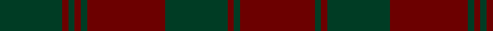

In pattern [GRGRGRGRGR](/patterns/grgrgrgrgr/).

This was sourced from register-of-tartans.  It is a [10 stripes tartan](/stripes/stripes10/).

Original link https://www.tartanregister.gov.uk/tartanDetails.aspx?ref=948

## Thread count
DG/40 DR4 DG4 DR4 DG4 DR50 DG40 DR4 DG4 DR/48

## Palette
Each colour and its ΔE from the base-6 reference it is a variant of.

| Colour | Shade | Base | ΔE (OKLab) |
|---|---|---|---|
| DG | <code style="background-color:#003C24;">#003C24</code> `#003C24` | G <code style="background-color:#006100;">#006100</code> | 0.14 |
| DR | <code style="background-color:#6C0000;">#6C0000</code> `#6C0000` | R <code style="background-color:#CC0000;">#CC0000</code> | 0.21 |

## Nearest tartans

The nearest existing variants by ΔTartan distance.

1. [Crawford](/setts/s7/b6y2b30g12b3g12b3~b59110d-g11450d-yaaaaaa~x2/) — ΔT 1.50
1. [Crawford](/setts/s7/b6y2b30g12b3g12b3~b59110d-g11450d-yaaaaaa/) — ΔT 1.50
1. [Donachie of Brockloch (Clan)](/setts/s10/r24g2r2g20r25g2r2g2r2g20~g005834-r940000~x2/) — ΔT 1.89
1. [Sarna (District)](/setts/s16/g13r1g2r2g2r1g2r5g11r1g2ga2g2r1g2ga7~g604000-ga006818-rc80000~x2/) — ΔT 1.97
1. [MacAlister of Glenbarr Clan Tartan Tartan Number: 910. Earliest known date: pre 1984 This version of the MacAlister of Glenbarr tartan is the same as the MacGillivray hunting tartan. This sample was taken from a piece woven by Lochcarron Weavers around 1984. See products available Copyright © Blair Urquhart, Comrie, 2015](/setts/s14/g4ga2g2ga2g2ga3b1ga1g4ga1b1ga12b2ga3~b2c2c80-g006818-ga604000~x2/) — ΔT 1.98
1. [Dark Island Black (Fashion)](/setts/s9/b4k2b2k4b20k43b2k4b2~b404040-k101010~x2/) — ΔT 2.10
1. [Murray of Dunmore (Clan)](/setts/s21/g4r4g4r6g15r11g2r2g16r21g2r2g4r2g2r3g5r3g2r2g4~g003820-r880000~x2/) — ΔT 2.10
1. [Gray (Name)](/setts/s10/r3g33ga10r3ga3r3ga3r8g10r3~g6c6c6c-ga006818-ra00000~x2/) — ΔT 2.12
1. [Keeper of the Quaich](/setts/s6/g3b3g3b27g40ga3~b304080-g402000-ga908000/) — ΔT 2.13
1. [Nithsdale](/setts/s10/g10r2ga2r6ga16r1ga2r1ga3r6~g005448-ga5c6428-ra00000~x4/) — ΔT 2.13

## Neighbour map

Every grey dot is one of 15726 variants placed by the first two principal components of the ΔTartan feature space (44% of its variance). Red is this tartan; blue dots are its nearest — click one to open its page.

<svg viewBox="0 0 640 380" role="img" style="max-width:100%;height:auto;border:1px solid #e0e0e0;border-radius:4px;display:block" xmlns="http://www.w3.org/2000/svg"><image href="/nn/cloud.v1.png" width="640" height="380"/><a href="/setts/s7/b6y2b30g12b3g12b3~b59110d-g11450d-yaaaaaa~x2/"><circle cx="492.6" cy="245.7" r="4" fill="#3465a4"><title>Crawford</title></circle></a><a href="/setts/s7/b6y2b30g12b3g12b3~b59110d-g11450d-yaaaaaa/"><circle cx="492.6" cy="245.7" r="4" fill="#3465a4"><title>Crawford</title></circle></a><a href="/setts/s10/r24g2r2g20r25g2r2g2r2g20~g005834-r940000~x2/"><circle cx="449.9" cy="231.2" r="4" fill="#3465a4"><title>Donachie of Brockloch (Clan)</title></circle></a><a href="/setts/s16/g13r1g2r2g2r1g2r5g11r1g2ga2g2r1g2ga7~g604000-ga006818-rc80000~x2/"><circle cx="479.8" cy="205.3" r="4" fill="#3465a4"><title>Sarna (District)</title></circle></a><a href="/setts/s14/g4ga2g2ga2g2ga3b1ga1g4ga1b1ga12b2ga3~b2c2c80-g006818-ga604000~x2/"><circle cx="467.5" cy="234.2" r="4" fill="#3465a4"><title>MacAlister of Glenbarr Clan Tartan Tartan Number: 910. Earliest known date: pre 1984 This version of the MacAlister of Glenbarr tartan is the same as the MacGillivray hunting tartan. This sample was taken from a piece woven by Lochcarron Weavers around 1984. See products available Copyright © Blair Urquhart, Comrie, 2015</title></circle></a><a href="/setts/s9/b4k2b2k4b20k43b2k4b2~b404040-k101010~x2/"><circle cx="581.4" cy="227.7" r="4" fill="#3465a4"><title>Dark Island Black (Fashion)</title></circle></a><a href="/setts/s21/g4r4g4r6g15r11g2r2g16r21g2r2g4r2g2r3g5r3g2r2g4~g003820-r880000~x2/"><circle cx="425.6" cy="215.8" r="4" fill="#3465a4"><title>Murray of Dunmore (Clan)</title></circle></a><a href="/setts/s10/r3g33ga10r3ga3r3ga3r8g10r3~g6c6c6c-ga006818-ra00000~x2/"><circle cx="413.1" cy="215.9" r="4" fill="#3465a4"><title>Gray (Name)</title></circle></a><a href="/setts/s6/g3b3g3b27g40ga3~b304080-g402000-ga908000/"><circle cx="471.2" cy="240.5" r="4" fill="#3465a4"><title>Keeper of the Quaich</title></circle></a><a href="/setts/s10/g10r2ga2r6ga16r1ga2r1ga3r6~g005448-ga5c6428-ra00000~x4/"><circle cx="391.7" cy="219.8" r="4" fill="#3465a4"><title>Nithsdale</title></circle></a><circle cx="497.6" cy="257.0" r="5" fill="#c00000"/></svg>

ID: /setts/s10/r24g2r2g20r25g2r2g2r2g20~g003c24-r6c0000~x2/
