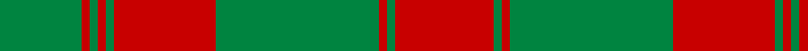

In pattern [GRGRGRGRGR](/patterns/grgrgrgrgr/).

This was sourced from register-of-tartans.  It is a [10 stripes tartan](/stripes/stripes10/).

Original link https://www.tartanregister.gov.uk/tartanDetails.aspx?ref=947

## Thread count
G/40 R4 G4 R4 G4 R50 G80 R4 G4 R/48

## Palette
Each colour and its ΔE from the base-6 reference it is a variant of.

| Colour | Shade | Base | ΔE (OKLab) |
|---|---|---|---|
| G | <code style="background-color:#008440;">#008440</code> `#008440` | G <code style="background-color:#006100;">#006100</code> | 0.11 |
| R | <code style="background-color:#C80000;">#C80000</code> `#C80000` | R <code style="background-color:#CC0000;">#CC0000</code> | 0.01 |

## Nearest tartans

The nearest existing variants by ΔTartan distance.

1. [Livingstone](/setts/s10/g14r4g2r2g2r4g19r30g2r9~g008000-rc00000~x2/) — ΔT 0.81
1. [Robertson 2](/setts/s14/g15r1g1r1g1r18g24r1g1r18g1r1g1r3~g008000-rc00000~x2/) — ΔT 1.05
1. [Yellow Pencil (Corporate)](/setts/s8/g48y9g6y9g12y4g2y16~g604000-ydc943c~x2/) — ΔT 1.08
1. [Robertson - 1746 (Artefact)](/setts/s14/g15r1g1r1g1r18g24r1g1r18g1r1g1r3~g006818-rc80000~x2/) — ΔT 1.10
1. [Donachie Clan Tartan Tartan Number: 6138. Earliest known date: 2004 A new tartan, a simplified sett based on the #893 Robertson tartan once presented by the Jacobite Prince to a Robertson during the '45.'' (The Setts of the Scottish Tartans, D.C. Stewart, 1950.) The Donachie of Brockloch Society have adopted this tartan. See products available Copyright © Blair Urquhart, Comrie, 2015](/setts/s18/g20r2g2r2g2r25g40r2g2r24g2r2g40r25g2r2g2r2~g008440-rc80000~x2/) — ΔT 1.26
1. [Erskine](/setts/s6/g6r1g24r28g1r4~g008000-rc00000~x2/) — ΔT 1.29
1. [Livingstone](/setts/s10/g12r4k1r2k1r4g16r20g2r8~g008000-k000000-rc00000~x2/) — ΔT 1.33
1. [Unidentified Cant #09](/setts/s8/r44b2g26r3b2r3g26b2~b2c2c80-g006818-rc80000/) — ΔT 1.34
1. [Livingstone #2](/setts/s10/g12r4k1r2k1r4g16r20g2r8~g006818-k101010-rc80000~x2/) — ΔT 1.34
1. [MacDonell of Glengarry](/setts/s11/g18r3g2r2b6r2g2r24g1r2g6~b304080-g008000-rc00000~x2/) — ΔT 1.35

## Neighbour map

Every grey dot is one of 15726 variants placed by the first two principal components of the ΔTartan feature space (44% of its variance). Red is this tartan; blue dots are its nearest — click one to open its page.

<svg viewBox="0 0 640 380" role="img" style="max-width:100%;height:auto;border:1px solid #e0e0e0;border-radius:4px;display:block" xmlns="http://www.w3.org/2000/svg"><image href="/nn/cloud.v1.png" width="640" height="380"/><a href="/setts/s10/g14r4g2r2g2r4g19r30g2r9~g008000-rc00000~x2/"><circle cx="415.0" cy="197.3" r="4" fill="#3465a4"><title>Livingstone</title></circle></a><a href="/setts/s14/g15r1g1r1g1r18g24r1g1r18g1r1g1r3~g008000-rc00000~x2/"><circle cx="419.8" cy="150.4" r="4" fill="#3465a4"><title>Robertson 2</title></circle></a><a href="/setts/s8/g48y9g6y9g12y4g2y16~g604000-ydc943c~x2/"><circle cx="476.6" cy="192.4" r="4" fill="#3465a4"><title>Yellow Pencil (Corporate)</title></circle></a><a href="/setts/s14/g15r1g1r1g1r18g24r1g1r18g1r1g1r3~g006818-rc80000~x2/"><circle cx="427.1" cy="152.6" r="4" fill="#3465a4"><title>Robertson - 1746 (Artefact)</title></circle></a><a href="/setts/s18/g20r2g2r2g2r25g40r2g2r24g2r2g40r25g2r2g2r2~g008440-rc80000~x2/"><circle cx="427.5" cy="153.0" r="4" fill="#3465a4"><title>Donachie Clan Tartan Tartan Number: 6138. Earliest known date: 2004 A new tartan, a simplified sett based on the #893 Robertson tartan once presented by the Jacobite Prince to a Robertson during the '45.'' (The Setts of the Scottish Tartans, D.C. Stewart, 1950.) The Donachie of Brockloch Society have adopted this tartan. See products available Copyright © Blair Urquhart, Comrie, 2015</title></circle></a><a href="/setts/s6/g6r1g24r28g1r4~g008000-rc00000~x2/"><circle cx="431.1" cy="197.3" r="4" fill="#3465a4"><title>Erskine</title></circle></a><a href="/setts/s10/g12r4k1r2k1r4g16r20g2r8~g008000-k000000-rc00000~x2/"><circle cx="372.4" cy="173.0" r="4" fill="#3465a4"><title>Livingstone</title></circle></a><a href="/setts/s8/r44b2g26r3b2r3g26b2~b2c2c80-g006818-rc80000/"><circle cx="375.9" cy="171.0" r="4" fill="#3465a4"><title>Unidentified Cant #09</title></circle></a><a href="/setts/s10/g12r4k1r2k1r4g16r20g2r8~g006818-k101010-rc80000~x2/"><circle cx="387.9" cy="178.0" r="4" fill="#3465a4"><title>Livingstone #2</title></circle></a><a href="/setts/s11/g18r3g2r2b6r2g2r24g1r2g6~b304080-g008000-rc00000~x2/"><circle cx="362.6" cy="147.7" r="4" fill="#3465a4"><title>MacDonell of Glengarry</title></circle></a><circle cx="424.0" cy="185.1" r="5" fill="#c00000"/></svg>

ID: /setts/s10/r24g2r2g40r25g2r2g2r2g20~g008440-rc80000~x2/
