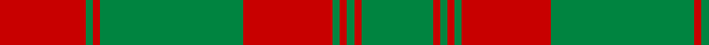

In pattern [GRGRGRGRGR](/stripes/grgrgrgrgr/).

This was sourced from register-of-tartans.  It is a [10 stripe tartan](/stripes/stripes10/).

Original link https://www.tartanregister.gov.uk/tartanDetails.aspx?ref=947

## Register references

External register numbers recorded for this tartan.

- Scottish Register of Tartans: [947](https://www.tartanregister.gov.uk/tartanDetails.aspx?ref=947)
- Scottish Tartans Authority (ITI): 6138

## Thread count
R/48 G4 R4 G80 R50 G4 R4 G4 R4 G/40

## Palette
Each colour and its ΔE from the base-6 reference it is a variant of.

| Colour | Shade | Base | ΔE (OKLab) |
|---|---|---|---|
| G | <code style="background-color:#008440;">#008440</code> `#008440` | G <code style="background-color:#006100;">#006100</code> | 0.11 |
| R | <code style="background-color:#C80000;">#C80000</code> `#C80000` | R <code style="background-color:#CC0000;">#CC0000</code> | 0.01 |

## Nearest tartans

The nearest existing variants by ΔTartan distance.

1. [Livingstone](/setts/s10/g14r4g2r2g2r4g19r30g2r9~x2/) — ΔT 0.81
1. [Yellow Pencil (Corporate)](/setts/s8/dy48lo9dy6lo9dy12lo4dy2lo16~x2/) — ΔT 1.07
1. [Robertson - 1746 (Artefact)](/setts/s14/g15r1g1r1g1r18g24r1g1r18g1r1g1r3~x2/) — ΔT 1.10
1. [Donachie Clan Tartan Tartan Number: 6138. Earliest known date: 2004 A new tartan, a simplified sett based on the #893 Robertson tartan once presented by the Jacobite Prince to a Robertson during the '45.'' (The Setts of the Scottish Tartans, D.C. Stewart, 1950.) The Donachie of Brockloch Society have adopted this tartan. See products available Copyright © Blair Urquhart, Comrie, 2015](/setts/s18/r24g2r2g40r25g2r2g2r2g20~x2/) — ΔT 1.25
1. [Unidentified Cant #09](/setts/s8/r44db2g26r3db2/) — ΔT 1.34
1. [Livingstone #2](/setts/s10/g12r4k1r2k1r4g16r20g2r8~x2/) — ΔT 1.35
1. [MacDonell of Glengarry](/setts/s11/g18r3g2r2db6r2g2r24g1r2g6~x2/) — ΔT 1.35
1. [Robertson #2](/setts/s14/dg15r1dg1r1dg1r18dg24r1dg1r18dg1r1dg1r3~x2/) — ΔT 1.44
1. [Livingstone](/setts/s10/dg14r4dg2r2dg2r4dg19r30dg2r9~x2/) — ΔT 1.45
1. [MacRea ? MacRae](/setts/s11/g22r4g22r22g2r3g2r3g2r3ly2~x2/) — ΔT 1.46

## Neighbour map

Every grey dot is one of 14299 variants placed by the first two principal components of the ΔTartan feature space (44% of its variance). Red is this tartan; blue dots are its nearest — click one to open its page.

<svg viewBox="0 0 640 380" role="img" style="max-width:100%;height:auto;border:1px solid #e0e0e0;border-radius:4px;display:block" xmlns="http://www.w3.org/2000/svg"><image href="/nn/cloud.v1.png" width="640" height="380"/><a href="/setts/s10/g14r4g2r2g2r4g19r30g2r9~x2/"><circle cx="415.0" cy="194.7" r="4" fill="#3465a4"><title>Livingstone</title></circle></a><a href="/setts/s8/dy48lo9dy6lo9dy12lo4dy2lo16~x2/"><circle cx="476.5" cy="188.9" r="4" fill="#3465a4"><title>Yellow Pencil (Corporate)</title></circle></a><a href="/setts/s14/g15r1g1r1g1r18g24r1g1r18g1r1g1r3~x2/"><circle cx="427.5" cy="151.7" r="4" fill="#3465a4"><title>Robertson - 1746 (Artefact)</title></circle></a><a href="/setts/s18/r24g2r2g40r25g2r2g2r2g20~x2/"><circle cx="428.1" cy="152.2" r="4" fill="#3465a4"><title>Donachie Clan Tartan Tartan Number: 6138. Earliest known date: 2004 A new tartan, a simplified sett based on the #893 Robertson tartan once presented by the Jacobite Prince to a Robertson during the '45.'' (The Setts of the Scottish Tartans, D.C. Stewart, 1950.) The Donachie of Brockloch Society have adopted this tartan. See products available Copyright © Blair Urquhart, Comrie, 2015</title></circle></a><a href="/setts/s8/r44db2g26r3db2/"><circle cx="376.6" cy="170.3" r="4" fill="#3465a4"><title>Unidentified Cant #09</title></circle></a><a href="/setts/s10/g12r4k1r2k1r4g16r20g2r8~x2/"><circle cx="387.9" cy="176.2" r="4" fill="#3465a4"><title>Livingstone #2</title></circle></a><a href="/setts/s11/g18r3g2r2db6r2g2r24g1r2g6~x2/"><circle cx="363.3" cy="147.3" r="4" fill="#3465a4"><title>MacDonell of Glengarry</title></circle></a><a href="/setts/s14/dg15r1dg1r1dg1r18dg24r1dg1r18dg1r1dg1r3~x2/"><circle cx="415.1" cy="142.8" r="4" fill="#3465a4"><title>Robertson #2</title></circle></a><a href="/setts/s10/dg14r4dg2r2dg2r4dg19r30dg2r9~x2/"><circle cx="409.1" cy="187.6" r="4" fill="#3465a4"><title>Livingstone</title></circle></a><a href="/setts/s11/g22r4g22r22g2r3g2r3g2r3ly2~x2/"><circle cx="380.3" cy="184.8" r="4" fill="#3465a4"><title>MacRea ? MacRae</title></circle></a><circle cx="424.4" cy="183.6" r="5" fill="#c00000"/></svg>

ID: /setts/s10/r24g2r2g40r25g2r2g2r2g20~x2/
