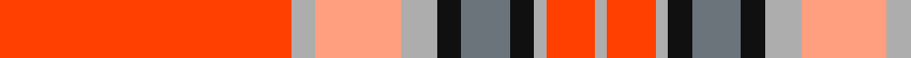

This page is one **sett** — a single exact thread-count. It belongs to the [tartan](/tartans/r24n2lr7n3k2na4k2n1r4n1/)
(the same proportion at any scale), whose colour order is pattern [RYYYKBKYRY](/stripes/ryyykbkyry/).

Sourced from register-of-tartans.  It is a [10 stripe tartan](/stripes/stripes10/).

Original link https://www.tartanregister.gov.uk/tartanDetails.aspx?ref=10730

## Register references

External register numbers recorded for this tartan.

- Scottish Register of Tartans: [10730](https://www.tartanregister.gov.uk/tartanDetails.aspx?ref=10730)

## Thread count
R/48 N4 LR14 N6 K4 Na8 K4 N2 R8 N/2

## Palette
Each colour and the base-6 reference it is a variant of.

| Colour | Shade | Base |
|---|---|---|
| K | <code style="background-color:#101010;">#101010</code> `oklch(17.3% 0.000 89.9)` <small>#101010</small> | K <code style="background-color:#000000;">#000000</code> |
| LR | <code style="background-color:#FF9F80;">#FF9F80</code> `oklch(79.3% 0.123 38.6)` <small>#FF9F80</small> | Y <code style="background-color:#F2BF00;">#F2BF00</code> |
| N | <code style="background-color:#ADADAD;">#ADADAD</code> `oklch(74.8% 0.000 89.9)` <small>#ADADAD</small> | Y <code style="background-color:#F2BF00;">#F2BF00</code> |
| Na | <code style="background-color:#6B747B;">#6B747B</code> `oklch(55.4% 0.015 241.1)` <small>#6B747B</small> | B <code style="background-color:#2A418A;">#2A418A</code> |
| R | <code style="background-color:#FF4000;">#FF4000</code> `oklch(65.6% 0.233 34.5)` <small>#FF4000</small> | R <code style="background-color:#CC0000;">#CC0000</code> |

## Nearest tartans

The nearest existing variants by ΔTartan distance, with this tartan at the top so the swatches line up against it.

ΔTartan

Tartan

Sett

—

<a href="/ttd/edit/#slug=r24lr2lr7lr3k2n4k2lr1r4lr1~x2">VeMMA</a> <a class="nn-out" href="/setts/s10/r24lr2lr7lr3k2n4k2lr1r4lr1~x2/" title="open its dictionary page">↗</a>

0.85

<a href="/ttd/edit/#slug=r67ly3n6lb3w25r10n6lb7w3~x2">Drummond of Perth Dress #3</a> <a class="nn-out" href="/setts/s9/r67ly3n6lb3w25r10n6lb7w3~x2/" title="open its dictionary page">↗</a>

1.27

<a href="/ttd/edit/#slug=r24lr2lr7lr3k2k4k2lr1r4lr1~x2">VeMMA Corporate Tartan Tartan Number: 10730. Earliest known date: 5 November 2012 Created for VeMMA International. VeMMA is a nutritional supplement company marketing fruit juice drinks that have been enhanced with vitamins and anti-oxidants (the name VeMMA is an acronym for Vitamins, essential Minerals, Mangosteen and Aloe vera). VeMMA offers an affiliate marketing program to those who wish to recommend its products. Colours: the orange represents enhanced health through supplementation; silver represents liquid and silver also purifies, soothes, inspires, and reflects back positive energy. See products available Copyright © Blair Urquhart, Comrie, 2015</a> <a class="nn-out" href="/setts/s10/r24lr2lr7lr3k2k4k2lr1r4lr1~x2/" title="open its dictionary page">↗</a>

1.30

<a href="/ttd/edit/#slug=k3lo6lb13r2lb2r32lb1r2lb1~x2">Fueglistal</a> <a class="nn-out" href="/setts/s9/k3lo6lb13r2lb2r32lb1r2lb1~x2/" title="open its dictionary page">↗</a>

1.37

<a href="/ttd/edit/#slug=r24ly2y3o2w10r4y3o3w2~x2">Manx Laxey, Red</a> <a class="nn-out" href="/setts/s9/r24ly2y3o2w10r4y3o3w2~x2/" title="open its dictionary page">↗</a>

1.38

<a href="/ttd/edit/#slug=r24ly2o3dy2w10r4o3dy3w2~x2">Manx Laxey (Red)</a> <a class="nn-out" href="/setts/s9/r24ly2o3dy2w10r4o3dy3w2~x2/" title="open its dictionary page">↗</a>

1.39

<a href="/ttd/edit/#slug=r18r3w3r3r2r1w1g1r2ly1r1k1~x4">Studio Wolf Polysun</a> <a class="nn-out" href="/setts/s12/r18r3w3r3r2r1w1g1r2ly1r1k1~x4/" title="open its dictionary page">↗</a>

1.42

<a href="/ttd/edit/#slug=k3o6lr13r2lr2r32lr1r2lr2~x2">Fueglistal (Aargau) (Personal)</a> <a class="nn-out" href="/setts/s9/k3o6lr13r2lr2r32lr1r2lr2~x2/" title="open its dictionary page">↗</a>

1.48

<a href="/ttd/edit/#slug=r62r1r6r9y2k2r9w6y1w6y20w2~x2">Canfor</a> <a class="nn-out" href="/setts/s12/r62r1r6r9y2k2r9w6y1w6y20w2~x2/" title="open its dictionary page">↗</a>

1.52

<a href="/ttd/edit/#slug=r40ly1k2y1w15r5k5y5w1~x2">Drummond of Perth Dress</a> <a class="nn-out" href="/setts/s9/r40ly1k2y1w15r5k5y5w1~x2/" title="open its dictionary page">↗</a>

1.55

<a href="/ttd/edit/#slug=y4r2y2r2y1r19y3r2db11r3y2r3w2~x2">Châine des Rôtisseurs, (Grande Bretagne)</a> <a class="nn-out" href="/setts/s13/y4r2y2r2y1r19y3r2db11r3y2r3w2~x2/" title="open its dictionary page">↗</a>

## Neighbour map

Every grey dot is one of 14299 variants placed by the first two principal components of the ΔTartan feature space (44% of its variance). Red is this tartan; blue dots are its nearest — click one to open its page.

<svg viewBox="0 0 640 380" role="img" style="max-width:100%;height:auto;border:1px solid #e0e0e0;border-radius:4px;display:block" xmlns="http://www.w3.org/2000/svg"><image href="/nn/cloud.v1.png" width="640" height="380"/><a href="/setts/s9/r67ly3n6lb3w25r10n6lb7w3~x2/"><circle cx="356.7" cy="87.6" r="4" fill="#3465a4"><title>Drummond of Perth Dress #3</title></circle></a><a href="/setts/s10/r24lr2lr7lr3k2k4k2lr1r4lr1~x2/"><circle cx="307.5" cy="73.8" r="4" fill="#3465a4"><title>VeMMA Corporate Tartan Tartan Number: 10730. Earliest known date: 5 November 2012 Created for VeMMA International. VeMMA is a nutritional supplement company marketing fruit juice drinks that have been enhanced with vitamins and anti-oxidants (the name VeMMA is an acronym for Vitamins, essential Minerals, Mangosteen and Aloe vera). VeMMA offers an affiliate marketing program to those who wish to recommend its products. Colours: the orange represents enhanced health through supplementation; silver represents liquid and silver also purifies, soothes, inspires, and reflects back positive energy. See products available Copyright © Blair Urquhart, Comrie, 2015</title></circle></a><a href="/setts/s9/k3lo6lb13r2lb2r32lb1r2lb1~x2/"><circle cx="395.4" cy="96.3" r="4" fill="#3465a4"><title>Fueglistal</title></circle></a><a href="/setts/s9/r24ly2y3o2w10r4y3o3w2~x2/"><circle cx="281.8" cy="125.1" r="4" fill="#3465a4"><title>Manx Laxey, Red</title></circle></a><a href="/setts/s9/r24ly2o3dy2w10r4o3dy3w2~x2/"><circle cx="277.6" cy="122.2" r="4" fill="#3465a4"><title>Manx Laxey (Red)</title></circle></a><a href="/setts/s12/r18r3w3r3r2r1w1g1r2ly1r1k1~x4/"><circle cx="347.5" cy="64.2" r="4" fill="#3465a4"><title>Studio Wolf Polysun</title></circle></a><a href="/setts/s9/k3o6lr13r2lr2r32lr1r2lr2~x2/"><circle cx="413.3" cy="112.3" r="4" fill="#3465a4"><title>Fueglistal (Aargau) (Personal)</title></circle></a><a href="/setts/s12/r62r1r6r9y2k2r9w6y1w6y20w2~x2/"><circle cx="370.4" cy="46.3" r="4" fill="#3465a4"><title>Canfor</title></circle></a><a href="/setts/s9/r40ly1k2y1w15r5k5y5w1~x2/"><circle cx="374.2" cy="59.2" r="4" fill="#3465a4"><title>Drummond of Perth Dress</title></circle></a><a href="/setts/s13/y4r2y2r2y1r19y3r2db11r3y2r3w2~x2/"><circle cx="330.7" cy="109.3" r="4" fill="#3465a4"><title>Châine des Rôtisseurs, (Grande Bretagne)</title></circle></a><circle cx="340.2" cy="89.1" r="5" fill="#c00000"/></svg>

ID: /setts/s10/r24lr2lr7lr3k2n4k2lr1r4lr1~x2/
