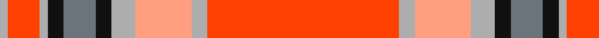

In pattern [RYYYKBKYRY](/patterns/ryyykbkyry/).

This was sourced from register-of-tartans.  It is a [10 stripes tartan](/stripes/stripes10/).

Original link https://www.tartanregister.gov.uk/tartanDetails.aspx?ref=10730

## Thread count
N/2 R8 N2 K4 Na8 K4 N6 LR14 N4 R/48

## Palette
Each colour and its ΔE from the base-6 reference it is a variant of.

| Colour | Shade | Base | ΔE (OKLab) |
|---|---|---|---|
| K | <code style="background-color:#101010;">#101010</code> `#101010` | K <code style="background-color:#000000;">#000000</code> | 0.17 |
| LR | <code style="background-color:#FF9F80;">#FF9F80</code> `#FF9F80` | Y <code style="background-color:#F2BF00;">#F2BF00</code> | 0.14 |
| N | <code style="background-color:#ADADAD;">#ADADAD</code> `#ADADAD` | Y <code style="background-color:#F2BF00;">#F2BF00</code> | 0.19 |
| Na | <code style="background-color:#6B747B;">#6B747B</code> `#6B747B` | B <code style="background-color:#2A418A;">#2A418A</code> | 0.19 |
| R | <code style="background-color:#FF4000;">#FF4000</code> `#FF4000` | R <code style="background-color:#CC0000;">#CC0000</code> | 0.13 |

## Nearest tartans

The nearest existing variants by ΔTartan distance.

1. [Drummond of Perth Dress #3](/setts/s9/r67y3b6w3wa25r10b6w7wa3x2~b505050-rdc0000-wc0c0c0-wae0e0e0-ye8c000/) — ΔT 0.86
1. [Drummond of Perth, dress](/setts/s9/r67y3b6w3wa25r10b6w7wa3x2~b505050-rc00000-wc0c0c0-wae0e0e0-yf0c000/) — ΔT 1.06
1. [VeMMA Corporate Tartan Tartan Number: 10730. Earliest known date: 5 November 2012 Created for VeMMA International. VeMMA is a nutritional supplement company marketing fruit juice drinks that have been enhanced with vitamins and anti-oxidants (the name VeMMA is an acronym for Vitamins, essential Minerals, Mangosteen and Aloe vera). VeMMA offers an affiliate marketing program to those who wish to recommend its products. Colours: the orange represents enhanced health through supplementation; silver represents liquid and silver also purifies, soothes, inspires, and reflects back positive energy. See products available Copyright © Blair Urquhart, Comrie, 2015](/setts/s10/r24y2ya7y3k2ka4k2y1r4y1x2~k101010-ka000000-rff4000-yadadad-yaff9f80/) — ΔT 1.27
1. [Fueglistal](/setts/s9/k3y6w13r2w2r32w1r2w1x2~k101010-rc80000-wc0c0c0-ybc8c00/) — ΔT 1.30
1. [Manx Laxey, Red](/setts/s9/r24y2g3ra2w10r4g3ra3w2x2~g808080-rc00000-ra806050-we0e0e0-yf0c000/) — ΔT 1.37
1. [Manx Laxey (Red)](/setts/s9/r24y2ra3g2w10r4ra3g3w2x2~g604000-rc80000-ra888888-we0e0e0-ye8c000/) — ΔT 1.38
1. [Studio Wolf Polysun](/setts/s12/r18ra3w3ra3r2ra1w1g1r2y1ra1k1x4~g006400-k101010-rfa4b00-rac80000-wffffff-yffe600/) — ΔT 1.39
1. [Fueglistal (Aargau) (Personal)](/setts/s9/k3r6y13ra2y2ra32y1ra2y2x2~k101010-rc27c05-rac50000-y9da39d/) — ΔT 1.42
1. [Canfor](/setts/s12/r62ra1r6ra9g2k2ra9w6g1w6g20w2x2~g757778-k101010-rdd072f-raa90725-wffffff/) — ΔT 1.48
1. [Drummond of Perth Dress](/setts/s9/r40y1k2g1w15r5k5g5w1x2~g808080-k101010-rdc0000-we0e0e0-ye8c000/) — ΔT 1.53

## Neighbour map

Every grey dot is one of 15726 variants placed by the first two principal components of the ΔTartan feature space (44% of its variance). Red is this tartan; blue dots are its nearest — click one to open its page.

<svg viewBox="0 0 640 380" role="img" style="max-width:100%;height:auto;border:1px solid #e0e0e0;border-radius:4px;display:block" xmlns="http://www.w3.org/2000/svg"><image href="/nn/cloud.v1.png" width="640" height="380"/><a href="/setts/s9/r67y3b6w3wa25r10b6w7wa3x2~b505050-rdc0000-wc0c0c0-wae0e0e0-ye8c000/"><circle cx="357.6" cy="92.2" r="4" fill="#3465a4"><title>Drummond of Perth Dress #3</title></circle></a><a href="/setts/s9/r67y3b6w3wa25r10b6w7wa3x2~b505050-rc00000-wc0c0c0-wae0e0e0-yf0c000/"><circle cx="351.5" cy="93.3" r="4" fill="#3465a4"><title>Drummond of Perth, dress</title></circle></a><a href="/setts/s10/r24y2ya7y3k2ka4k2y1r4y1x2~k101010-ka000000-rff4000-yadadad-yaff9f80/"><circle cx="308.1" cy="79.8" r="4" fill="#3465a4"><title>VeMMA Corporate Tartan Tartan Number: 10730. Earliest known date: 5 November 2012 Created for VeMMA International. VeMMA is a nutritional supplement company marketing fruit juice drinks that have been enhanced with vitamins and anti-oxidants (the name VeMMA is an acronym for Vitamins, essential Minerals, Mangosteen and Aloe vera). VeMMA offers an affiliate marketing program to those who wish to recommend its products. Colours: the orange represents enhanced health through supplementation; silver represents liquid and silver also purifies, soothes, inspires, and reflects back positive energy. See products available Copyright © Blair Urquhart, Comrie, 2015</title></circle></a><a href="/setts/s9/k3y6w13r2w2r32w1r2w1x2~k101010-rc80000-wc0c0c0-ybc8c00/"><circle cx="396.2" cy="100.6" r="4" fill="#3465a4"><title>Fueglistal</title></circle></a><a href="/setts/s9/r24y2g3ra2w10r4g3ra3w2x2~g808080-rc00000-ra806050-we0e0e0-yf0c000/"><circle cx="282.1" cy="127.7" r="4" fill="#3465a4"><title>Manx Laxey, Red</title></circle></a><a href="/setts/s9/r24y2ra3g2w10r4ra3g3w2x2~g604000-rc80000-ra888888-we0e0e0-ye8c000/"><circle cx="277.9" cy="125.4" r="4" fill="#3465a4"><title>Manx Laxey (Red)</title></circle></a><a href="/setts/s12/r18ra3w3ra3r2ra1w1g1r2y1ra1k1x4~g006400-k101010-rfa4b00-rac80000-wffffff-yffe600/"><circle cx="349.3" cy="67.3" r="4" fill="#3465a4"><title>Studio Wolf Polysun</title></circle></a><a href="/setts/s9/k3r6y13ra2y2ra32y1ra2y2x2~k101010-rc27c05-rac50000-y9da39d/"><circle cx="414.3" cy="113.5" r="4" fill="#3465a4"><title>Fueglistal (Aargau) (Personal)</title></circle></a><a href="/setts/s12/r62ra1r6ra9g2k2ra9w6g1w6g20w2x2~g757778-k101010-rdd072f-raa90725-wffffff/"><circle cx="371.4" cy="47.7" r="4" fill="#3465a4"><title>Canfor</title></circle></a><a href="/setts/s9/r40y1k2g1w15r5k5g5w1x2~g808080-k101010-rdc0000-we0e0e0-ye8c000/"><circle cx="374.9" cy="65.3" r="4" fill="#3465a4"><title>Drummond of Perth Dress</title></circle></a><circle cx="341.3" cy="91.3" r="5" fill="#c00000"/></svg>

ID: /setts/s10/r24y2ya7y3k2b4k2y1r4y1x2~b6b747b-k101010-rff4000-yadadad-yaff9f80/
