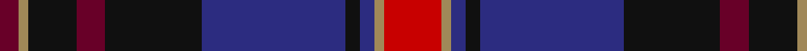

In pattern [BYKBKBKBYR](/patterns/bykbkbkbyr/).

This was sourced from tartans-authority.  It is a [10 stripes tartan](/stripes/stripes10/).

Original link http://www.tartansauthority.com/tartan-ferret/display/2287/

## Thread count
DR/8 LT4 K20 DR12 K40 DB60 K6 DB6 LT4 R/24

## Palette
Each colour and its ΔE from the base-6 reference it is a variant of.

| Colour | Shade | Base | ΔE (OKLab) |
|---|---|---|---|
| DB | <code style="background-color:#2C2C80;">#2C2C80</code> `#2C2C80` | B <code style="background-color:#2A418A;">#2A418A</code> | 0.06 |
| DR | <code style="background-color:#680028;">#680028</code> `#680028` | B <code style="background-color:#2A418A;">#2A418A</code> | 0.21 |
| K | <code style="background-color:#101010;">#101010</code> `#101010` | K <code style="background-color:#000000;">#000000</code> | 0.17 |
| LT | <code style="background-color:#A08858;">#A08858</code> `#A08858` | Y <code style="background-color:#F2BF00;">#F2BF00</code> | 0.21 |
| R | <code style="background-color:#C80000;">#C80000</code> `#C80000` | R <code style="background-color:#CC0000;">#CC0000</code> | 0.01 |

## Nearest tartans

The nearest existing variants by ΔTartan distance.

1. [Bootneck 350](/setts/s8/k12r8k38g8b50r10g6y4-b202060-g285800-k101010-rc80000-ye8c000/) — ΔT 0.88
1. [Land's End (Unnamed Maroon)](/setts/s9/k46g4r6b14r6g4ga30r42g10-b304080-g908000-ga004010-k000030-r802040/) — ΔT 0.96
1. [Bootneck 350](/setts/s8/k12r8k38g8b50r10g6y4-b141e46-g003c14-k101010-rc8002c-yffd700/) — ΔT 1.06
1. [Wardlaw](/setts/s10/k8b60k6b4ba4r4g24k6ba36r6-b780078-ba2c2c80-g006818-k101010-rc80000/) — ΔT 1.09
1. [United Arrows House Check](/setts/s9/b90r8k40w6ra18ba8ra6ba18k22-b202060-ba4c0000-k1c1714-rdc0000-rab07430-we8ccb8/) — ΔT 1.11
1. [Scotch House 2000 Antique](/setts/s8/b44r6b4r6b4k34g36ga8-b2c2c80-g604000-ga006818-k101010-rc80000/) — ΔT 1.12
1. [United Arrows House Check](/setts/s9/b80r8k32w6g16ra8g6ra16k20-b1c0070-g603800-k101010-rc80000-ra880000-wfcfcfc/) — ΔT 1.16
1. [Ross Dempster (Personal)](/setts/s7/b8ba58g20r20ra36g4ba8-b0000ff-ba141e46-g003c14-r960000-rac80028/) — ΔT 1.18
1. [Largs District Tartan Tartan Number: 478. Earliest known date: 1981 The Largs tartan is a new design created for the town and officially adopted in 1981. There is also a dress version. See products available Copyright © Blair Urquhart, Comrie, 2015](/setts/s13/b4r4ba44w6ba5g4ba3g8ba3g16b4r22w4-b1c0070-ba202060-g604000-r880000-we0e0e0/) — ΔT 1.18
1. [First](/setts/s8/b2r8b2r2b24k12ba32w2-b780078-ba003c64-k101010-ra00048-we0e0e0/) — ΔT 1.18

## Neighbour map

Every grey dot is one of 15726 variants placed by the first two principal components of the ΔTartan feature space (44% of its variance). Red is this tartan; blue dots are its nearest — click one to open its page.

<svg viewBox="0 0 640 380" role="img" style="max-width:100%;height:auto;border:1px solid #e0e0e0;border-radius:4px;display:block" xmlns="http://www.w3.org/2000/svg"><image href="/nn/cloud.v1.png" width="640" height="380"/><a href="/setts/s8/k12r8k38g8b50r10g6y4-b202060-g285800-k101010-rc80000-ye8c000/"><circle cx="207.6" cy="176.6" r="4" fill="#3465a4"><title>Bootneck 350</title></circle></a><a href="/setts/s9/k46g4r6b14r6g4ga30r42g10-b304080-g908000-ga004010-k000030-r802040/"><circle cx="166.6" cy="175.3" r="4" fill="#3465a4"><title>Land's End (Unnamed Maroon)</title></circle></a><a href="/setts/s8/k12r8k38g8b50r10g6y4-b141e46-g003c14-k101010-rc8002c-yffd700/"><circle cx="216.1" cy="182.7" r="4" fill="#3465a4"><title>Bootneck 350</title></circle></a><a href="/setts/s10/k8b60k6b4ba4r4g24k6ba36r6-b780078-ba2c2c80-g006818-k101010-rc80000/"><circle cx="244.4" cy="148.1" r="4" fill="#3465a4"><title>Wardlaw</title></circle></a><a href="/setts/s9/b90r8k40w6ra18ba8ra6ba18k22-b202060-ba4c0000-k1c1714-rdc0000-rab07430-we8ccb8/"><circle cx="219.4" cy="142.2" r="4" fill="#3465a4"><title>United Arrows House Check</title></circle></a><a href="/setts/s8/b44r6b4r6b4k34g36ga8-b2c2c80-g604000-ga006818-k101010-rc80000/"><circle cx="208.7" cy="191.8" r="4" fill="#3465a4"><title>Scotch House 2000 Antique</title></circle></a><a href="/setts/s9/b80r8k32w6g16ra8g6ra16k20-b1c0070-g603800-k101010-rc80000-ra880000-wfcfcfc/"><circle cx="201.4" cy="143.7" r="4" fill="#3465a4"><title>United Arrows House Check</title></circle></a><a href="/setts/s7/b8ba58g20r20ra36g4ba8-b0000ff-ba141e46-g003c14-r960000-rac80028/"><circle cx="221.7" cy="180.7" r="4" fill="#3465a4"><title>Ross Dempster (Personal)</title></circle></a><a href="/setts/s13/b4r4ba44w6ba5g4ba3g8ba3g16b4r22w4-b1c0070-ba202060-g604000-r880000-we0e0e0/"><circle cx="227.9" cy="127.6" r="4" fill="#3465a4"><title>Largs District Tartan Tartan Number: 478. Earliest known date: 1981 The Largs tartan is a new design created for the town and officially adopted in 1981. There is also a dress version. See products available Copyright © Blair Urquhart, Comrie, 2015</title></circle></a><a href="/setts/s8/b2r8b2r2b24k12ba32w2-b780078-ba003c64-k101010-ra00048-we0e0e0/"><circle cx="250.0" cy="166.0" r="4" fill="#3465a4"><title>First</title></circle></a><circle cx="213.0" cy="159.3" r="5" fill="#c00000"/></svg>

ID: /setts/s10/r24y4b6k6b60k40ba12k20y4ba8-b2c2c80-ba680028-k101010-rc80000-ya08858/
