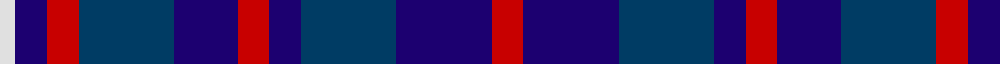

In pattern [RBBBRBBRBW](/patterns/rbbbrbbrbw/).

This was sourced from tartans-authority.  It is a [10 stripes tartan](/stripes/stripes10/).

Original link http://www.tartansauthority.com/tartan-ferret/display/6910/

## Thread count
LN/4 DBa8 R8 DB24 DBa16 R8 DBa8 DB24 DBa24 R/8

## Palette
Each colour and its ΔE from the base-6 reference it is a variant of.

| Colour | Shade | Base | ΔE (OKLab) |
|---|---|---|---|
| DB | <code style="background-color:#003C64;">#003C64</code> `#003C64` | B <code style="background-color:#2A418A;">#2A418A</code> | 0.08 |
| DBa | <code style="background-color:#1C0070;">#1C0070</code> `#1C0070` | B <code style="background-color:#2A418A;">#2A418A</code> | 0.14 |
| LN | <code style="background-color:#E0E0E0;">#E0E0E0</code> `#E0E0E0` | W <code style="background-color:#F7F7F7;">#F7F7F7</code> | 0.07 |
| R | <code style="background-color:#C80000;">#C80000</code> `#C80000` | R <code style="background-color:#CC0000;">#CC0000</code> | 0.01 |

## Nearest tartans

The nearest existing variants by ΔTartan distance.

1. [Hamilton (Personal)](/setts/s10/b3g3b18r14b5r14b5r14b21g3x2~b000088-g004c00-r880000/) — ΔT 0.71
1. [Heritage of Scotland](/setts/s7/b6w3b21k16ba6k3ba6x2~b2c2c80-ba780078-k101010-wf8f8f8/) — ΔT 1.09
1. [Brodie Countryfare (Corporate)](/setts/s7/b3k13b13ba13w2ba13w3x2~b2c2c80-ba1c0070-k101010-we0e0e0/) — ΔT 1.17
1. [Poulter Sandwich](/setts/s13/b69ba14b13ba14b13ba69bb72w13bb72ba69b68ba14b13~b440044-ba1870a4-bb141e46-w98c8e8/) — ΔT 1.27
1. [Clergy "Two Spirit" (Personal)](/setts/s11/b1ba3b1ba2b1k6w1k6ba6b1k1x2~b5c8ca8-ba2c2c80-k101010-wc49cd8/) — ΔT 1.28
1. [Allianz Deutschland 2012 (Corporate)](/setts/s7/b6ba3b6ba20k20ba8w4x2~b2c2c80-ba202060-k101010-wfcfcfc/) — ΔT 1.30
1. [Lexington Fire Department](/setts/s8/k8b8k2b2w2k5b5r2x5~b1c0070-k101010-rc80000-we0e0e0/) — ΔT 1.33
1. [Scottish North American Business Council](/setts/s18/b2r2ba6b4r2b2ba6b6r2b6ba6b2r2b4ba6r2b2w1x4~b1c0070-ba003c64-rc80000-we0e0e0/) — ΔT 1.37
1. [Clemson University](/setts/s13/b11k2b2k2b2k8ba8y2ba8k8b8k2b2x4~b2c2c80-ba780078-k101010-yd87c00/) — ΔT 1.39
1. [Blue Family Tartan Tartan Number: 1420. Earliest known date: 1985 Blue is a Sept name of MacMillan. See products available Copyright © Blair Urquhart, Comrie, 2015](/setts/s7/r2b11r3b11ba12bb10w2x2~b2c2c80-ba5c8ca8-bb202060-rc80000-we0e0e0/) — ΔT 1.42

## Neighbour map

Every grey dot is one of 15726 variants placed by the first two principal components of the ΔTartan feature space (44% of its variance). Red is this tartan; blue dots are its nearest — click one to open its page.

<svg viewBox="0 0 640 380" role="img" style="max-width:100%;height:auto;border:1px solid #e0e0e0;border-radius:4px;display:block" xmlns="http://www.w3.org/2000/svg"><image href="/nn/cloud.v1.png" width="640" height="380"/><a href="/setts/s10/b3g3b18r14b5r14b5r14b21g3x2~b000088-g004c00-r880000/"><circle cx="227.4" cy="231.9" r="4" fill="#3465a4"><title>Hamilton (Personal)</title></circle></a><a href="/setts/s7/b6w3b21k16ba6k3ba6x2~b2c2c80-ba780078-k101010-wf8f8f8/"><circle cx="223.4" cy="233.8" r="4" fill="#3465a4"><title>Heritage of Scotland</title></circle></a><a href="/setts/s7/b3k13b13ba13w2ba13w3x2~b2c2c80-ba1c0070-k101010-we0e0e0/"><circle cx="191.7" cy="254.9" r="4" fill="#3465a4"><title>Brodie Countryfare (Corporate)</title></circle></a><a href="/setts/s13/b69ba14b13ba14b13ba69bb72w13bb72ba69b68ba14b13~b440044-ba1870a4-bb141e46-w98c8e8/"><circle cx="186.7" cy="227.6" r="4" fill="#3465a4"><title>Poulter Sandwich</title></circle></a><a href="/setts/s11/b1ba3b1ba2b1k6w1k6ba6b1k1x2~b5c8ca8-ba2c2c80-k101010-wc49cd8/"><circle cx="227.1" cy="218.9" r="4" fill="#3465a4"><title>Clergy &quot;Two Spirit&quot; (Personal)</title></circle></a><a href="/setts/s7/b6ba3b6ba20k20ba8w4x2~b2c2c80-ba202060-k101010-wfcfcfc/"><circle cx="232.1" cy="248.4" r="4" fill="#3465a4"><title>Allianz Deutschland 2012 (Corporate)</title></circle></a><a href="/setts/s8/k8b8k2b2w2k5b5r2x5~b1c0070-k101010-rc80000-we0e0e0/"><circle cx="198.6" cy="267.2" r="4" fill="#3465a4"><title>Lexington Fire Department</title></circle></a><a href="/setts/s18/b2r2ba6b4r2b2ba6b6r2b6ba6b2r2b4ba6r2b2w1x4~b1c0070-ba003c64-rc80000-we0e0e0/"><circle cx="210.6" cy="230.8" r="4" fill="#3465a4"><title>Scottish North American Business Council</title></circle></a><a href="/setts/s13/b11k2b2k2b2k8ba8y2ba8k8b8k2b2x4~b2c2c80-ba780078-k101010-yd87c00/"><circle cx="210.3" cy="236.4" r="4" fill="#3465a4"><title>Clemson University</title></circle></a><a href="/setts/s7/r2b11r3b11ba12bb10w2x2~b2c2c80-ba5c8ca8-bb202060-rc80000-we0e0e0/"><circle cx="165.6" cy="234.4" r="4" fill="#3465a4"><title>Blue Family Tartan Tartan Number: 1420. Earliest known date: 1985 Blue is a Sept name of MacMillan. See products available Copyright © Blair Urquhart, Comrie, 2015</title></circle></a><circle cx="196.5" cy="243.0" r="5" fill="#c00000"/></svg>

ID: /setts/s10/r2b6ba6b2r2b4ba6r2b2w1x4~b1c0070-ba003c64-rc80000-we0e0e0/
