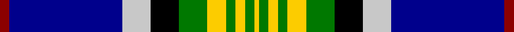

This page is one **sett** — a single exact thread-count. It belongs to the [tartan](/tartans/dr2db24n6k6g6y4g2y2g2y1/)
(the same proportion at any scale), whose colour order is pattern [RBWKGYGYGY](/stripes/rbwkgygygy/).

Sourced from tartans-authority.  It is a [10 stripe tartan](/stripes/stripes10/).

Original link http://www.tartansauthority.com/tartan-ferret/display/2207/

## Thread count
DR/4 DB48 N12 K12 G12 Y8 G4 Y4 G4 Y/2

## Palette
Each colour and the base-6 reference it is a variant of.

| Colour | Shade | Base |
|---|---|---|
| DB | <code style="background-color:#00008C;">#00008C</code> `oklch(28.9% 0.200 264.1)` <small>#00008C</small> | B <code style="background-color:#2A418A;">#2A418A</code> |
| DR | <code style="background-color:#8C0000;">#8C0000</code> `oklch(40.2% 0.165 29.2)` <small>#8C0000</small> | R <code style="background-color:#CC0000;">#CC0000</code> |
| G | <code style="background-color:#007800;">#007800</code> `oklch(49.6% 0.169 142.5)` <small>#007800</small> | G <code style="background-color:#006100;">#006100</code> |
| K | <code style="background-color:#000000;">#000000</code> `oklch(0.0% 0.000 0.0)` <small>#000000</small> | K <code style="background-color:#000000;">#000000</code> |
| N | <code style="background-color:#C8C8C8;">#C8C8C8</code> `oklch(83.3% 0.000 89.9)` <small>#C8C8C8</small> | W <code style="background-color:#F7F7F7;">#F7F7F7</code> |
| Y | <code style="background-color:#FCCC00;">#FCCC00</code> `oklch(86.2% 0.176 91.5)` <small>#FCCC00</small> | Y <code style="background-color:#F2BF00;">#F2BF00</code> |

## Nearest tartans

The nearest existing variants by ΔTartan distance, with this tartan at the top so the swatches line up against it.

ΔTartan

Tartan

Sett

—

<a href="/ttd/edit/#slug=r2db24lb6k6g6ly4g2ly2g2ly1~x2">Crookdake-Cheng (Personal)</a> <a class="nn-out" href="/setts/s10/r2db24lb6k6g6ly4g2ly2g2ly1~x2/" title="open its dictionary page">↗</a>

0.68

<a href="/ttd/edit/#slug=r3db36lb10k8g13lo6g3lo3g3lo1~x2">Crookdake Cheng Family Tartan Tartan Number: 2207. Earliest known date: 1994 Designed by Phil Smith 1994 for the then Treasurer/Accountant of the Scottish Tartans Society at the request of Keith Lumsden. The yellow represents rice stalks. See products available Copyright © Blair Urquhart, Comrie, 2015</a> <a class="nn-out" href="/setts/s10/r3db36lb10k8g13lo6g3lo3g3lo1~x2/" title="open its dictionary page">↗</a>

0.95

<a href="/ttd/edit/#slug=r3db36w10k8g13ly6g3ly3g3ly1~x2">Crookdake Cheng</a> <a class="nn-out" href="/setts/s10/r3db36w10k8g13ly6g3ly3g3ly1~x2/" title="open its dictionary page">↗</a>

1.02

<a href="/ttd/edit/#slug=lb16ly3lb9b14lb1b8k32r1w4~x2">Wrens (WRNS) (Military)</a> <a class="nn-out" href="/setts/s9/lb16ly3lb9b14lb1b8k32r1w4~x2/" title="open its dictionary page">↗</a>

1.06

<a href="/ttd/edit/#slug=r2db24lb6k6g6k4g2k2g2k1~x2">Crookdake-Cheng (Personal)</a> <a class="nn-out" href="/setts/s10/r2db24lb6k6g6k4g2k2g2k1~x2/" title="open its dictionary page">↗</a>

1.08

<a href="/ttd/edit/#slug=lg2dg9k16r2t30lg3dg6w1~x2">Climb, The</a> <a class="nn-out" href="/setts/s8/lg2dg9k16r2t30lg3dg6w1~x2/" title="open its dictionary page">↗</a>

1.13

<a href="/ttd/edit/#slug=g30dp4r6w6db6dp3k14w14db50g50w2">Brehat (Personal)</a> <a class="nn-out" href="/setts/s11/g30dp4r6w6db6dp3k14w14db50g50w2/" title="open its dictionary page">↗</a>

1.16

<a href="/ttd/edit/#slug=dt3db28w2ly2db1dg4dt8w3r4ly10dt2~x2">Colours of Hope</a> <a class="nn-out" href="/setts/s11/dt3db28w2ly2db1dg4dt8w3r4ly10dt2~x2/" title="open its dictionary page">↗</a>

1.19

<a href="/ttd/edit/#slug=t29db3k10ly2k2t2k2g10r5k3r2t2~x2">Stewart Blue</a> <a class="nn-out" href="/setts/s12/t29db3k10ly2k2t2k2g10r5k3r2t2~x2/" title="open its dictionary page">↗</a>

1.19

<a href="/ttd/edit/#slug=r2k1db30k6g12ly1db2ly1g12k3w1~x2">Hororata</a> <a class="nn-out" href="/setts/s11/r2k1db30k6g12ly1db2ly1g12k3w1~x2/" title="open its dictionary page">↗</a>

1.22

<a href="/ttd/edit/#slug=dt30k4dg5k2r2k2dg5k4w10k5n8k1~x2">Lyon, Jeffrey M (Personal)</a> <a class="nn-out" href="/setts/s12/dt30k4dg5k2r2k2dg5k4w10k5n8k1~x2/" title="open its dictionary page">↗</a>

## Neighbour map

Every grey dot is one of 14299 variants placed by the first two principal components of the ΔTartan feature space (44% of its variance). Red is this tartan; blue dots are its nearest — click one to open its page.

<svg viewBox="0 0 640 380" role="img" style="max-width:100%;height:auto;border:1px solid #e0e0e0;border-radius:4px;display:block" xmlns="http://www.w3.org/2000/svg"><image href="/nn/cloud.v1.png" width="640" height="380"/><a href="/setts/s10/r3db36lb10k8g13lo6g3lo3g3lo1~x2/"><circle cx="187.4" cy="80.7" r="4" fill="#3465a4"><title>Crookdake Cheng Family Tartan Tartan Number: 2207. Earliest known date: 1994 Designed by Phil Smith 1994 for the then Treasurer/Accountant of the Scottish Tartans Society at the request of Keith Lumsden. The yellow represents rice stalks. See products available Copyright © Blair Urquhart, Comrie, 2015</title></circle></a><a href="/setts/s10/r3db36w10k8g13ly6g3ly3g3ly1~x2/"><circle cx="179.0" cy="75.3" r="4" fill="#3465a4"><title>Crookdake Cheng</title></circle></a><a href="/setts/s9/lb16ly3lb9b14lb1b8k32r1w4~x2/"><circle cx="150.1" cy="92.6" r="4" fill="#3465a4"><title>Wrens (WRNS) (Military)</title></circle></a><a href="/setts/s10/r2db24lb6k6g6k4g2k2g2k1~x2/"><circle cx="184.9" cy="100.1" r="4" fill="#3465a4"><title>Crookdake-Cheng (Personal)</title></circle></a><a href="/setts/s8/lg2dg9k16r2t30lg3dg6w1~x2/"><circle cx="206.7" cy="100.5" r="4" fill="#3465a4"><title>Climb, The</title></circle></a><a href="/setts/s11/g30dp4r6w6db6dp3k14w14db50g50w2/"><circle cx="193.3" cy="99.4" r="4" fill="#3465a4"><title>Brehat (Personal)</title></circle></a><a href="/setts/s11/dt3db28w2ly2db1dg4dt8w3r4ly10dt2~x2/"><circle cx="198.6" cy="77.0" r="4" fill="#3465a4"><title>Colours of Hope</title></circle></a><a href="/setts/s12/t29db3k10ly2k2t2k2g10r5k3r2t2~x2/"><circle cx="186.4" cy="96.8" r="4" fill="#3465a4"><title>Stewart Blue</title></circle></a><a href="/setts/s11/r2k1db30k6g12ly1db2ly1g12k3w1~x2/"><circle cx="233.3" cy="84.5" r="4" fill="#3465a4"><title>Hororata</title></circle></a><a href="/setts/s12/dt30k4dg5k2r2k2dg5k4w10k5n8k1~x2/"><circle cx="180.8" cy="87.6" r="4" fill="#3465a4"><title>Lyon, Jeffrey M (Personal)</title></circle></a><circle cx="173.8" cy="88.8" r="5" fill="#c00000"/></svg>

ID: /setts/s10/r2db24lb6k6g6ly4g2ly2g2ly1~x2/
