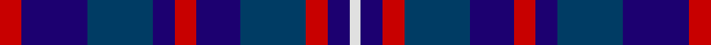

This page is one **sett** — a single exact thread-count. It belongs to the [tartan](/tartans/r2db6dt6db2r2db4dt6r2db2w1/)
(the same proportion at any scale), whose colour order is pattern [RBBBRBBRBW](/stripes/rbbbrbbrbw/).

Sourced from tartans-authority.  It is a [10 stripe tartan](/stripes/stripes10/).

Original link http://www.tartansauthority.com/tartan-ferret/display/6910/

## Thread count
R/8 DBa24 DB24 DBa8 R8 DBa16 DB24 R8 DBa8 LN/4

## Palette

Palette: <strong>Tartan Register</strong>
<table><thead><tr><th>Colour</th><th>Threads</th><th>Shade</th><th>Base</th><th>OKLCh</th></tr></thead><tbody><tr><td>R/</td><td style="text-align:right;font-variant-numeric:tabular-nums">8</td><td><code style="background-color:#C80000;">#C80000</code> <small style="color:#888">#C80000</small></td><td>R <code style="background-color:#CC0000;">#CC0000</code></td><td><small style="color:#888">oklch(52.3% 0.215 29.2)</small></td></tr><tr><td>DBa</td><td style="text-align:right;font-variant-numeric:tabular-nums">24</td><td><code style="background-color:#1C0070;">#1C0070</code> <small style="color:#888">#1C0070</small></td><td>B <code style="background-color:#2A418A;">#2A418A</code></td><td><small style="color:#888">oklch(26.3% 0.162 277.1)</small></td></tr><tr><td>DB</td><td style="text-align:right;font-variant-numeric:tabular-nums">24</td><td><code style="background-color:#003C64;">#003C64</code> <small style="color:#888">#003C64</small></td><td>B <code style="background-color:#2A418A;">#2A418A</code></td><td><small style="color:#888">oklch(34.5% 0.089 246.0)</small></td></tr><tr><td>DBa</td><td style="text-align:right;font-variant-numeric:tabular-nums">8</td><td><code style="background-color:#1C0070;">#1C0070</code> <small style="color:#888">#1C0070</small></td><td>B <code style="background-color:#2A418A;">#2A418A</code></td><td><small style="color:#888">oklch(26.3% 0.162 277.1)</small></td></tr><tr><td>R</td><td style="text-align:right;font-variant-numeric:tabular-nums">8</td><td><code style="background-color:#C80000;">#C80000</code> <small style="color:#888">#C80000</small></td><td>R <code style="background-color:#CC0000;">#CC0000</code></td><td><small style="color:#888">oklch(52.3% 0.215 29.2)</small></td></tr><tr><td>DBa</td><td style="text-align:right;font-variant-numeric:tabular-nums">16</td><td><code style="background-color:#1C0070;">#1C0070</code> <small style="color:#888">#1C0070</small></td><td>B <code style="background-color:#2A418A;">#2A418A</code></td><td><small style="color:#888">oklch(26.3% 0.162 277.1)</small></td></tr><tr><td>DB</td><td style="text-align:right;font-variant-numeric:tabular-nums">24</td><td><code style="background-color:#003C64;">#003C64</code> <small style="color:#888">#003C64</small></td><td>B <code style="background-color:#2A418A;">#2A418A</code></td><td><small style="color:#888">oklch(34.5% 0.089 246.0)</small></td></tr><tr><td>R</td><td style="text-align:right;font-variant-numeric:tabular-nums">8</td><td><code style="background-color:#C80000;">#C80000</code> <small style="color:#888">#C80000</small></td><td>R <code style="background-color:#CC0000;">#CC0000</code></td><td><small style="color:#888">oklch(52.3% 0.215 29.2)</small></td></tr><tr><td>DBa</td><td style="text-align:right;font-variant-numeric:tabular-nums">8</td><td><code style="background-color:#1C0070;">#1C0070</code> <small style="color:#888">#1C0070</small></td><td>B <code style="background-color:#2A418A;">#2A418A</code></td><td><small style="color:#888">oklch(26.3% 0.162 277.1)</small></td></tr><tr><td>LN/</td><td style="text-align:right;font-variant-numeric:tabular-nums">4</td><td><code style="background-color:#E0E0E0;">#E0E0E0</code> <small style="color:#888">#E0E0E0</small></td><td>W <code style="background-color:#F7F7F7;">#F7F7F7</code></td><td><small style="color:#888">oklch(90.7% 0.000 89.9)</small></td></tr></tbody></table>

## Nearest tartans

The nearest existing variants by ΔTartan distance, with this tartan at the top so the swatches line up against it.

ΔTartan

Tartan

Sett

—

<a href="/ttd/edit/#slug=r2db6dt6db2r2db4dt6r2db2w1~x4">Scottish N. A. Business Council (Co</a> <a class="nn-out" href="/setts/s10/r2db6dt6db2r2db4dt6r2db2w1~x4/" title="open its dictionary page">↗</a>

0.71

<a href="/ttd/edit/#slug=dg3db21r14db5r14db5r14db18dg3db3~x2">Hamilton (Personal)</a> <a class="nn-out" href="/setts/s10/dg3db21r14db5r14db5r14db18dg3db3~x2/" title="open its dictionary page">↗</a>

1.09

<a href="/ttd/edit/#slug=db6w3db21k16dp6k3dp6~x2">Heritage of Scotland</a> <a class="nn-out" href="/setts/s7/db6w3db21k16dp6k3dp6~x2/" title="open its dictionary page">↗</a>

1.16

<a href="/ttd/edit/#slug=db3k13db13db13w2db13w3~x2">Brodie Countryfare (Corporate)</a> <a class="nn-out" href="/setts/s7/db3k13db13db13w2db13w3~x2/" title="open its dictionary page">↗</a>

1.26

<a href="/ttd/edit/#slug=dp69b14dp13b14dp13b69db72lb13db72b69dp68b14dp13">Poulter Sandwich</a> <a class="nn-out" href="/setts/s13/dp69b14dp13b14dp13b69db72lb13db72b69dp68b14dp13/" title="open its dictionary page">↗</a>

1.29

<a href="/ttd/edit/#slug=k1t1db6k6lp1k6t1db2t1db3t1~x2">Clergy &quot;Two Spirit&quot; (Personal)</a> <a class="nn-out" href="/setts/s11/k1t1db6k6lp1k6t1db2t1db3t1~x2/" title="open its dictionary page">↗</a>

1.30

<a href="/ttd/edit/#slug=db6db3db6db20k20db8w4~x2">Allianz Deutschland 2012 (Corporate)</a> <a class="nn-out" href="/setts/s7/db6db3db6db20k20db8w4~x2/" title="open its dictionary page">↗</a>

1.33

<a href="/ttd/edit/#slug=k8db8k2db2w2k5db5r2~x5">Lexington Fire Department</a> <a class="nn-out" href="/setts/s8/k8db8k2db2w2k5db5r2~x5/" title="open its dictionary page">↗</a>

1.36

<a href="/ttd/edit/#slug=db2r2dt6db4r2db2dt6db6r2db6dt6db2r2db4dt6r2db2w1~x4">Scottish North American Business Council</a> <a class="nn-out" href="/setts/s18/db2r2dt6db4r2db2dt6db6r2db6dt6db2r2db4dt6r2db2w1~x4/" title="open its dictionary page">↗</a>

1.39

<a href="/ttd/edit/#slug=db11k2db2k2db2k8dp8lo2dp8k8db8k2db2~x4">Clemson University</a> <a class="nn-out" href="/setts/s13/db11k2db2k2db2k8dp8lo2dp8k8db8k2db2~x4/" title="open its dictionary page">↗</a>

1.46

<a href="/ttd/edit/#slug=r2db11r3db11t12db10w2~x2">Blue</a> <a class="nn-out" href="/setts/s7/r2db11r3db11t12db10w2~x2/" title="open its dictionary page">↗</a>

## Neighbour map

Every grey dot is one of 14299 variants placed by the first two principal components of the ΔTartan feature space (44% of its variance). Red is this tartan; blue dots are its nearest — click one to open its page.

<svg viewBox="0 0 640 380" role="img" style="max-width:100%;height:auto;border:1px solid #e0e0e0;border-radius:4px;display:block" xmlns="http://www.w3.org/2000/svg"><image href="/nn/cloud.v1.png" width="640" height="380"/><a href="/setts/s10/dg3db21r14db5r14db5r14db18dg3db3~x2/"><circle cx="229.9" cy="235.8" r="4" fill="#3465a4"><title>Hamilton (Personal)</title></circle></a><a href="/setts/s7/db6w3db21k16dp6k3dp6~x2/"><circle cx="226.2" cy="236.4" r="4" fill="#3465a4"><title>Heritage of Scotland</title></circle></a><a href="/setts/s7/db3k13db13db13w2db13w3~x2/"><circle cx="195.1" cy="259.1" r="4" fill="#3465a4"><title>Brodie Countryfare (Corporate)</title></circle></a><a href="/setts/s13/dp69b14dp13b14dp13b69db72lb13db72b69dp68b14dp13/"><circle cx="189.7" cy="235.0" r="4" fill="#3465a4"><title>Poulter Sandwich</title></circle></a><a href="/setts/s11/k1t1db6k6lp1k6t1db2t1db3t1~x2/"><circle cx="230.4" cy="222.5" r="4" fill="#3465a4"><title>Clergy &quot;Two Spirit&quot; (Personal)</title></circle></a><a href="/setts/s7/db6db3db6db20k20db8w4~x2/"><circle cx="235.2" cy="253.3" r="4" fill="#3465a4"><title>Allianz Deutschland 2012 (Corporate)</title></circle></a><a href="/setts/s8/k8db8k2db2w2k5db5r2~x5/"><circle cx="201.8" cy="268.7" r="4" fill="#3465a4"><title>Lexington Fire Department</title></circle></a><a href="/setts/s18/db2r2dt6db4r2db2dt6db6r2db6dt6db2r2db4dt6r2db2w1~x4/"><circle cx="213.3" cy="237.2" r="4" fill="#3465a4"><title>Scottish North American Business Council</title></circle></a><a href="/setts/s13/db11k2db2k2db2k8dp8lo2dp8k8db8k2db2~x4/"><circle cx="212.7" cy="244.0" r="4" fill="#3465a4"><title>Clemson University</title></circle></a><a href="/setts/s7/r2db11r3db11t12db10w2~x2/"><circle cx="163.1" cy="237.8" r="4" fill="#3465a4"><title>Blue</title></circle></a><circle cx="199.3" cy="246.8" r="5" fill="#c00000"/></svg>

ID: /setts/s10/r2db6dt6db2r2db4dt6r2db2w1~x4/
