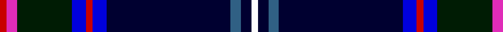

In pattern [RRKBRBKBKW](/stripes/rrkbrbkbkw/).

This was sourced from register-of-tartans.  It is a [10 stripe tartan](/stripes/stripes10/).

Original link https://www.tartanregister.gov.uk/tartanDetails.aspx?ref=1196

## Also known as

This cloth is also recorded under:

- Fitzgerald Hunting

## Attestations

This cloth appears in 2 source records; the oldest owns this page.

- 01/01/1901 — Fitzgerald Hunting (register-of-tartans, [record](https://www.tartanregister.gov.uk/tartanDetails.aspx?ref=1196))
- 1975 — Fitzgerald Htg (Name) (tartans-authority, [record](http://www.tartansauthority.com/tartan-ferret/display/1336/))

## Register references

External register numbers recorded for this tartan.

- Scottish Register of Tartans: [1196](https://www.tartanregister.gov.uk/tartanDetails.aspx?ref=1196)
- Scottish Tartans Authority (ITI): 1336
- Scottish Tartans World Register: 1336

## Thread count
R/4 LR6 DG32 Ba8 R4 Ba8 DB72 B6 DB6 W/4

## Palette
Each colour and the base-6 reference it is a variant of.

| Colour | Shade | Base |
|---|---|---|
| B | <code style="background-color:#306084;">#306084</code> `oklch(47.2% 0.079 243.2)` <small>#306084</small> | B <code style="background-color:#2A418A;">#2A418A</code> |
| Ba | <code style="background-color:#0000DC;">#0000DC</code> `oklch(40.4% 0.280 264.1)` <small>#0000DC</small> | B <code style="background-color:#2A418A;">#2A418A</code> |
| DB | <code style="background-color:#000030;">#000030</code> `oklch(14.0% 0.097 264.1)` <small>#000030</small> | K <code style="background-color:#000000;">#000000</code> |
| DG | <code style="background-color:#001C04;">#001C04</code> `oklch(19.7% 0.059 146.5)` <small>#001C04</small> | K <code style="background-color:#000000;">#000000</code> |
| LR | <code style="background-color:#E02CB8;">#E02CB8</code> `oklch(62.9% 0.248 339.3)` <small>#E02CB8</small> | R <code style="background-color:#CC0000;">#CC0000</code> |
| R | <code style="background-color:#C80000;">#C80000</code> `oklch(52.3% 0.215 29.2)` <small>#C80000</small> | R <code style="background-color:#CC0000;">#CC0000</code> |
| W | <code style="background-color:#FCFCFC;">#FCFCFC</code> `oklch(99.1% 0.000 89.9)` <small>#FCFCFC</small> | W <code style="background-color:#F7F7F7;">#F7F7F7</code> |

## Nearest tartans

The nearest existing variants by ΔTartan distance, with this tartan at the top so the swatches line up against it.

ΔTartan

Tartan

Sett

—

<a href="/ttd/edit/#slug=r2m3k16db4r2db4k36n3k3w2~x2">Fitzgerald Hunting</a> <a class="nn-out" href="/setts/s10/r2m3k16db4r2db4k36n3k3w2~x2/" title="open its dictionary page">↗</a>

1.39

<a href="/ttd/edit/#slug=k48n12lo3n3w3n3o9dy8t2dy10w2~x2">Holyrood (Commemorative)</a> <a class="nn-out" href="/setts/s11/k48n12lo3n3w3n3o9dy8t2dy10w2~x2/" title="open its dictionary page">↗</a>

1.40

<a href="/ttd/edit/#slug=k42n2k2n4y4ly2y6k9y2k2r2~x2">Dama Weekend</a> <a class="nn-out" href="/setts/s11/k42n2k2n4y4ly2y6k9y2k2r2~x2/" title="open its dictionary page">↗</a>

1.44

<a href="/ttd/edit/#slug=dp3g3w1k25db25k2db2g1r3w2~x2">Heart of Oak</a> <a class="nn-out" href="/setts/s10/dp3g3w1k25db25k2db2g1r3w2~x2/" title="open its dictionary page">↗</a>

1.44

<a href="/ttd/edit/#slug=r1db15k2ly1k1b1k5r4k1r2lb1~x4">Glen Stewart</a> <a class="nn-out" href="/setts/s11/r1db15k2ly1k1b1k5r4k1r2lb1~x4/" title="open its dictionary page">↗</a>

1.46

<a href="/ttd/edit/#slug=k42dp4k16dg10k2r6k2dg10k3w4~x2">Mount Dora</a> <a class="nn-out" href="/setts/s10/k42dp4k16dg10k2r6k2dg10k3w4~x2/" title="open its dictionary page">↗</a>

1.51

<a href="/ttd/edit/#slug=db39o3k14o3t14ly4w2dr2~x2">Unidentified, Lady's kilt</a> <a class="nn-out" href="/setts/s8/db39o3k14o3t14ly4w2dr2~x2/" title="open its dictionary page">↗</a>

1.51

<a href="/ttd/edit/#slug=lr2db1t2db2k1t12db2k1k10db28t1db3t2db3w1~x2">Northfield Academy Corporate Tartan Tartan Number: 11490. Earliest known date: 2016, March Northfield is built on Freedom Lands gifted by Robert the Bruce to the Burgh of Aberdeen around 1313 and this Academy design is based on the complex 1782 Aberdeen tartan. The dark blue squares number 56 threads for the year 1956 when the Academy was opened; the maroon is from the original 1956 school badge; the predominantly dark blue and light blue colours represent the colours of the school tie in 2016; the four light blue lines around the white represent the four capacities of Scottish education's Curriculum for Excellence in the 21st century. Finally, the grey remembers the 19th century Cairncry Granite Quarry on part of which, Northfield Academy was built. See products available Copyright © Blair Urquhart, Comrie, 2015</a> <a class="nn-out" href="/setts/s15/lr2db1t2db2k1t12db2k1k10db28t1db3t2db3w1~x2/" title="open its dictionary page">↗</a>

1.53

<a href="/ttd/edit/#slug=db64ly3dg12k3dg12w3db15db4r21db3ly2">Allison (1882)</a> <a class="nn-out" href="/setts/s11/db64ly3dg12k3dg12w3db15db4r21db3ly2/" title="open its dictionary page">↗</a>

1.55

<a href="/ttd/edit/#slug=db64ly3g12k3g12w3db15db4r21db3ly2">Allison</a> <a class="nn-out" href="/setts/s11/db64ly3g12k3g12w3db15db4r21db3ly2/" title="open its dictionary page">↗</a>

1.55

<a href="/ttd/edit/#slug=k23db1g1r3db2r1db12ly1k1w1k6db4g2k2g3~x2">Astrobiology</a> <a class="nn-out" href="/setts/s15/k23db1g1r3db2r1db12ly1k1w1k6db4g2k2g3~x2/" title="open its dictionary page">↗</a>

## Neighbour map

Every grey dot is one of 14299 variants placed by the first two principal components of the ΔTartan feature space (44% of its variance). Red is this tartan; blue dots are its nearest — click one to open its page.

<svg viewBox="0 0 640 380" role="img" style="max-width:100%;height:auto;border:1px solid #e0e0e0;border-radius:4px;display:block" xmlns="http://www.w3.org/2000/svg"><image href="/nn/cloud.v1.png" width="640" height="380"/><a href="/setts/s11/k48n12lo3n3w3n3o9dy8t2dy10w2~x2/"><circle cx="212.9" cy="75.7" r="4" fill="#3465a4"><title>Holyrood (Commemorative)</title></circle></a><a href="/setts/s11/k42n2k2n4y4ly2y6k9y2k2r2~x2/"><circle cx="320.3" cy="98.2" r="4" fill="#3465a4"><title>Dama Weekend</title></circle></a><a href="/setts/s10/dp3g3w1k25db25k2db2g1r3w2~x2/"><circle cx="248.8" cy="106.3" r="4" fill="#3465a4"><title>Heart of Oak</title></circle></a><a href="/setts/s11/r1db15k2ly1k1b1k5r4k1r2lb1~x4/"><circle cx="217.7" cy="114.0" r="4" fill="#3465a4"><title>Glen Stewart</title></circle></a><a href="/setts/s10/k42dp4k16dg10k2r6k2dg10k3w4~x2/"><circle cx="313.2" cy="126.9" r="4" fill="#3465a4"><title>Mount Dora</title></circle></a><a href="/setts/s8/db39o3k14o3t14ly4w2dr2~x2/"><circle cx="207.9" cy="101.0" r="4" fill="#3465a4"><title>Unidentified, Lady's kilt</title></circle></a><a href="/setts/s15/lr2db1t2db2k1t12db2k1k10db28t1db3t2db3w1~x2/"><circle cx="309.0" cy="80.8" r="4" fill="#3465a4"><title>Northfield Academy Corporate Tartan Tartan Number: 11490. Earliest known date: 2016, March Northfield is built on Freedom Lands gifted by Robert the Bruce to the Burgh of Aberdeen around 1313 and this Academy design is based on the complex 1782 Aberdeen tartan. The dark blue squares number 56 threads for the year 1956 when the Academy was opened; the maroon is from the original 1956 school badge; the predominantly dark blue and light blue colours represent the colours of the school tie in 2016; the four light blue lines around the white represent the four capacities of Scottish education's Curriculum for Excellence in the 21st century. Finally, the grey remembers the 19th century Cairncry Granite Quarry on part of which, Northfield Academy was built. See products available Copyright © Blair Urquhart, Comrie, 2015</title></circle></a><a href="/setts/s11/db64ly3dg12k3dg12w3db15db4r21db3ly2/"><circle cx="300.5" cy="68.3" r="4" fill="#3465a4"><title>Allison (1882)</title></circle></a><a href="/setts/s11/db64ly3g12k3g12w3db15db4r21db3ly2/"><circle cx="287.8" cy="65.2" r="4" fill="#3465a4"><title>Allison</title></circle></a><a href="/setts/s15/k23db1g1r3db2r1db12ly1k1w1k6db4g2k2g3~x2/"><circle cx="280.7" cy="88.7" r="4" fill="#3465a4"><title>Astrobiology</title></circle></a><circle cx="248.7" cy="98.9" r="5" fill="#c00000"/></svg>

ID: /setts/s10/r2m3k16db4r2db4k36n3k3w2~x2/
