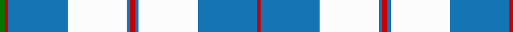

In pattern [GRBWBRBWBR](/stripes/grbwbrbwbr/).

This was sourced from register-of-tartans.  It is a [10 stripe tartan](/stripes/stripes10/).

Original link https://www.tartanregister.gov.uk/tartanDetails.aspx?ref=1302

## Register references

External register numbers recorded for this tartan.

- Scottish Register of Tartans: [1302](https://www.tartanregister.gov.uk/tartanDetails.aspx?ref=1302)
- Scottish Tartans Authority (ITI): 4953

## Thread count
G/6 R4 B70 W70 B4 R6 B4 W70 B70 R/4

## Palette
Each colour and the base-6 reference it is a variant of.

| Colour | Shade | Base |
|---|---|---|
| B | <code style="background-color:#1474B4;">#1474B4</code> `oklch(54.0% 0.129 245.1)` <small>#1474B4</small> | B <code style="background-color:#2A418A;">#2A418A</code> |
| G | <code style="background-color:#007800;">#007800</code> `oklch(49.6% 0.169 142.5)` <small>#007800</small> | G <code style="background-color:#006100;">#006100</code> |
| R | <code style="background-color:#C80000;">#C80000</code> `oklch(52.3% 0.215 29.2)` <small>#C80000</small> | R <code style="background-color:#CC0000;">#CC0000</code> |
| W | <code style="background-color:#FCFCFC;">#FCFCFC</code> `oklch(99.1% 0.000 89.9)` <small>#FCFCFC</small> | W <code style="background-color:#F7F7F7;">#F7F7F7</code> |

## Nearest tartans

The nearest existing variants by ΔTartan distance, with this tartan at the top so the swatches line up against it.

ΔTartan

Tartan

Sett

—

<a href="/ttd/edit/#slug=r3b2w35b35r2g3~x2">Galloway (Dance)</a> <a class="nn-out" href="/setts/s10/r3b2w35b35r2g3~x2/" title="open its dictionary page">↗</a>

1.09

<a href="/setts/s12/w2db1w15t12w1ly3db1~x6/">St John's</a>

1.11

<a href="/ttd/edit/#slug=w4k2w26t23w3t8p3~x2">MacPherson Turquoise Dress Tartan Tartan Number: 8183. Earliest known date: Threadcount and colours aren't 100% original. Generated manually. See products available Copyright © Blair Urquhart, Comrie, 2015</a> <a class="nn-out" href="/setts/s7/w4k2w26t23w3t8p3~x2/" title="open its dictionary page">↗</a>

1.13

<a href="/ttd/edit/#slug=r3b2w35b35r2g3~x2">Galloway (Dance)</a> <a class="nn-out" href="/setts/s6/r3b2w35b35r2g3~x2/" title="open its dictionary page">↗</a>

1.20

<a href="/ttd/edit/#slug=w2db1w15t12w1ly3db1~x6">St. John's (Corporate)</a> <a class="nn-out" href="/setts/s7/w2db1w15t12w1ly3db1~x6/" title="open its dictionary page">↗</a>

1.21

<a href="/ttd/edit/#slug=w24b24lr6w1db4w20b10lr3w4~x2">Silver (Personal)</a> <a class="nn-out" href="/setts/s9/w24b24lr6w1db4w20b10lr3w4~x2/" title="open its dictionary page">↗</a>

1.21

<a href="/ttd/edit/#slug=dt3n2w2n30w30r2w3~x2">Torridon, Royal Blue (Dance)</a> <a class="nn-out" href="/setts/s7/dt3n2w2n30w30r2w3~x2/" title="open its dictionary page">↗</a>

1.26

<a href="/ttd/edit/#slug=t42k2w2k2t5n12w32t4~x2">Longniddry, dress (Turquoise)</a> <a class="nn-out" href="/setts/s8/t42k2w2k2t5n12w32t4~x2/" title="open its dictionary page">↗</a>

1.31

<a href="/ttd/edit/#slug=t8db2t24db5w26k2w8~x2">Lennox Turquoise Dress District Tartan Tartan Number: 8190. Earliest known date: pre 2003 Families with the surname 'Lennox' are usually considered related to Clans Stewart or MacFarlane. Some of this surname also choose to wear the distinctive and ancient 'Lennox' tartan. D W Stewart reproduced the sett from a 'lost' portrait of the Countess of Lennox dating from the 16th century./Threadcount and colours aren't 100% original. Generated manually./ See products available Copyright © Blair Urquhart, Comrie, 2015</a> <a class="nn-out" href="/setts/s7/t8db2t24db5w26k2w8~x2/" title="open its dictionary page">↗</a>

1.37

<a href="/ttd/edit/#slug=k9w4k2w4k2w29k9w4b14lo2~x2">Hannay</a> <a class="nn-out" href="/setts/s10/k9w4k2w4k2w29k9w4b14lo2~x2/" title="open its dictionary page">↗</a>

1.39

<a href="/ttd/edit/#slug=db9lb27db2ly4db2lb10db2w3~x2">Alaska Highlanders P &amp; D (Corporate)</a> <a class="nn-out" href="/setts/s8/db9lb27db2ly4db2lb10db2w3~x2/" title="open its dictionary page">↗</a>

## Neighbour map

Every grey dot is one of 14299 variants placed by the first two principal components of the ΔTartan feature space (44% of its variance). Red is this tartan; blue dots are its nearest — click one to open its page.

<svg viewBox="0 0 640 380" role="img" style="max-width:100%;height:auto;border:1px solid #e0e0e0;border-radius:4px;display:block" xmlns="http://www.w3.org/2000/svg"><image href="/nn/cloud.v1.png" width="640" height="380"/><a href="/setts/s12/w2db1w15t12w1ly3db1~x6/"><circle cx="274.2" cy="138.4" r="4" fill="#3465a4"><title>St John's</title></circle></a><a href="/setts/s7/w4k2w26t23w3t8p3~x2/"><circle cx="278.6" cy="172.4" r="4" fill="#3465a4"><title>MacPherson Turquoise Dress Tartan Tartan Number: 8183. Earliest known date: Threadcount and colours aren't 100% original. Generated manually. See products available Copyright © Blair Urquhart, Comrie, 2015</title></circle></a><a href="/setts/s6/r3b2w35b35r2g3~x2/"><circle cx="271.6" cy="144.0" r="4" fill="#3465a4"><title>Galloway (Dance)</title></circle></a><a href="/setts/s7/w2db1w15t12w1ly3db1~x6/"><circle cx="287.3" cy="154.0" r="4" fill="#3465a4"><title>St. John's (Corporate)</title></circle></a><a href="/setts/s9/w24b24lr6w1db4w20b10lr3w4~x2/"><circle cx="284.0" cy="150.1" r="4" fill="#3465a4"><title>Silver (Personal)</title></circle></a><a href="/setts/s7/dt3n2w2n30w30r2w3~x2/"><circle cx="285.2" cy="141.8" r="4" fill="#3465a4"><title>Torridon, Royal Blue (Dance)</title></circle></a><a href="/setts/s8/t42k2w2k2t5n12w32t4~x2/"><circle cx="297.4" cy="137.8" r="4" fill="#3465a4"><title>Longniddry, dress (Turquoise)</title></circle></a><a href="/setts/s7/t8db2t24db5w26k2w8~x2/"><circle cx="249.7" cy="177.0" r="4" fill="#3465a4"><title>Lennox Turquoise Dress District Tartan Tartan Number: 8190. Earliest known date: pre 2003 Families with the surname 'Lennox' are usually considered related to Clans Stewart or MacFarlane. Some of this surname also choose to wear the distinctive and ancient 'Lennox' tartan. D W Stewart reproduced the sett from a 'lost' portrait of the Countess of Lennox dating from the 16th century./Threadcount and colours aren't 100% original. Generated manually./ See products available Copyright © Blair Urquhart, Comrie, 2015</title></circle></a><a href="/setts/s10/k9w4k2w4k2w29k9w4b14lo2~x2/"><circle cx="234.3" cy="128.0" r="4" fill="#3465a4"><title>Hannay</title></circle></a><a href="/setts/s8/db9lb27db2ly4db2lb10db2w3~x2/"><circle cx="333.6" cy="153.4" r="4" fill="#3465a4"><title>Alaska Highlanders P &amp; D (Corporate)</title></circle></a><circle cx="271.2" cy="131.2" r="5" fill="#c00000"/></svg>

ID: /setts/s10/r3b2w35b35r2g3~x2/
