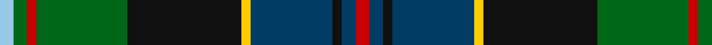

In pattern [RBKBYKGRGW](/patterns/rbkbykgrgw/).

This was sourced from tartans-authority.  It is a [10 stripes tartan](/stripes/stripes10/).

Original link http://www.tartansauthority.com/tartan-ferret/display/10725/

## Thread count
LB/6 G6 R4 G40 K50 Y4 DB36 K4 DB6 R/6

## Palette
Each colour and its ΔE from the base-6 reference it is a variant of.

| Colour | Shade | Base | ΔE (OKLab) |
|---|---|---|---|
| DB | <code style="background-color:#003C64;">#003C64</code> `#003C64` | B <code style="background-color:#2A418A;">#2A418A</code> | 0.08 |
| G | <code style="background-color:#006818;">#006818</code> `#006818` | G <code style="background-color:#006100;">#006100</code> | 0.02 |
| K | <code style="background-color:#101010;">#101010</code> `#101010` | K <code style="background-color:#000000;">#000000</code> | 0.17 |
| LB | <code style="background-color:#98C8E8;">#98C8E8</code> `#98C8E8` | W <code style="background-color:#F7F7F7;">#F7F7F7</code> | 0.18 |
| R | <code style="background-color:#C80000;">#C80000</code> `#C80000` | R <code style="background-color:#CC0000;">#CC0000</code> | 0.01 |
| Y | <code style="background-color:#FCCC00;">#FCCC00</code> `#FCCC00` | Y <code style="background-color:#F2BF00;">#F2BF00</code> | 0.04 |

## Nearest tartans

The nearest existing variants by ΔTartan distance.

1. [Loch Freuchie](/setts/s10/b3g3r2g20k25y2ba13k2ba3r3~b4a708b-ba2c4e75-g124d36-k101010-rff0000-yf0da0f~x2/) — ΔT 0.71
1. [Loch Awe](/setts/s9/w3k2r3g20k24b20r3k2y3~b2c2c80-g006818-k101010-rc80000-wc0c0c0-yfccc00~x2/) — ΔT 0.72
1. [Ayrton (1979) (Personal)](/setts/s11/r4k2g25k2b10k2g4k2ba25k2y4~b5c8ca8-ba2c2c80-g006818-k101010-rc80000-ye8c000~x2/) — ΔT 0.77
1. [Big Rory (Corporate)](/setts/s10/b10w5b48k35g5k5g35r5g5ba5~b2c607c-ba780078-g006818-k101010-rc80000-we0e0e0/) — ΔT 0.81
1. [Trades House](/setts/s9/r2g2b9k10ga12k1g1k1y1~b0c585c-g789484-ga00643c-k101010-rc80000-ye8c000~x4/) — ΔT 0.81
1. [Tindal](/setts/s11/r3k2g18k18b3k3b3k3b18y2w3~b202060-g006818-k101010-rc80000-we0e0e0-ye8c000~x2/) — ΔT 0.82
1. [Schmidt (2014)](/setts/s10/k3b20ba8b4g20k2g2r2g3y3~b202060-ba2c2c80-g006818-k101010-rc80000-yfccc00~x2/) — ΔT 0.83
1. [Wojtek Memorial Trust](/setts/s11/w3b15r6b3r3b4g11ga3g3ga28y3~b202060-g003820-ga005020-rdc0000-wffffff-ya08858~x2/) — ΔT 0.84
1. [Tombow 21st School Memorial](/setts/s9/g4b3k18ka3k2ga18g3ga2w2~b2c2c80-g604000-ga006818-k000034-ka000000-wc8c8c8~x4/) — ΔT 0.87
1. [Rutledge (Name)](/setts/s10/k3b10k2w1k2g10k2ga10r1ga2~b1c1c50-g289c18-ga003820-k101010-rc80000-we0e0e0~x4/) — ΔT 0.90

## Neighbour map

Every grey dot is one of 15726 variants placed by the first two principal components of the ΔTartan feature space (44% of its variance). Red is this tartan; blue dots are its nearest — click one to open its page.

<svg viewBox="0 0 640 380" role="img" style="max-width:100%;height:auto;border:1px solid #e0e0e0;border-radius:4px;display:block" xmlns="http://www.w3.org/2000/svg"><image href="/nn/cloud.v1.png" width="640" height="380"/><a href="/setts/s10/b3g3r2g20k25y2ba13k2ba3r3~b4a708b-ba2c4e75-g124d36-k101010-rff0000-yf0da0f~x2/"><circle cx="177.3" cy="141.9" r="4" fill="#3465a4"><title>Loch Freuchie</title></circle></a><a href="/setts/s9/w3k2r3g20k24b20r3k2y3~b2c2c80-g006818-k101010-rc80000-wc0c0c0-yfccc00~x2/"><circle cx="141.7" cy="140.9" r="4" fill="#3465a4"><title>Loch Awe</title></circle></a><a href="/setts/s11/r4k2g25k2b10k2g4k2ba25k2y4~b5c8ca8-ba2c2c80-g006818-k101010-rc80000-ye8c000~x2/"><circle cx="155.4" cy="124.3" r="4" fill="#3465a4"><title>Ayrton (1979) (Personal)</title></circle></a><a href="/setts/s10/b10w5b48k35g5k5g35r5g5ba5~b2c607c-ba780078-g006818-k101010-rc80000-we0e0e0/"><circle cx="166.1" cy="155.5" r="4" fill="#3465a4"><title>Big Rory (Corporate)</title></circle></a><a href="/setts/s9/r2g2b9k10ga12k1g1k1y1~b0c585c-g789484-ga00643c-k101010-rc80000-ye8c000~x4/"><circle cx="151.2" cy="153.8" r="4" fill="#3465a4"><title>Trades House</title></circle></a><a href="/setts/s11/r3k2g18k18b3k3b3k3b18y2w3~b202060-g006818-k101010-rc80000-we0e0e0-ye8c000~x2/"><circle cx="137.3" cy="149.2" r="4" fill="#3465a4"><title>Tindal</title></circle></a><a href="/setts/s10/k3b20ba8b4g20k2g2r2g3y3~b202060-ba2c2c80-g006818-k101010-rc80000-yfccc00~x2/"><circle cx="171.5" cy="152.7" r="4" fill="#3465a4"><title>Schmidt (2014)</title></circle></a><a href="/setts/s11/w3b15r6b3r3b4g11ga3g3ga28y3~b202060-g003820-ga005020-rdc0000-wffffff-ya08858~x2/"><circle cx="157.0" cy="148.0" r="4" fill="#3465a4"><title>Wojtek Memorial Trust</title></circle></a><a href="/setts/s9/g4b3k18ka3k2ga18g3ga2w2~b2c2c80-g604000-ga006818-k000034-ka000000-wc8c8c8~x4/"><circle cx="151.6" cy="156.8" r="4" fill="#3465a4"><title>Tombow 21st School Memorial</title></circle></a><a href="/setts/s10/k3b10k2w1k2g10k2ga10r1ga2~b1c1c50-g289c18-ga003820-k101010-rc80000-we0e0e0~x4/"><circle cx="97.0" cy="158.2" r="4" fill="#3465a4"><title>Rutledge (Name)</title></circle></a><circle cx="152.3" cy="137.7" r="5" fill="#c00000"/></svg>

ID: /setts/s10/r3b3k2b18y2k25g20r2g3w3~b003c64-g006818-k101010-rc80000-w98c8e8-yfccc00~x2/
