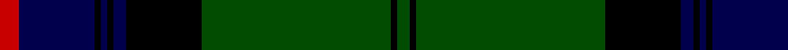

In pattern [GKGKBKBKBR](/stripes/gkgkbkbkbr/).

This was sourced from weddslist.  It is a [10 stripe tartan](/stripes/stripes10/).

Original link http://www.weddslist.com/cgi-bin/tartans/pg.pl?source=rb

## Attestations

This cloth appears in 3 source records; the oldest owns this page.

- undated — Armstrong (weddslist, [record](http://www.weddslist.com/cgi-bin/tartans/pg.pl?source=rb))
- undated — Armstrong (weddslist, [record](http://www.weddslist.com/cgi-bin/tartans/pg.pl?source=tinsel))
- undated — Armstrong (weddslist, [record](http://www.weddslist.com/cgi-bin/tartans/pg.pl?source=x))

## Register references

External register numbers recorded for this tartan.

- Scottish Register of Tartans: [1166](https://www.tartanregister.gov.uk/tartanDetails.aspx?ref=1166)
- Scottish Register of Tartans: [1510](https://www.tartanregister.gov.uk/tartanDetails.aspx?ref=1510)
- Scottish Register of Tartans: [1758](https://www.tartanregister.gov.uk/tartanDetails.aspx?ref=1758)
- Scottish Register of Tartans: [2307](https://www.tartanregister.gov.uk/tartanDetails.aspx?ref=2307)
- Scottish Register of Tartans: [2349](https://www.tartanregister.gov.uk/tartanDetails.aspx?ref=2349)
- Scottish Register of Tartans: [2540](https://www.tartanregister.gov.uk/tartanDetails.aspx?ref=2540)
- Scottish Register of Tartans: [2582](https://www.tartanregister.gov.uk/tartanDetails.aspx?ref=2582)
- Scottish Register of Tartans: [2585](https://www.tartanregister.gov.uk/tartanDetails.aspx?ref=2585)
- Scottish Register of Tartans: [2625](https://www.tartanregister.gov.uk/tartanDetails.aspx?ref=2625)
- Scottish Register of Tartans: [2666](https://www.tartanregister.gov.uk/tartanDetails.aspx?ref=2666)
- Scottish Register of Tartans: [2730](https://www.tartanregister.gov.uk/tartanDetails.aspx?ref=2730)
- Scottish Register of Tartans: [2862](https://www.tartanregister.gov.uk/tartanDetails.aspx?ref=2862)
- Scottish Register of Tartans: [3072](https://www.tartanregister.gov.uk/tartanDetails.aspx?ref=3072)
- Scottish Register of Tartans: [3555](https://www.tartanregister.gov.uk/tartanDetails.aspx?ref=3555)
- Scottish Register of Tartans: [3808](https://www.tartanregister.gov.uk/tartanDetails.aspx?ref=3808)
- Scottish Register of Tartans: [4925](https://www.tartanregister.gov.uk/tartanDetails.aspx?ref=4925)
- Scottish Register of Tartans: [696](https://www.tartanregister.gov.uk/tartanDetails.aspx?ref=696)
- Scottish Register of Tartans: [697](https://www.tartanregister.gov.uk/tartanDetails.aspx?ref=697)
- Scottish Register of Tartans: [982](https://www.tartanregister.gov.uk/tartanDetails.aspx?ref=982)
- Scottish Tartans Authority (ITI): 1277
- Scottish Tartans Authority (ITI): 1429
- Scottish Tartans Authority (ITI): 218
- Scottish Tartans Authority (ITI): 977
- Scottish Tartans World Register: 1010
- Scottish Tartans World Register: 1042
- Scottish Tartans World Register: 127
- Scottish Tartans World Register: 1277
- Scottish Tartans World Register: 1399
- Scottish Tartans World Register: 1429
- Scottish Tartans World Register: 1585
- Scottish Tartans World Register: 1593
- Scottish Tartans World Register: 218
- Scottish Tartans World Register: 2218
- Scottish Tartans World Register: 3061
- Scottish Tartans World Register: 441
- Scottish Tartans World Register: 737
- Scottish Tartans World Register: 858
- Scottish Tartans World Register: 864
- Scottish Tartans World Register: 873
- Scottish Tartans World Register: 897
- Scottish Tartans World Register: 977
- Scottish Tartans World Register: 978

## Thread count
R/6 DB24 K2 DB2 K2 DB4 K24 G60 K2 G/4

## Palette
Each colour and its ΔE from the base-6 reference it is a variant of.

| Colour | Shade | Base | ΔE (OKLab) |
|---|---|---|---|
| DB | <code style="background-color:#00004C;">#00004C</code> `#00004C` | B <code style="background-color:#2A418A;">#2A418A</code> | 0.21 |
| G | <code style="background-color:#004C00;">#004C00</code> `#004C00` | G <code style="background-color:#006100;">#006100</code> | 0.07 |
| K | <code style="background-color:#000000;">#000000</code> `#000000` | K <code style="background-color:#000000;">#000000</code> | 0.00 |
| R | <code style="background-color:#C80000;">#C80000</code> `#C80000` | R <code style="background-color:#CC0000;">#CC0000</code> | 0.01 |

## Nearest tartans

The nearest existing variants by ΔTartan distance.

1. [Johnston](/setts/s8/ly3dg2k1dg30db24k2db2k2~x2/) — ΔT 1.01
1. [MacDonnald of ye Ylis](/setts/s9/lr4dg30k1dg1k1dg3k12db10r3~x2/) — ΔT 1.05
1. [MacDonnald of ye Ylis](/setts/s9/lr4dg30k1dg1k1dg3k12db10r3/) — ΔT 1.05
1. [Johnston](/setts/s8/ly3dg2k1dg30db24k2db2k2/) — ΔT 1.06
1. [Armstrong](/setts/s10/r3db12k1db1k1db2k12g30k1g2~x2/) — ΔT 1.22
1. [Urquhart](/setts/s12/db2lb1db12k1db2k1db4k12dg24k1dg2r1~x2/) — ΔT 1.27
1. [MacDonnald of ye Ylis](/setts/s9/lb4dg30k1dg1k1dg3k12db10r3/) — ΔT 1.31
1. [Currie of Balilone (Variant Franklin)](/setts/s13/dg30k1dg2lo2k2w1k12w1k2w2k2w1k6~x2/) — ΔT 1.34
1. [Sinclair Hunting](/setts/s7/dg2r1dg30k16lb1db16r2~x2/) — ΔT 1.35
1. [Hutchens (Personal)](/setts/s9/db10k12dg3k1dg1k1dg30w4lo4~x2/) — ΔT 1.35

## Neighbour map

Every grey dot is one of 14299 variants placed by the first two principal components of the ΔTartan feature space (44% of its variance). Red is this tartan; blue dots are its nearest — click one to open its page.

<svg viewBox="0 0 640 380" role="img" style="max-width:100%;height:auto;border:1px solid #e0e0e0;border-radius:4px;display:block" xmlns="http://www.w3.org/2000/svg"><image href="/nn/cloud.v1.png" width="640" height="380"/><a href="/setts/s8/ly3dg2k1dg30db24k2db2k2~x2/"><circle cx="354.7" cy="156.0" r="4" fill="#3465a4"><title>Johnston</title></circle></a><a href="/setts/s9/lr4dg30k1dg1k1dg3k12db10r3~x2/"><circle cx="304.7" cy="125.6" r="4" fill="#3465a4"><title>MacDonnald of ye Ylis</title></circle></a><a href="/setts/s9/lr4dg30k1dg1k1dg3k12db10r3/"><circle cx="304.7" cy="125.6" r="4" fill="#3465a4"><title>MacDonnald of ye Ylis</title></circle></a><a href="/setts/s8/ly3dg2k1dg30db24k2db2k2/"><circle cx="334.4" cy="145.7" r="4" fill="#3465a4"><title>Johnston</title></circle></a><a href="/setts/s10/r3db12k1db1k1db2k12g30k1g2~x2/"><circle cx="340.2" cy="139.1" r="4" fill="#3465a4"><title>Armstrong</title></circle></a><a href="/setts/s12/db2lb1db12k1db2k1db4k12dg24k1dg2r1~x2/"><circle cx="259.6" cy="124.9" r="4" fill="#3465a4"><title>Urquhart</title></circle></a><a href="/setts/s9/lb4dg30k1dg1k1dg3k12db10r3/"><circle cx="290.4" cy="118.7" r="4" fill="#3465a4"><title>MacDonnald of ye Ylis</title></circle></a><a href="/setts/s13/dg30k1dg2lo2k2w1k12w1k2w2k2w1k6~x2/"><circle cx="342.5" cy="106.4" r="4" fill="#3465a4"><title>Currie of Balilone (Variant Franklin)</title></circle></a><a href="/setts/s7/dg2r1dg30k16lb1db16r2~x2/"><circle cx="280.5" cy="148.8" r="4" fill="#3465a4"><title>Sinclair Hunting</title></circle></a><a href="/setts/s9/db10k12dg3k1dg1k1dg30w4lo4~x2/"><circle cx="311.7" cy="133.3" r="4" fill="#3465a4"><title>Hutchens (Personal)</title></circle></a><circle cx="326.9" cy="137.0" r="5" fill="#c00000"/></svg>

ID: /setts/s10/r3db12k1db1k1db2k12dg30k1dg2~x2/
