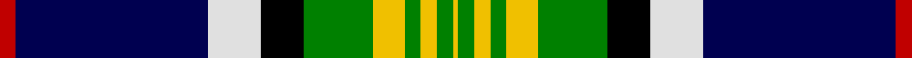

In pattern [RBWKGYGYGY](/stripes/rbwkgygygy/).

This was sourced from weddslist.  It is a [10 stripe tartan](/stripes/stripes10/).

Original link http://www.weddslist.com/cgi-bin/tartans/pg.pl?source=sts

## Thread count
R/6 DB72 LN20 K16 G26 Y12 G6 Y6 G6 Y/2

## Palette
Each colour and the base-6 reference it is a variant of.

| Colour | Shade | Base |
|---|---|---|
| DB | <code style="background-color:#000050;">#000050</code> `oklch(19.5% 0.135 264.1)` <small>#000050</small> | B <code style="background-color:#2A418A;">#2A418A</code> |
| G | <code style="background-color:#008000;">#008000</code> `oklch(52.0% 0.177 142.5)` <small>#008000</small> | G <code style="background-color:#006100;">#006100</code> |
| K | <code style="background-color:#000000;">#000000</code> `oklch(0.0% 0.000 0.0)` <small>#000000</small> | K <code style="background-color:#000000;">#000000</code> |
| LN | <code style="background-color:#E0E0E0;">#E0E0E0</code> `oklch(90.7% 0.000 89.9)` <small>#E0E0E0</small> | W <code style="background-color:#F7F7F7;">#F7F7F7</code> |
| R | <code style="background-color:#C00000;">#C00000</code> `oklch(50.7% 0.208 29.2)` <small>#C00000</small> | R <code style="background-color:#CC0000;">#CC0000</code> |
| Y | <code style="background-color:#F0C000;">#F0C000</code> `oklch(82.7% 0.169 90.5)` <small>#F0C000</small> | Y <code style="background-color:#F2BF00;">#F2BF00</code> |

## Nearest tartans

The nearest existing variants by ΔTartan distance, with this tartan at the top so the swatches line up against it.

ΔTartan

Tartan

Sett

—

<a href="/ttd/edit/#slug=r3db36w10k8g13ly6g3ly3g3ly1~x2">Crookdake Cheng</a> <a class="nn-out" href="/setts/s10/r3db36w10k8g13ly6g3ly3g3ly1~x2/" title="open its dictionary page">↗</a>

0.75

<a href="/ttd/edit/#slug=r3db36lb10k8g13lo6g3lo3g3lo1~x2">Crookdake Cheng Family Tartan Tartan Number: 2207. Earliest known date: 1994 Designed by Phil Smith 1994 for the then Treasurer/Accountant of the Scottish Tartans Society at the request of Keith Lumsden. The yellow represents rice stalks. See products available Copyright © Blair Urquhart, Comrie, 2015</a> <a class="nn-out" href="/setts/s10/r3db36lb10k8g13lo6g3lo3g3lo1~x2/" title="open its dictionary page">↗</a>

0.91

<a href="/ttd/edit/#slug=lg2dg9k16r2t30lg3dg6w1~x2">Climb, The</a> <a class="nn-out" href="/setts/s8/lg2dg9k16r2t30lg3dg6w1~x2/" title="open its dictionary page">↗</a>

0.93

<a href="/ttd/edit/#slug=lb11k2lb2k2lo2k11dg30r2dg3k1w5~x2">Labrador (District)</a> <a class="nn-out" href="/setts/s11/lb11k2lb2k2lo2k11dg30r2dg3k1w5~x2/" title="open its dictionary page">↗</a>

0.95

<a href="/ttd/edit/#slug=r2db24lb6k6g6ly4g2ly2g2ly1~x2">Crookdake-Cheng (Personal)</a> <a class="nn-out" href="/setts/s10/r2db24lb6k6g6ly4g2ly2g2ly1~x2/" title="open its dictionary page">↗</a>

1.05

<a href="/ttd/edit/#slug=lb16ly3lb9b14lb1b8k32r1w4~x2">Wrens (WRNS) (Military)</a> <a class="nn-out" href="/setts/s9/lb16ly3lb9b14lb1b8k32r1w4~x2/" title="open its dictionary page">↗</a>

1.09

<a href="/ttd/edit/#slug=g30dp4r6w6db6dp3k14w14db50g50w2">Brehat (Personal)</a> <a class="nn-out" href="/setts/s11/g30dp4r6w6db6dp3k14w14db50g50w2/" title="open its dictionary page">↗</a>

1.13

<a href="/ttd/edit/#slug=k2w2k8ly8db24g13k3r1~x2">Froben, Christian (Personal)</a> <a class="nn-out" href="/setts/s8/k2w2k8ly8db24g13k3r1~x2/" title="open its dictionary page">↗</a>

1.14

<a href="/ttd/edit/#slug=dt3db28w2ly2db1dg4dt8w3r4ly10dt2~x2">Colours of Hope</a> <a class="nn-out" href="/setts/s11/dt3db28w2ly2db1dg4dt8w3r4ly10dt2~x2/" title="open its dictionary page">↗</a>

1.18

<a href="/ttd/edit/#slug=ly4db7ly4k26g3k1g3w9r2w4r2~x2">Beaudoux - Amis Picards (District)</a> <a class="nn-out" href="/setts/s11/ly4db7ly4k26g3k1g3w9r2w4r2~x2/" title="open its dictionary page">↗</a>

1.18

<a href="/ttd/edit/#slug=g3dp2g25k6r2k6t20k1lb2~x2">Birch (Name)</a> <a class="nn-out" href="/setts/s9/g3dp2g25k6r2k6t20k1lb2~x2/" title="open its dictionary page">↗</a>

## Neighbour map

Every grey dot is one of 14299 variants placed by the first two principal components of the ΔTartan feature space (44% of its variance). Red is this tartan; blue dots are its nearest — click one to open its page.

<svg viewBox="0 0 640 380" role="img" style="max-width:100%;height:auto;border:1px solid #e0e0e0;border-radius:4px;display:block" xmlns="http://www.w3.org/2000/svg"><image href="/nn/cloud.v1.png" width="640" height="380"/><a href="/setts/s10/r3db36lb10k8g13lo6g3lo3g3lo1~x2/"><circle cx="187.4" cy="80.7" r="4" fill="#3465a4"><title>Crookdake Cheng Family Tartan Tartan Number: 2207. Earliest known date: 1994 Designed by Phil Smith 1994 for the then Treasurer/Accountant of the Scottish Tartans Society at the request of Keith Lumsden. The yellow represents rice stalks. See products available Copyright © Blair Urquhart, Comrie, 2015</title></circle></a><a href="/setts/s8/lg2dg9k16r2t30lg3dg6w1~x2/"><circle cx="206.7" cy="100.5" r="4" fill="#3465a4"><title>Climb, The</title></circle></a><a href="/setts/s11/lb11k2lb2k2lo2k11dg30r2dg3k1w5~x2/"><circle cx="223.5" cy="78.1" r="4" fill="#3465a4"><title>Labrador (District)</title></circle></a><a href="/setts/s10/r2db24lb6k6g6ly4g2ly2g2ly1~x2/"><circle cx="173.8" cy="88.8" r="4" fill="#3465a4"><title>Crookdake-Cheng (Personal)</title></circle></a><a href="/setts/s9/lb16ly3lb9b14lb1b8k32r1w4~x2/"><circle cx="150.1" cy="92.6" r="4" fill="#3465a4"><title>Wrens (WRNS) (Military)</title></circle></a><a href="/setts/s11/g30dp4r6w6db6dp3k14w14db50g50w2/"><circle cx="193.3" cy="99.4" r="4" fill="#3465a4"><title>Brehat (Personal)</title></circle></a><a href="/setts/s8/k2w2k8ly8db24g13k3r1~x2/"><circle cx="167.5" cy="118.4" r="4" fill="#3465a4"><title>Froben, Christian (Personal)</title></circle></a><a href="/setts/s11/dt3db28w2ly2db1dg4dt8w3r4ly10dt2~x2/"><circle cx="198.6" cy="77.0" r="4" fill="#3465a4"><title>Colours of Hope</title></circle></a><a href="/setts/s11/ly4db7ly4k26g3k1g3w9r2w4r2~x2/"><circle cx="163.2" cy="73.9" r="4" fill="#3465a4"><title>Beaudoux - Amis Picards (District)</title></circle></a><a href="/setts/s9/g3dp2g25k6r2k6t20k1lb2~x2/"><circle cx="193.6" cy="102.0" r="4" fill="#3465a4"><title>Birch (Name)</title></circle></a><circle cx="179.0" cy="75.3" r="5" fill="#c00000"/></svg>

ID: /setts/s10/r3db36w10k8g13ly6g3ly3g3ly1~x2/
