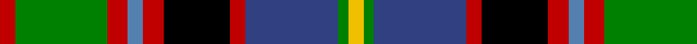

In pattern [RGRBRKRBGY](/patterns/rgrbrkrbgy/).

This was sourced from weddslist.  It is a [10 stripes tartan](/stripes/stripes10/).

Original link http://www.weddslist.com/cgi-bin/tartans/pg.pl?source=sts

## Thread count
R/6 G36 R8 Ba6 R8 K26 R6 B36 G4 Y/6

## Palette
Each colour and its ΔE from the base-6 reference it is a variant of.

| Colour | Shade | Base | ΔE (OKLab) |
|---|---|---|---|
| B | <code style="background-color:#304080;">#304080</code> `#304080` | B <code style="background-color:#2A418A;">#2A418A</code> | 0.02 |
| Ba | <code style="background-color:#5480B0;">#5480B0</code> `#5480B0` | B <code style="background-color:#2A418A;">#2A418A</code> | 0.19 |
| G | <code style="background-color:#008000;">#008000</code> `#008000` | G <code style="background-color:#006100;">#006100</code> | 0.10 |
| K | <code style="background-color:#000000;">#000000</code> `#000000` | K <code style="background-color:#000000;">#000000</code> | 0.00 |
| R | <code style="background-color:#C00000;">#C00000</code> `#C00000` | R <code style="background-color:#CC0000;">#CC0000</code> | 0.03 |
| Y | <code style="background-color:#F0C000;">#F0C000</code> `#F0C000` | Y <code style="background-color:#F2BF00;">#F2BF00</code> | 0.00 |

## Nearest tartans

The nearest existing variants by ΔTartan distance.

1. [National Trade Tartan Tartan Number: 1775. Earliest known date: 1934 This sett was designed by the National Association of Scottish Woollen Manufacturers in 1934. (STS archives) Some 60 years later (1994) a new 'National' tartan has been developed. See 'Scottish National' and 'Scottish National Dress'. See products available Copyright © Blair Urquhart, Comrie, 2015](/setts/s9/w2b3r6k8g12y1b4k2w2~b2c2c80-g006818-k101010-rc80000-we0e0e0-ye8c000~x2/) — ΔT 0.68
1. [National (1934), The](/setts/s9/w2b3r6k8g12y1b4k2w2~b1c0070-g006818-k101010-rc80000-wfcfcfc-yd09800~x2/) — ΔT 0.69
1. [Comyn/Cumming](/setts/s9/b4k2b4k10y1g10r4w1r4~b3c82af-g005020-k101010-rdc0000-we0e0e0-ye8c000~x4/) — ΔT 0.78
1. [Comyn, Cumming](/setts/s9/b4k2b4k10y1g10r4w1r4~b5480b0-g008000-k000000-rc00000-we0e0e0-yf0c000~x4/) — ΔT 0.78
1. [National](/setts/s9/w2b3r6k8g12y1b4k2w2~b304080-g008000-k000000-rc00000-we0e0e0-yf0c000~x2/) — ΔT 0.80
1. [Stirling and Bannockburn District Tartan Tartan Number: 1536. Earliest known date: 1847 The Stirling and Bannockburn Caledonian Society tartan produced by Wilson's of Bannockburn around 1847, has been recognised in more recent times as the District tartan for the Stirling and Bannockburn area of central Scotland. See products available Copyright © Blair Urquhart, Comrie, 2015](/setts/s10/r3g18r4b3r4k13r3ba18g2y3~b5c8ca8-ba2c2c80-g006818-k101010-rc80000-ye8c000~x2/) — ΔT 0.81
1. [Gordonstoun](/setts/s12/y4g20r3b11ba3r11g11r3k20r3k3ba3~b304080-ba5480b0-g008000-k000000-r900030-yf0c000~x2/) — ΔT 0.81
1. [Leitrim Irish County Tartan Tartan Number: 2271. Earliest known date: 1996 One of a series of Irish District tartans designed by Polly Wittering of the House of Edgar, with colours reminiscent of the Country with soft warm colours dominating. See products available Copyright © Blair Urquhart, Comrie, 2015](/setts/s10/y3k18y4g3y4r13y3ya18k2yb3~g28200c-k000000-rc05830-y749cb0-yaa4a8a8-ybd88c74~x2/) — ΔT 0.84
1. [MacLean](/setts/s11/b8k8y2k3w3k3g24r16b3r4k2~b304080-g008000-k000000-rc00000-we0e0e0-yf0c000~x2/) — ΔT 0.85
1. [George Brown](/setts/s9/y3b29k15r4g25r8k4r3w2~b304080-g008000-k000000-rc00000-we0e0e0-yf0c000~x2/) — ΔT 0.87

## Neighbour map

Every grey dot is one of 15726 variants placed by the first two principal components of the ΔTartan feature space (44% of its variance). Red is this tartan; blue dots are its nearest — click one to open its page.

<svg viewBox="0 0 640 380" role="img" style="max-width:100%;height:auto;border:1px solid #e0e0e0;border-radius:4px;display:block" xmlns="http://www.w3.org/2000/svg"><image href="/nn/cloud.v1.png" width="640" height="380"/><a href="/setts/s9/w2b3r6k8g12y1b4k2w2~b2c2c80-g006818-k101010-rc80000-we0e0e0-ye8c000~x2/"><circle cx="78.3" cy="146.8" r="4" fill="#3465a4"><title>National Trade Tartan Tartan Number: 1775. Earliest known date: 1934 This sett was designed by the National Association of Scottish Woollen Manufacturers in 1934. (STS archives) Some 60 years later (1994) a new 'National' tartan has been developed. See 'Scottish National' and 'Scottish National Dress'. See products available Copyright © Blair Urquhart, Comrie, 2015</title></circle></a><a href="/setts/s9/w2b3r6k8g12y1b4k2w2~b1c0070-g006818-k101010-rc80000-wfcfcfc-yd09800~x2/"><circle cx="71.5" cy="144.6" r="4" fill="#3465a4"><title>National (1934), The</title></circle></a><a href="/setts/s9/b4k2b4k10y1g10r4w1r4~b3c82af-g005020-k101010-rdc0000-we0e0e0-ye8c000~x4/"><circle cx="83.3" cy="160.3" r="4" fill="#3465a4"><title>Comyn/Cumming</title></circle></a><a href="/setts/s9/b4k2b4k10y1g10r4w1r4~b5480b0-g008000-k000000-rc00000-we0e0e0-yf0c000~x4/"><circle cx="61.6" cy="154.3" r="4" fill="#3465a4"><title>Comyn, Cumming</title></circle></a><a href="/setts/s9/w2b3r6k8g12y1b4k2w2~b304080-g008000-k000000-rc00000-we0e0e0-yf0c000~x2/"><circle cx="62.0" cy="142.3" r="4" fill="#3465a4"><title>National</title></circle></a><a href="/setts/s10/r3g18r4b3r4k13r3ba18g2y3~b5c8ca8-ba2c2c80-g006818-k101010-rc80000-ye8c000~x2/"><circle cx="89.9" cy="150.6" r="4" fill="#3465a4"><title>Stirling and Bannockburn District Tartan Tartan Number: 1536. Earliest known date: 1847 The Stirling and Bannockburn Caledonian Society tartan produced by Wilson's of Bannockburn around 1847, has been recognised in more recent times as the District tartan for the Stirling and Bannockburn area of central Scotland. See products available Copyright © Blair Urquhart, Comrie, 2015</title></circle></a><a href="/setts/s12/y4g20r3b11ba3r11g11r3k20r3k3ba3~b304080-ba5480b0-g008000-k000000-r900030-yf0c000~x2/"><circle cx="62.0" cy="154.1" r="4" fill="#3465a4"><title>Gordonstoun</title></circle></a><a href="/setts/s10/y3k18y4g3y4r13y3ya18k2yb3~g28200c-k000000-rc05830-y749cb0-yaa4a8a8-ybd88c74~x2/"><circle cx="55.3" cy="133.3" r="4" fill="#3465a4"><title>Leitrim Irish County Tartan Tartan Number: 2271. Earliest known date: 1996 One of a series of Irish District tartans designed by Polly Wittering of the House of Edgar, with colours reminiscent of the Country with soft warm colours dominating. See products available Copyright © Blair Urquhart, Comrie, 2015</title></circle></a><a href="/setts/s11/b8k8y2k3w3k3g24r16b3r4k2~b304080-g008000-k000000-rc00000-we0e0e0-yf0c000~x2/"><circle cx="96.4" cy="118.2" r="4" fill="#3465a4"><title>MacLean</title></circle></a><a href="/setts/s9/y3b29k15r4g25r8k4r3w2~b304080-g008000-k000000-rc00000-we0e0e0-yf0c000~x2/"><circle cx="106.9" cy="127.6" r="4" fill="#3465a4"><title>George Brown</title></circle></a><circle cx="67.9" cy="143.2" r="5" fill="#c00000"/></svg>

ID: /setts/s10/r3g18r4b3r4k13r3ba18g2y3~b5480b0-ba304080-g008000-k000000-rc00000-yf0c000~x2/
