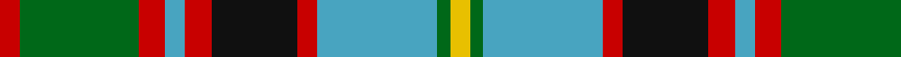

**Bands:** [RGRYRKRYGY](/stripes/rgryrkrygy/) · **Stripes:** [R G R LG R K R LG G LY](/stripes/stripes10/) R G R LG R K R LG G LY

This was sourced from tartans-authority.  It is a [10 band tartan](/bands/bands10/).

Original link http://www.tartansauthority.com/tartan-ferret/display/1536/

## Thread count
R/6 G36 R8 B6 R8 K26 R6 B36 G4 Y/6

## Palette
Each colour and its ΔE from the base-6 reference it is a variant of.

| Colour | Shade | Base | ΔE (OKLab) |
|---|---|---|---|
| B | <code style="background-color:#48A4C0;">#48A4C0</code> `#48A4C0` | Y <code style="background-color:#F2BF00;">#F2BF00</code> | 0.29 |
| G | <code style="background-color:#006818;">#006818</code> `#006818` | G <code style="background-color:#006100;">#006100</code> | 0.02 |
| K | <code style="background-color:#101010;">#101010</code> `#101010` | K <code style="background-color:#000000;">#000000</code> | 0.17 |
| R | <code style="background-color:#C80000;">#C80000</code> `#C80000` | R <code style="background-color:#CC0000;">#CC0000</code> | 0.01 |
| Y | <code style="background-color:#E8C000;">#E8C000</code> `#E8C000` | Y <code style="background-color:#F2BF00;">#F2BF00</code> | 0.02 |

## Nearest tartans

The nearest existing variants by ΔTartan distance.

1. [Leitrem County Crest (Fashion)](/setts/s10/lo10db24lo5db13lo24db5g52db5db18w8/) — ΔT 0.63
1. [Lobban (Personal)](/setts/s10/ly5g2r2g12k9t12r2t2r2t2~x2/) — ΔT 0.78
1. [Stirling and Bannockburn](/setts/s10/r3g18r4lb3r4k13r3lg18g2ly3~x2/) — ΔT 0.88
1. [Leitrim County, Crest Range](/setts/s10/o10k24o5k13o24k5dg52k5db18w8/) — ΔT 0.97
1. [Macallan Distillery](/setts/s12/g8r1g2r3g12k12ly1t12r3t2r1t8~x2/) — ΔT 1.00
1. [MacDuff Dress #2](/setts/s10/r4k1r4g8k6lb3db2lb11db1r2~x4/) — ΔT 1.04
1. [Limerick](/setts/s11/dr6ly4dr3db2dr5db2dr3db2g15r3db2~x2/) — ΔT 1.06
1. [Heart of the Highlands](/setts/s9/lr18k3lr4w3lr4k19n20k2m4~x2/) — ΔT 1.09
1. [Equorian Olympic](/setts/s8/db2y1o1dg6w3o3o1y1/) — ΔT 1.09
1. [Carnegie Dress #2 (Fashion)](/setts/s13/w18r3w3r10w26r3k26g28r10g3r3g8lo6/) — ΔT 1.10

## Neighbour map

Every grey dot is one of 14299 variants placed by the first two principal components of the ΔTartan feature space (44% of its variance). Red is this tartan; blue dots are its nearest — click one to open its page.

<svg viewBox="0 0 640 380" role="img" style="max-width:100%;height:auto;border:1px solid #e0e0e0;border-radius:4px;display:block" xmlns="http://www.w3.org/2000/svg"><image href="/nn/cloud.v1.png" width="640" height="380"/><a href="/setts/s10/lo10db24lo5db13lo24db5g52db5db18w8/"><circle cx="126.4" cy="168.0" r="4" fill="#3465a4"><title>Leitrem County Crest (Fashion)</title></circle></a><a href="/setts/s10/ly5g2r2g12k9t12r2t2r2t2~x2/"><circle cx="91.9" cy="183.1" r="4" fill="#3465a4"><title>Lobban (Personal)</title></circle></a><a href="/setts/s10/r3g18r4lb3r4k13r3lg18g2ly3~x2/"><circle cx="75.4" cy="145.0" r="4" fill="#3465a4"><title>Stirling and Bannockburn</title></circle></a><a href="/setts/s10/o10k24o5k13o24k5dg52k5db18w8/"><circle cx="124.7" cy="166.5" r="4" fill="#3465a4"><title>Leitrim County, Crest Range</title></circle></a><a href="/setts/s12/g8r1g2r3g12k12ly1t12r3t2r1t8~x2/"><circle cx="151.8" cy="161.9" r="4" fill="#3465a4"><title>Macallan Distillery</title></circle></a><a href="/setts/s10/r4k1r4g8k6lb3db2lb11db1r2~x4/"><circle cx="103.8" cy="157.1" r="4" fill="#3465a4"><title>MacDuff Dress #2</title></circle></a><a href="/setts/s11/dr6ly4dr3db2dr5db2dr3db2g15r3db2~x2/"><circle cx="141.2" cy="174.8" r="4" fill="#3465a4"><title>Limerick</title></circle></a><a href="/setts/s9/lr18k3lr4w3lr4k19n20k2m4~x2/"><circle cx="141.8" cy="163.1" r="4" fill="#3465a4"><title>Heart of the Highlands</title></circle></a><a href="/setts/s8/db2y1o1dg6w3o3o1y1/"><circle cx="96.1" cy="194.6" r="4" fill="#3465a4"><title>Equorian Olympic</title></circle></a><a href="/setts/s13/w18r3w3r10w26r3k26g28r10g3r3g8lo6/"><circle cx="87.6" cy="137.9" r="4" fill="#3465a4"><title>Carnegie Dress #2 (Fashion)</title></circle></a><circle cx="106.9" cy="162.4" r="5" fill="#c00000"/></svg>

ID: /setts/s10/r3g18r4lg3r4k13r3lg18g2ly3~x2/
