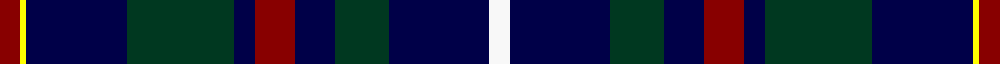

In pattern [RYBGBRBGBW](/stripes/rybgbrbgbw/).

This was sourced from register-of-tartans.  It is a [10 stripe tartan](/stripes/stripes10/).

Original link https://www.tartanregister.gov.uk/tartanDetails.aspx?ref=10891

## Register references

External register numbers recorded for this tartan.

- Scottish Register of Tartans: [10891](https://www.tartanregister.gov.uk/tartanDetails.aspx?ref=10891)

## Thread count
DR/6 Y2 DB30 DG32 DB6 DR12 DB12 DG16 DB30 W/6

## Palette
Each colour and its ΔE from the base-6 reference it is a variant of.

| Colour | Shade | Base | ΔE (OKLab) |
|---|---|---|---|
| DB | <code style="background-color:#000048;">#000048</code> `#000048` | B <code style="background-color:#2A418A;">#2A418A</code> | 0.22 |
| DG | <code style="background-color:#003820;">#003820</code> `#003820` | G <code style="background-color:#006100;">#006100</code> | 0.15 |
| DR | <code style="background-color:#880000;">#880000</code> `#880000` | R <code style="background-color:#CC0000;">#CC0000</code> | 0.15 |
| W | <code style="background-color:#F8F8F8;">#F8F8F8</code> `#F8F8F8` | W <code style="background-color:#F7F7F7;">#F7F7F7</code> | 0.00 |
| Y | <code style="background-color:#FFFF00;">#FFFF00</code> `#FFFF00` | Y <code style="background-color:#F2BF00;">#F2BF00</code> | 0.16 |

## Nearest tartans

The nearest existing variants by ΔTartan distance.

1. [Apache](/setts/s12/k15db7o3k13o3db7k23o3db7ly2dp4ly2~x2/) — ΔT 1.10
1. [Steve Walls](/setts/s10/r3ly1db15g16db3r6db6g8db15w3~x2/) — ΔT 1.18
1. [Dalmeny - 2002 (Fashion)](/setts/s10/db11w2db11k4g8r1~x2/) — ΔT 1.21
1. [Grainger](/setts/s12/db36r4db6g18db15k18w4~x2/) — ΔT 1.30
1. [Goodwin, Robert Richard (Personal)](/setts/s12/k5lb2b10lb2k5db15k2db15k5db10lb1ly2~x2/) — ΔT 1.33
1. [U.S.I. Limited](/setts/s11/k20n2t2n4dg20w2k16n7t2k3t5~x2/) — ΔT 1.34
1. [Croy, Jake (Personal)](/setts/s8/n10k7lt2lb2k27b7lt2b7~x2/) — ΔT 1.35
1. [Edgar (2014) (Name)](/setts/s13/w1db16k12lb2dp3lb2k12db2k2db2k2db7w1~x2/) — ΔT 1.36
1. [MacCainsh](/setts/s11/r2db8k1g2k1g4k1g2k1db8lo2~x2/) — ΔT 1.36
1. [Miller](/setts/s8/r2db6g15b9db30b9g6lo2~x2/) — ΔT 1.39

## Neighbour map

Every grey dot is one of 14299 variants placed by the first two principal components of the ΔTartan feature space (44% of its variance). Red is this tartan; blue dots are its nearest — click one to open its page.

<svg viewBox="0 0 640 380" role="img" style="max-width:100%;height:auto;border:1px solid #e0e0e0;border-radius:4px;display:block" xmlns="http://www.w3.org/2000/svg"><image href="/nn/cloud.v1.png" width="640" height="380"/><a href="/setts/s12/k15db7o3k13o3db7k23o3db7ly2dp4ly2~x2/"><circle cx="280.4" cy="173.1" r="4" fill="#3465a4"><title>Apache</title></circle></a><a href="/setts/s10/r3ly1db15g16db3r6db6g8db15w3~x2/"><circle cx="246.7" cy="171.7" r="4" fill="#3465a4"><title>Steve Walls</title></circle></a><a href="/setts/s10/db11w2db11k4g8r1~x2/"><circle cx="224.3" cy="196.8" r="4" fill="#3465a4"><title>Dalmeny - 2002 (Fashion)</title></circle></a><a href="/setts/s12/db36r4db6g18db15k18w4~x2/"><circle cx="206.6" cy="199.1" r="4" fill="#3465a4"><title>Grainger</title></circle></a><a href="/setts/s12/k5lb2b10lb2k5db15k2db15k5db10lb1ly2~x2/"><circle cx="263.2" cy="168.0" r="4" fill="#3465a4"><title>Goodwin, Robert Richard (Personal)</title></circle></a><a href="/setts/s11/k20n2t2n4dg20w2k16n7t2k3t5~x2/"><circle cx="210.0" cy="173.7" r="4" fill="#3465a4"><title>U.S.I. Limited</title></circle></a><a href="/setts/s8/n10k7lt2lb2k27b7lt2b7~x2/"><circle cx="267.0" cy="169.1" r="4" fill="#3465a4"><title>Croy, Jake (Personal)</title></circle></a><a href="/setts/s13/w1db16k12lb2dp3lb2k12db2k2db2k2db7w1~x2/"><circle cx="252.0" cy="148.0" r="4" fill="#3465a4"><title>Edgar (2014) (Name)</title></circle></a><a href="/setts/s11/r2db8k1g2k1g4k1g2k1db8lo2~x2/"><circle cx="224.0" cy="186.7" r="4" fill="#3465a4"><title>MacCainsh</title></circle></a><a href="/setts/s8/r2db6g15b9db30b9g6lo2~x2/"><circle cx="230.0" cy="180.7" r="4" fill="#3465a4"><title>Miller</title></circle></a><circle cx="254.0" cy="183.5" r="5" fill="#c00000"/></svg>

ID: /setts/s10/r3ly1db15dg16db3r6db6dg8db15w3~x2/
