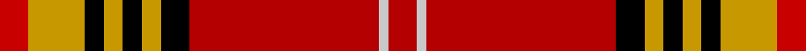

This page is one **sett** — a single exact thread-count. It belongs to the [tartan](/tartans/r3ly6k2ly2k2ly2k3ri20lb1ri3/)
(the same proportion at any scale), whose colour order is pattern [RWRKYKYKYR](/stripes/rwrkykykyr/).

Sourced from tartans-authority.  It is a [10 stripe tartan](/stripes/stripes10/).

Original link http://www.tartansauthority.com/tartan-ferret/display/5656/

## Register references

External register numbers recorded for this tartan.

- Scottish Tartans Authority (ITI): 5656

## Thread count
R/12 DY24 K8 DY8 K8 DY8 K12 Ra80 N4 Ra/12

## Palette

Palette: <strong>Tartan Register</strong> <small style="color:#888">(4 of 5 colours)</small>
<table><thead><tr><th>Colour</th><th>Threads</th><th>Shade</th><th>Base</th><th>OKLCh</th></tr></thead><tbody><tr><td>R/</td><td style="text-align:right;font-variant-numeric:tabular-nums">12</td><td><code style="background-color:#C80000;">#C80000</code> <small style="color:#888">#C80000</small></td><td>R <code style="background-color:#CC0000;">#CC0000</code></td><td><small style="color:#888">oklch(52.3% 0.215 29.2)</small></td></tr><tr><td>DY</td><td style="text-align:right;font-variant-numeric:tabular-nums">24</td><td><code style="background-color:#C89800;">#C89800</code> <small style="color:#888">#C89800</small></td><td>Y <code style="background-color:#F2BF00;">#F2BF00</code></td><td><small style="color:#888">oklch(70.6% 0.144 85.9)</small></td></tr><tr><td>K</td><td style="text-align:right;font-variant-numeric:tabular-nums">8</td><td><code style="background-color:#000000;">#000000</code> <small style="color:#888">#000000</small></td><td>K <code style="background-color:#000000;">#000000</code></td><td><small style="color:#888">oklch(0.0% 0.000 0.0)</small></td></tr><tr><td>DY</td><td style="text-align:right;font-variant-numeric:tabular-nums">8</td><td><code style="background-color:#C89800;">#C89800</code> <small style="color:#888">#C89800</small></td><td>Y <code style="background-color:#F2BF00;">#F2BF00</code></td><td><small style="color:#888">oklch(70.6% 0.144 85.9)</small></td></tr><tr><td>K</td><td style="text-align:right;font-variant-numeric:tabular-nums">8</td><td><code style="background-color:#000000;">#000000</code> <small style="color:#888">#000000</small></td><td>K <code style="background-color:#000000;">#000000</code></td><td><small style="color:#888">oklch(0.0% 0.000 0.0)</small></td></tr><tr><td>DY</td><td style="text-align:right;font-variant-numeric:tabular-nums">8</td><td><code style="background-color:#C89800;">#C89800</code> <small style="color:#888">#C89800</small></td><td>Y <code style="background-color:#F2BF00;">#F2BF00</code></td><td><small style="color:#888">oklch(70.6% 0.144 85.9)</small></td></tr><tr><td>K</td><td style="text-align:right;font-variant-numeric:tabular-nums">12</td><td><code style="background-color:#000000;">#000000</code> <small style="color:#888">#000000</small></td><td>K <code style="background-color:#000000;">#000000</code></td><td><small style="color:#888">oklch(0.0% 0.000 0.0)</small></td></tr><tr><td>Ra</td><td style="text-align:right;font-variant-numeric:tabular-nums">80</td><td><code style="background-color:#B40000;">#B40000</code> <small style="color:#888">#B40000</small></td><td>R <code style="background-color:#CC0000;">#CC0000</code></td><td><small style="color:#888">oklch(48.3% 0.198 29.2)</small></td></tr><tr><td>N</td><td style="text-align:right;font-variant-numeric:tabular-nums">4</td><td><code style="background-color:#C8C8C8;">#C8C8C8</code> <small style="color:#888">#C8C8C8</small></td><td>W <code style="background-color:#F7F7F7;">#F7F7F7</code></td><td><small style="color:#888">oklch(83.3% 0.000 89.9)</small></td></tr><tr><td>Ra/</td><td style="text-align:right;font-variant-numeric:tabular-nums">12</td><td><code style="background-color:#B40000;">#B40000</code> <small style="color:#888">#B40000</small></td><td>R <code style="background-color:#CC0000;">#CC0000</code></td><td><small style="color:#888">oklch(48.3% 0.198 29.2)</small></td></tr></tbody></table>

## Nearest tartans

The nearest existing variants by ΔTartan distance, with this tartan at the top so the swatches line up against it.

ΔTartan

Tartan

Sett

—

<a href="/ttd/edit/#slug=r3ly6k2ly2k2ly2k3ri20lb1ri3~x4">Motherwell F.C. Fir Park Dress (Spor</a> <a class="nn-out" href="/setts/s10/r3ly6k2ly2k2ly2k3ri20lb1ri3~x4/" title="open its dictionary page">↗</a>

1.16

<a href="/ttd/edit/#slug=r50ly8k2w2k2ly8k22r3~x2">FIRES Center of Excelence</a> <a class="nn-out" href="/setts/s8/r50ly8k2w2k2ly8k22r3~x2/" title="open its dictionary page">↗</a>

1.19

<a href="/setts/s15/r31lg3r2lg2r3lg2r2lg3r15ki15lg2k15lg3k3w2~x2/">Moir (Loch Insh) (Personal)</a>

1.20

<a href="/ttd/edit/#slug=r6lb1r24db6dg2k1dg2k1dg12r1">Chisholm VS</a> <a class="nn-out" href="/setts/s10/r6lb1r24db6dg2k1dg2k1dg12r1/" title="open its dictionary page">↗</a>

1.20

<a href="/ttd/edit/#slug=r6w1r24db6dg2k1dg2k1dg12r1~x2">Chisholm #2</a> <a class="nn-out" href="/setts/s10/r6w1r24db6dg2k1dg2k1dg12r1~x2/" title="open its dictionary page">↗</a>

1.22

<a href="/ttd/edit/#slug=r28dg4k4dg4k4t6ly1~x2">Livingstone MacLay MacLeay</a> <a class="nn-out" href="/setts/s7/r28dg4k4dg4k4t6ly1~x2/" title="open its dictionary page">↗</a>

1.24

<a href="/setts/s10/r24lri2lr7lri3ki2k4ki2lri1r4lri1~x2/">VeMMA Corporate Tartan Tartan Number: 10730. Earliest known date: 5 November 2012 Created for VeMMA International. VeMMA is a nutritional supplement company marketing fruit juice drinks that have been enhanced with vitamins and anti-oxidants (the name VeMMA is an acronym for Vitamins, essential Minerals, Mangosteen and Aloe vera). VeMMA offers an affiliate marketing program to those who wish to recommend its products. Colours: the orange represents enhanced health through supplementation; silver represents liquid and silver also purifies, soothes, inspires, and reflects back positive energy. See products available Copyright © Blair Urquhart, Comrie, 2015</a>

1.26

<a href="/ttd/edit/#slug=r28g4k4g4k4t6ly1~x2">Livingstone, MacLay MacLeay</a> <a class="nn-out" href="/setts/s7/r28g4k4g4k4t6ly1~x2/" title="open its dictionary page">↗</a>

1.29

<a href="/ttd/edit/#slug=r21db4k5ly2k2ly2k2r7g4r2db3ly2~x2">Hepburn</a> <a class="nn-out" href="/setts/s12/r21db4k5ly2k2ly2k2r7g4r2db3ly2~x2/" title="open its dictionary page">↗</a>

1.29

<a href="/ttd/edit/#slug=k3r24k4ly1k2w1db4dg6r3k1r2w1~x4">Stewart of Galloway - 1842 (Clan)</a> <a class="nn-out" href="/setts/s12/k3r24k4ly1k2w1db4dg6r3k1r2w1~x4/" title="open its dictionary page">↗</a>

1.30

<a href="/ttd/edit/#slug=n4ly2n2k5n4k4n8k6n2r32n2w4~x2">Orr Senior, Gerald William</a> <a class="nn-out" href="/setts/s12/n4ly2n2k5n4k4n8k6n2r32n2w4~x2/" title="open its dictionary page">↗</a>

## Neighbour map

Every grey dot is one of 14359 variants placed by the first two principal components of the ΔTartan feature space (44% of its variance). Red is this tartan; blue dots are its nearest — click one to open its page.

<svg viewBox="0 0 640 380" role="img" style="max-width:100%;height:auto;border:1px solid #e0e0e0;border-radius:4px;display:block" xmlns="http://www.w3.org/2000/svg"><image href="/nn/cloud.v1.png" width="640" height="380"/><a href="/setts/s8/r50ly8k2w2k2ly8k22r3~x2/"><circle cx="336.0" cy="107.6" r="4" fill="#3465a4"><title>FIRES Center of Excelence</title></circle></a><a href="/setts/s15/r31lg3r2lg2r3lg2r2lg3r15ki15lg2k15lg3k3w2~x2/"><circle cx="235.5" cy="80.0" r="4" fill="#3465a4"><title>Moir (Loch Insh) (Personal)</title></circle></a><a href="/setts/s10/r6lb1r24db6dg2k1dg2k1dg12r1/"><circle cx="330.4" cy="103.1" r="4" fill="#3465a4"><title>Chisholm VS</title></circle></a><a href="/setts/s10/r6w1r24db6dg2k1dg2k1dg12r1~x2/"><circle cx="339.6" cy="103.3" r="4" fill="#3465a4"><title>Chisholm #2</title></circle></a><a href="/setts/s7/r28dg4k4dg4k4t6ly1~x2/"><circle cx="323.9" cy="110.6" r="4" fill="#3465a4"><title>Livingstone MacLay MacLeay</title></circle></a><a href="/setts/s10/r24lri2lr7lri3ki2k4ki2lri1r4lri1~x2/"><circle cx="306.0" cy="74.1" r="4" fill="#3465a4"><title>VeMMA Corporate Tartan Tartan Number: 10730. Earliest known date: 5 November 2012 Created for VeMMA International. VeMMA is a nutritional supplement company marketing fruit juice drinks that have been enhanced with vitamins and anti-oxidants (the name VeMMA is an acronym for Vitamins, essential Minerals, Mangosteen and Aloe vera). VeMMA offers an affiliate marketing program to those who wish to recommend its products. Colours: the orange represents enhanced health through supplementation; silver represents liquid and silver also purifies, soothes, inspires, and reflects back positive energy. See products available Copyright © Blair Urquhart, Comrie, 2015</title></circle></a><a href="/setts/s7/r28g4k4g4k4t6ly1~x2/"><circle cx="308.9" cy="107.5" r="4" fill="#3465a4"><title>Livingstone, MacLay MacLeay</title></circle></a><a href="/setts/s12/r21db4k5ly2k2ly2k2r7g4r2db3ly2~x2/"><circle cx="242.2" cy="118.9" r="4" fill="#3465a4"><title>Hepburn</title></circle></a><a href="/setts/s12/k3r24k4ly1k2w1db4dg6r3k1r2w1~x4/"><circle cx="304.1" cy="64.7" r="4" fill="#3465a4"><title>Stewart of Galloway - 1842 (Clan)</title></circle></a><a href="/setts/s12/n4ly2n2k5n4k4n8k6n2r32n2w4~x2/"><circle cx="217.9" cy="90.7" r="4" fill="#3465a4"><title>Orr Senior, Gerald William</title></circle></a><circle cx="284.8" cy="96.6" r="5" fill="#c00000"/></svg>

ID: /setts/s10/r3ly6k2ly2k2ly2k3ri20lb1ri3~x4/
