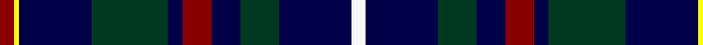

In pattern [RYBGBRBGBW](/patterns/rybgbrbgbw/).

This was sourced from register-of-tartans.  It is a [10 stripes tartan](/stripes/stripes10/).

Original link https://www.tartanregister.gov.uk/tartanDetails.aspx?ref=10891

## Thread count
DR/6 Y2 DB30 DG32 DB6 DR12 DB12 DG16 DB30 W/6

## Palette
Each colour and its ΔE from the base-6 reference it is a variant of.

| Colour | Shade | Base | ΔE (OKLab) |
|---|---|---|---|
| DB | <code style="background-color:#000048;">#000048</code> `#000048` | B <code style="background-color:#2A418A;">#2A418A</code> | 0.22 |
| DG | <code style="background-color:#003820;">#003820</code> `#003820` | G <code style="background-color:#006100;">#006100</code> | 0.15 |
| DR | <code style="background-color:#880000;">#880000</code> `#880000` | R <code style="background-color:#CC0000;">#CC0000</code> | 0.15 |
| W | <code style="background-color:#F8F8F8;">#F8F8F8</code> `#F8F8F8` | W <code style="background-color:#F7F7F7;">#F7F7F7</code> | 0.00 |
| Y | <code style="background-color:#FFFF00;">#FFFF00</code> `#FFFF00` | Y <code style="background-color:#F2BF00;">#F2BF00</code> | 0.16 |

## Nearest tartans

The nearest existing variants by ΔTartan distance.

1. [Apache](/setts/s12/k15b7r3k13r3b7k23r3b7y2ba4y2x2~b2c2c80-ba780078-k101010-r888888-ye8c000/) — ΔT 1.10
1. [Steve Walls](/setts/s10/r3y1b15g16b3r6b6g8b15w3x2~b202060-g006818-rc80000-wfcfcfc-ye8c000/) — ΔT 1.17
1. [Dalmeny - 2002 (Fashion)](/setts/s10/b11w2b11k4g8r1g8k4b11w2x2~b2c2c80-g006818-k101010-rc80000-wfcfcfc/) — ΔT 1.20
1. [Gillies Clan Tartan Tartan Number: 309. Earliest known date: c.1930 A name associated with Badenoch and the Hebrides. It means 'servant of Jesus'. See products available Copyright © Blair Urquhart, Comrie, 2015](/setts/s8/b32k12b12g6r6g18k2y3x2~b2c2c80-g006818-k101010-rc80000-ye8c000/) — ΔT 1.21
1. [Grainger](/setts/s12/b36r4b6g18b15k18w4k18b15g18b6r4x2~b2c2c80-g006818-k101010-rc80000-wfcfcfc/) — ΔT 1.30
1. [City of Sarnia (District)](/setts/s15/b10k2w2k3w2k10b10k1r2k1b10k10b10k1y2x2~b202060-k101010-rc80000-we0e0e0-yfccc00/) — ΔT 1.32
1. [Goodwin, Robert Richard (Personal)](/setts/s12/k5w2b10w2k5ba15k2ba15k5ba10w1y2x2~b1870a4-ba2c2c80-k101010-w98c8e8-yfccc00/) — ΔT 1.33
1. [U.S.I. Limited](/setts/s11/k20b2ba2b4g20w2k16b7ba2k3ba5x2~b5a5a82-ba3c82af-g005020-k000028-we0e0e0/) — ΔT 1.34
1. [Croy, Jake (Personal)](/setts/s8/b10k7w2wa2k27ba7w2ba7x2~b505050-ba1870a4-k1c1714-w82cffd-wae8ccb8/) — ΔT 1.35
1. [Edgar (2014) (Name)](/setts/s13/w1b16k12wa2ba3wa2k12b2k2b2k2b7w1x2~b202060-ba780078-k101010-wfcfcfc-wa98c8e8/) — ΔT 1.36

## Neighbour map

Every grey dot is one of 15726 variants placed by the first two principal components of the ΔTartan feature space (44% of its variance). Red is this tartan; blue dots are its nearest — click one to open its page.

<svg viewBox="0 0 640 380" role="img" style="max-width:100%;height:auto;border:1px solid #e0e0e0;border-radius:4px;display:block" xmlns="http://www.w3.org/2000/svg"><image href="/nn/cloud.v1.png" width="640" height="380"/><a href="/setts/s12/k15b7r3k13r3b7k23r3b7y2ba4y2x2~b2c2c80-ba780078-k101010-r888888-ye8c000/"><circle cx="277.7" cy="171.6" r="4" fill="#3465a4"><title>Apache</title></circle></a><a href="/setts/s10/r3y1b15g16b3r6b6g8b15w3x2~b202060-g006818-rc80000-wfcfcfc-ye8c000/"><circle cx="244.0" cy="170.8" r="4" fill="#3465a4"><title>Steve Walls</title></circle></a><a href="/setts/s10/b11w2b11k4g8r1g8k4b11w2x2~b2c2c80-g006818-k101010-rc80000-wfcfcfc/"><circle cx="221.1" cy="195.3" r="4" fill="#3465a4"><title>Dalmeny - 2002 (Fashion)</title></circle></a><a href="/setts/s8/b32k12b12g6r6g18k2y3x2~b2c2c80-g006818-k101010-rc80000-ye8c000/"><circle cx="247.7" cy="178.0" r="4" fill="#3465a4"><title>Gillies Clan Tartan Tartan Number: 309. Earliest known date: c.1930 A name associated with Badenoch and the Hebrides. It means 'servant of Jesus'. See products available Copyright © Blair Urquhart, Comrie, 2015</title></circle></a><a href="/setts/s12/b36r4b6g18b15k18w4k18b15g18b6r4x2~b2c2c80-g006818-k101010-rc80000-wfcfcfc/"><circle cx="203.5" cy="195.0" r="4" fill="#3465a4"><title>Grainger</title></circle></a><a href="/setts/s15/b10k2w2k3w2k10b10k1r2k1b10k10b10k1y2x2~b202060-k101010-rc80000-we0e0e0-yfccc00/"><circle cx="259.2" cy="172.7" r="4" fill="#3465a4"><title>City of Sarnia (District)</title></circle></a><a href="/setts/s12/k5w2b10w2k5ba15k2ba15k5ba10w1y2x2~b1870a4-ba2c2c80-k101010-w98c8e8-yfccc00/"><circle cx="260.0" cy="164.8" r="4" fill="#3465a4"><title>Goodwin, Robert Richard (Personal)</title></circle></a><a href="/setts/s11/k20b2ba2b4g20w2k16b7ba2k3ba5x2~b5a5a82-ba3c82af-g005020-k000028-we0e0e0/"><circle cx="206.1" cy="170.3" r="4" fill="#3465a4"><title>U.S.I. Limited</title></circle></a><a href="/setts/s8/b10k7w2wa2k27ba7w2ba7x2~b505050-ba1870a4-k1c1714-w82cffd-wae8ccb8/"><circle cx="264.0" cy="167.8" r="4" fill="#3465a4"><title>Croy, Jake (Personal)</title></circle></a><a href="/setts/s13/w1b16k12wa2ba3wa2k12b2k2b2k2b7w1x2~b202060-ba780078-k101010-wfcfcfc-wa98c8e8/"><circle cx="248.8" cy="144.5" r="4" fill="#3465a4"><title>Edgar (2014) (Name)</title></circle></a><circle cx="250.7" cy="180.9" r="5" fill="#c00000"/></svg>

ID: /setts/s10/r3y1b15g16b3r6b6g8b15w3x2~b000048-g003820-r880000-wf8f8f8-yffff00/
