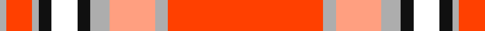

In pattern [RYYYKKKYRY](/patterns/ryyykkkyry/).

This was sourced from house-of-tartan.  It is a [10 stripes tartan](/stripes/stripes10/).

Original link http://www.house-of-tartan.scotland.net/house/TartanViewjs.asp?colr=Def&tnam=10730

## Thread count
N/2 R8 N2 K4 DN8 K4 N6 LR14 N4 R/48

## Palette
Each colour and its ΔE from the base-6 reference it is a variant of.

| Colour | Shade | Base | ΔE (OKLab) |
|---|---|---|---|
| K | <code style="background-color:#101010;">#101010</code> `#101010` | K <code style="background-color:#000000;">#000000</code> | 0.17 |
| LR | <code style="background-color:#FF9F80;">#FF9F80</code> `#FF9F80` | Y <code style="background-color:#F2BF00;">#F2BF00</code> | 0.14 |
| N | <code style="background-color:#ADADAD;">#ADADAD</code> `#ADADAD` | Y <code style="background-color:#F2BF00;">#F2BF00</code> | 0.19 |
| R | <code style="background-color:#FF4000;">#FF4000</code> `#FF4000` | R <code style="background-color:#CC0000;">#CC0000</code> | 0.13 |

## Nearest tartans

The nearest existing variants by ΔTartan distance.

1. [Drummond of Perth, dress](/setts/s9/r134y6b12w6wa50r20b12w14wa6-b505050-rc00000-wc0c0c0-wae0e0e0-yf0c000/) — ΔT 0.97
1. [Drummond of Perth Dress #3](/setts/s9/r134y6b12w6wa50r20b12w14wa6-b505050-rdc0000-wc0c0c0-wae0e0e0-ye8c000/) — ΔT 1.08
1. [Drummond of Perth Dress](/setts/s9/r80y2k4g2w30r10k10g10w2-g808080-k101010-rdc0000-we0e0e0-ye8c000/) — ΔT 1.12
1. [Drummond of Perth Dress Clan Tartan Tartan Number: 1717. Earliest known date: pre 2003 Nothing See products available Copyright © Blair Urquhart, Comrie, 2015](/setts/s9/r80y2k4ra2w30r10k10ra10w2-k101010-rc80000-ra888888-we0e0e0-ye8c000/) — ΔT 1.16
1. [Drummond of Perth, dress](/setts/s9/r80y2k4g2w30r10k10g10w2-g808080-k000000-rc00000-we0e0e0-yf0c000/) — ΔT 1.22
1. [Motherwell F.C. Fir Park Dress (Spor](/setts/s10/r12w4r80k12y8k8y8k8y24ra12-k000000-rb40000-rac80000-wc8c8c8-yc89800/) — ΔT 1.23
1. [VeMMA](/setts/s10/r48y4ya14y6k4b8k4y2r8y2-b6b747b-k101010-rff4000-yadadad-yaff9f80/) — ΔT 1.25
1. [O'Meehan (Name)](/setts/s9/y54k8w8r128w8r8k8r8k24-k101010-rc80050-we0e0e0-ye8c000/) — ΔT 1.30
1. [Longniddry Burgundy (Dance)](/setts/s8/r84ra4w4ra4r10rb24w64r8-r880000-rae87878-rbc80000-we0e0e0/) — ΔT 1.39
1. [Unidentified Plaid #7](/setts/s10/w8r100b42r5k3r5g42k42r100w8-b3c82af-g005020-k101010-rdc0000-we0e0e0/) — ΔT 1.44

## Neighbour map

Every grey dot is one of 15726 variants placed by the first two principal components of the ΔTartan feature space (44% of its variance). Red is this tartan; blue dots are its nearest — click one to open its page.

<svg viewBox="0 0 640 380" role="img" style="max-width:100%;height:auto;border:1px solid #e0e0e0;border-radius:4px;display:block" xmlns="http://www.w3.org/2000/svg"><image href="/nn/cloud.v1.png" width="640" height="380"/><a href="/setts/s9/r134y6b12w6wa50r20b12w14wa6-b505050-rc00000-wc0c0c0-wae0e0e0-yf0c000/"><circle cx="350.5" cy="90.8" r="4" fill="#3465a4"><title>Drummond of Perth, dress</title></circle></a><a href="/setts/s9/r134y6b12w6wa50r20b12w14wa6-b505050-rdc0000-wc0c0c0-wae0e0e0-ye8c000/"><circle cx="356.5" cy="89.8" r="4" fill="#3465a4"><title>Drummond of Perth Dress #3</title></circle></a><a href="/setts/s9/r80y2k4g2w30r10k10g10w2-g808080-k101010-rdc0000-we0e0e0-ye8c000/"><circle cx="373.6" cy="62.1" r="4" fill="#3465a4"><title>Drummond of Perth Dress</title></circle></a><a href="/setts/s9/r80y2k4ra2w30r10k10ra10w2-k101010-rc80000-ra888888-we0e0e0-ye8c000/"><circle cx="372.2" cy="64.0" r="4" fill="#3465a4"><title>Drummond of Perth Dress Clan Tartan Tartan Number: 1717. Earliest known date: pre 2003 Nothing See products available Copyright © Blair Urquhart, Comrie, 2015</title></circle></a><a href="/setts/s9/r80y2k4g2w30r10k10g10w2-g808080-k000000-rc00000-we0e0e0-yf0c000/"><circle cx="361.8" cy="61.5" r="4" fill="#3465a4"><title>Drummond of Perth, dress</title></circle></a><a href="/setts/s10/r12w4r80k12y8k8y8k8y24ra12-k000000-rb40000-rac80000-wc8c8c8-yc89800/"><circle cx="284.9" cy="98.4" r="4" fill="#3465a4"><title>Motherwell F.C. Fir Park Dress (Spor</title></circle></a><a href="/setts/s10/r48y4ya14y6k4b8k4y2r8y2-b6b747b-k101010-rff4000-yadadad-yaff9f80/"><circle cx="339.6" cy="90.0" r="4" fill="#3465a4"><title>VeMMA</title></circle></a><a href="/setts/s9/y54k8w8r128w8r8k8r8k24-k101010-rc80050-we0e0e0-ye8c000/"><circle cx="326.9" cy="113.0" r="4" fill="#3465a4"><title>O'Meehan (Name)</title></circle></a><a href="/setts/s8/r84ra4w4ra4r10rb24w64r8-r880000-rae87878-rbc80000-we0e0e0/"><circle cx="301.2" cy="119.2" r="4" fill="#3465a4"><title>Longniddry Burgundy (Dance)</title></circle></a><a href="/setts/s10/w8r100b42r5k3r5g42k42r100w8-b3c82af-g005020-k101010-rdc0000-we0e0e0/"><circle cx="336.7" cy="98.0" r="4" fill="#3465a4"><title>Unidentified Plaid #7</title></circle></a><circle cx="306.9" cy="77.2" r="5" fill="#c00000"/></svg>

ID: /setts/s10/r48y4ya14y6k4ka8k4y2r8y2-k101010-ka000000-rff4000-yadadad-yaff9f80/
