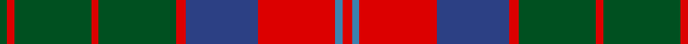

In pattern [GRGRGRBRBR](/patterns/grgrgrbrbr/).

This was sourced from register-of-tartans.  It is a [10 stripes tartan](/stripes/stripes10/).

Original link https://www.tartanregister.gov.uk/tartanDetails.aspx?ref=4348

## Thread count
G/6 R6 G64 R6 G64 R8 B60 R64 Ba6 R/8

## Palette
Each colour and its ΔE from the base-6 reference it is a variant of.

| Colour | Shade | Base | ΔE (OKLab) |
|---|---|---|---|
| B | <code style="background-color:#2C4084;">#2C4084</code> `#2C4084` | B <code style="background-color:#2A418A;">#2A418A</code> | 0.01 |
| Ba | <code style="background-color:#3C82AF;">#3C82AF</code> `#3C82AF` | B <code style="background-color:#2A418A;">#2A418A</code> | 0.19 |
| G | <code style="background-color:#005020;">#005020</code> `#005020` | G <code style="background-color:#006100;">#006100</code> | 0.07 |
| R | <code style="background-color:#DC0000;">#DC0000</code> `#DC0000` | R <code style="background-color:#CC0000;">#CC0000</code> | 0.03 |

## Nearest tartans

The nearest existing variants by ΔTartan distance.

1. [MacKillop (Clan)](/setts/s10/g3r2b2r14ba1b4r2g12r2b2~b2c2c80-ba2474e8-g006818-rc80000~x8/) — ΔT 0.82
1. [Unidentified Plaid 6](/setts/s10/r4b3r32ba30r4g32r3g32r3g3~b5480b0-ba304080-g008000-rc00000~x2/) — ΔT 0.87
1. [MacKillen](/setts/s9/k4y15g5k3g7k3g30r20g3~g003820-k101010-ra00000-ybc8c00~x2/) — ΔT 0.89
1. [Shieldhall (Fashion)](/setts/s12/b12r1b2r1b2w2b3ra9r1ra2r1ra3~b4c3428-rc80000-ra888888-wc0c0c0~x4/) — ΔT 0.89
1. [Cape Breton University Chemistry Society](/setts/s10/b4r17b4g4b2g4b4g27b4y4~b000080-g546c3a-r943602-yc49d38~x2/) — ΔT 0.89
1. [Leitrim](/setts/s10/g3b18g4b3g4r13g3g18b2y3~b401000-g808080-rc00000-yff8500~x2/) — ΔT 0.95
1. [Glenfinnan (Clan?)](/setts/s10/b28r26w2b5w2r26y28r5w2r5~b506880-r880000-wfcfcfc-y78a064~x2/) — ΔT 0.97
1. [Daks (Blue Loden)](/setts/s8/y3b7ba2r2ba14b2ba2y3~b5c8ca8-ba441800-ra00048-ya08858~x2/) — ΔT 0.98
1. [Convention of the Baronage (Corp)](/setts/s9/g3r9b1g9r1g1r9ba9r1~b2888c4-ba2c2c80-g006818-rc80000~x4/) — ΔT 0.98
1. [Leach (1999)](/setts/s12/k6r3k3r24b4g10r2g4r2g24r6b2~b2888c4-g006818-k101010-rc80000~x2/) — ΔT 1.01

## Neighbour map

Every grey dot is one of 15726 variants placed by the first two principal components of the ΔTartan feature space (44% of its variance). Red is this tartan; blue dots are its nearest — click one to open its page.

<svg viewBox="0 0 640 380" role="img" style="max-width:100%;height:auto;border:1px solid #e0e0e0;border-radius:4px;display:block" xmlns="http://www.w3.org/2000/svg"><image href="/nn/cloud.v1.png" width="640" height="380"/><a href="/setts/s10/g3r2b2r14ba1b4r2g12r2b2~b2c2c80-ba2474e8-g006818-rc80000~x8/"><circle cx="277.4" cy="162.2" r="4" fill="#3465a4"><title>MacKillop (Clan)</title></circle></a><a href="/setts/s10/r4b3r32ba30r4g32r3g32r3g3~b5480b0-ba304080-g008000-rc00000~x2/"><circle cx="259.5" cy="181.0" r="4" fill="#3465a4"><title>Unidentified Plaid 6</title></circle></a><a href="/setts/s9/k4y15g5k3g7k3g30r20g3~g003820-k101010-ra00000-ybc8c00~x2/"><circle cx="267.4" cy="194.6" r="4" fill="#3465a4"><title>MacKillen</title></circle></a><a href="/setts/s12/b12r1b2r1b2w2b3ra9r1ra2r1ra3~b4c3428-rc80000-ra888888-wc0c0c0~x4/"><circle cx="302.7" cy="165.9" r="4" fill="#3465a4"><title>Shieldhall (Fashion)</title></circle></a><a href="/setts/s10/b4r17b4g4b2g4b4g27b4y4~b000080-g546c3a-r943602-yc49d38~x2/"><circle cx="278.7" cy="171.9" r="4" fill="#3465a4"><title>Cape Breton University Chemistry Society</title></circle></a><a href="/setts/s10/g3b18g4b3g4r13g3g18b2y3~b401000-g808080-rc00000-yff8500~x2/"><circle cx="246.8" cy="185.1" r="4" fill="#3465a4"><title>Leitrim</title></circle></a><a href="/setts/s10/b28r26w2b5w2r26y28r5w2r5~b506880-r880000-wfcfcfc-y78a064~x2/"><circle cx="272.8" cy="167.2" r="4" fill="#3465a4"><title>Glenfinnan (Clan?)</title></circle></a><a href="/setts/s8/y3b7ba2r2ba14b2ba2y3~b5c8ca8-ba441800-ra00048-ya08858~x2/"><circle cx="265.5" cy="206.3" r="4" fill="#3465a4"><title>Daks (Blue Loden)</title></circle></a><a href="/setts/s9/g3r9b1g9r1g1r9ba9r1~b2888c4-ba2c2c80-g006818-rc80000~x4/"><circle cx="250.9" cy="197.0" r="4" fill="#3465a4"><title>Convention of the Baronage (Corp)</title></circle></a><a href="/setts/s12/k6r3k3r24b4g10r2g4r2g24r6b2~b2888c4-g006818-k101010-rc80000~x2/"><circle cx="254.7" cy="158.1" r="4" fill="#3465a4"><title>Leach (1999)</title></circle></a><circle cx="264.5" cy="181.7" r="5" fill="#c00000"/></svg>

ID: /setts/s10/r4b3r32ba30r4g32r3g32r3g3~b3c82af-ba2c4084-g005020-rdc0000~x2/
