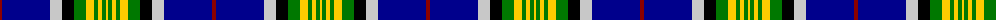

In pattern [RBWKGYGYGY](/patterns/rbwkgygygy/).

This was sourced from tartans-authority.  It is a [10 stripes tartan](/stripes/stripes10/).

Original link http://www.tartansauthority.com/tartan-ferret/display/2207/

## Thread count
DR/4 DB48 N12 K12 G12 Y8 G4 Y4 G4 Y/2

## Palette
Each colour and its ΔE from the base-6 reference it is a variant of.

| Colour | Shade | Base | ΔE (OKLab) |
|---|---|---|---|
| DB | <code style="background-color:#00008C;">#00008C</code> `#00008C` | B <code style="background-color:#2C4084;">#2C4084</code> | 0.13 |
| DR | <code style="background-color:#8C0000;">#8C0000</code> `#8C0000` | R <code style="background-color:#C80000;">#C80000</code> | 0.13 |
| G | <code style="background-color:#007800;">#007800</code> `#007800` | G <code style="background-color:#006400;">#006400</code> | 0.06 |
| K | <code style="background-color:#000000;">#000000</code> `#000000` | K <code style="background-color:#000000;">#000000</code> | 0.00 |
| N | <code style="background-color:#C8C8C8;">#C8C8C8</code> `#C8C8C8` | W <code style="background-color:#F4F4F0;">#F4F4F0</code> | 0.13 |
| Y | <code style="background-color:#FCCC00;">#FCCC00</code> `#FCCC00` | Y <code style="background-color:#E8C000;">#E8C000</code> | 0.04 |

## Nearest tartans

The nearest existing variants by ΔTartan distance.

1. [Crookdake Cheng Family Tartan Tartan Number: 2207. Earliest known date: 1994 Designed by Phil Smith 1994 for the then Treasurer/Accountant of the Scottish Tartans Society at the request of Keith Lumsden. The yellow represents rice stalks. See products available Copyright © Blair Urquhart, Comrie, 2015](/setts/s10/r6b72w20k16g26y12g6y6g6y2-b00008c-g007800-k000000-r8c0000-wc8c8c8-yc88c00/) — ΔT 0.68
1. [Crookdake Cheng](/setts/s10/r6b72w20k16g26y12g6y6g6y2-b000050-g008000-k000000-rc00000-we0e0e0-yf0c000/) — ΔT 0.95
1. [Wrens (WRNS) (Military)](/setts/s9/w32y6w18b28w2b16k64r2wa8-b1474b4-k000000-r8c0000-w98c8e8-waf0f0f0-ye8c000/) — ΔT 1.02
1. [Crookdake-Cheng (Personal)](/setts/s10/r4b48w12k12g12k8g4k4g4k2-b00008c-g007800-k000000-r8c0000-wc8c8c8/) — ΔT 1.06
1. [Climb, The](/setts/s8/y4g18k32r4b60y6g12w2-b5f749c-g23321b-k000000-rca2625-wf9f5ef-yb7d38b/) — ΔT 1.08
1. [Brehat (Personal)](/setts/s11/g30b4r6w6ba6b3k14w14ba50g50w2-b780078-ba2c2c80-g006818-k101010-rc80000-wffffff/) — ΔT 1.12
1. [Colours of Hope](/setts/s11/b6ba56w4y4ba2g8b16w6r8y20b4-b1c1c1c-ba2c4084-g004c00-ra00000-we0e0e0-ye8c000/) — ΔT 1.16
1. [Strathclyde, University of](/setts/s14/b14k2r6k2b48k2w6k6g6k6g6ga38k4w8-b304080-g607030-ga008000-k000000-rc00000-we0e0e0/) — ΔT 1.17
1. [Hororata](/setts/s11/r4k2b60k12g24y2b4y2g24k6w2-b000080-g008b00-k101010-rff0000-wffffff-yffe600/) — ΔT 1.18
1. [Stewart Blue](/setts/s12/b58ba6k20y4k4b4k4g20r10k6r4b4-b5480b0-ba304080-g008000-k000000-rc00000-yf0c000/) — ΔT 1.18

## Neighbour map

Every grey dot is one of 15726 variants placed by the first two principal components of the ΔTartan feature space (44% of its variance). Red is this tartan; blue dots are its nearest — click one to open its page.

<svg viewBox="0 0 640 380" role="img" style="max-width:100%;height:auto;border:1px solid #e0e0e0;border-radius:4px;display:block" xmlns="http://www.w3.org/2000/svg"><image href="/nn/cloud.v1.png" width="640" height="380"/><a href="/setts/s10/r6b72w20k16g26y12g6y6g6y2-b00008c-g007800-k000000-r8c0000-wc8c8c8-yc88c00/"><circle cx="180.6" cy="78.9" r="4" fill="#3465a4"><title>Crookdake Cheng Family Tartan Tartan Number: 2207. Earliest known date: 1994 Designed by Phil Smith 1994 for the then Treasurer/Accountant of the Scottish Tartans Society at the request of Keith Lumsden. The yellow represents rice stalks. See products available Copyright © Blair Urquhart, Comrie, 2015</title></circle></a><a href="/setts/s10/r6b72w20k16g26y12g6y6g6y2-b000050-g008000-k000000-rc00000-we0e0e0-yf0c000/"><circle cx="172.5" cy="74.5" r="4" fill="#3465a4"><title>Crookdake Cheng</title></circle></a><a href="/setts/s9/w32y6w18b28w2b16k64r2wa8-b1474b4-k000000-r8c0000-w98c8e8-waf0f0f0-ye8c000/"><circle cx="143.9" cy="92.4" r="4" fill="#3465a4"><title>Wrens (WRNS) (Military)</title></circle></a><a href="/setts/s10/r4b48w12k12g12k8g4k4g4k2-b00008c-g007800-k000000-r8c0000-wc8c8c8/"><circle cx="177.7" cy="97.6" r="4" fill="#3465a4"><title>Crookdake-Cheng (Personal)</title></circle></a><a href="/setts/s8/y4g18k32r4b60y6g12w2-b5f749c-g23321b-k000000-rca2625-wf9f5ef-yb7d38b/"><circle cx="201.1" cy="99.3" r="4" fill="#3465a4"><title>Climb, The</title></circle></a><a href="/setts/s11/g30b4r6w6ba6b3k14w14ba50g50w2-b780078-ba2c2c80-g006818-k101010-rc80000-wffffff/"><circle cx="187.5" cy="97.7" r="4" fill="#3465a4"><title>Brehat (Personal)</title></circle></a><a href="/setts/s11/b6ba56w4y4ba2g8b16w6r8y20b4-b1c1c1c-ba2c4084-g004c00-ra00000-we0e0e0-ye8c000/"><circle cx="192.8" cy="75.8" r="4" fill="#3465a4"><title>Colours of Hope</title></circle></a><a href="/setts/s14/b14k2r6k2b48k2w6k6g6k6g6ga38k4w8-b304080-g607030-ga008000-k000000-rc00000-we0e0e0/"><circle cx="166.3" cy="75.9" r="4" fill="#3465a4"><title>Strathclyde, University of</title></circle></a><a href="/setts/s11/r4k2b60k12g24y2b4y2g24k6w2-b000080-g008b00-k101010-rff0000-wffffff-yffe600/"><circle cx="226.3" cy="81.8" r="4" fill="#3465a4"><title>Hororata</title></circle></a><a href="/setts/s12/b58ba6k20y4k4b4k4g20r10k6r4b4-b5480b0-ba304080-g008000-k000000-rc00000-yf0c000/"><circle cx="180.8" cy="95.8" r="4" fill="#3465a4"><title>Stewart Blue</title></circle></a><circle cx="167.3" cy="87.7" r="5" fill="#c00000"/></svg>

ID: /setts/s10/r4b48w12k12g12y8g4y4g4y2-b00008c-g007800-k000000-r8c0000-wc8c8c8-yfccc00/
