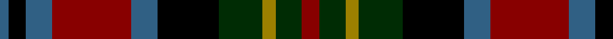

**Bands:** [BKBRBKGRGR](/stripes/bkbrbkgrgr/) · **Stripes:** [N K N R N K DG O DG R](/stripes/stripes10/) N K N R N K DG O DG R

This was sourced from register-of-tartans.  It is a [10 band tartan](/bands/bands10/).

Original link https://www.tartanregister.gov.uk/tartanDetails.aspx?ref=584

## Register references

External register numbers recorded for this tartan.

- Scottish Register of Tartans: [584](https://www.tartanregister.gov.uk/tartanDetails.aspx?ref=584)
- Scottish Tartans Authority (ITI): 4474

## Thread count
B/4 K8 B12 DR36 B12 K28 DG20 LG6 DG12 DR/8

## Palette
Each colour and its ΔE from the base-6 reference it is a variant of.

| Colour | Shade | Base | ΔE (OKLab) |
|---|---|---|---|
| B | <code style="background-color:#306084;">#306084</code> `#306084` | B <code style="background-color:#2A418A;">#2A418A</code> | 0.10 |
| DG | <code style="background-color:#002C04;">#002C04</code> `#002C04` | G <code style="background-color:#006100;">#006100</code> | 0.18 |
| DR | <code style="background-color:#880000;">#880000</code> `#880000` | R <code style="background-color:#CC0000;">#CC0000</code> | 0.15 |
| K | <code style="background-color:#000000;">#000000</code> `#000000` | K <code style="background-color:#000000;">#000000</code> | 0.00 |
| LG | <code style="background-color:#9C8000;">#9C8000</code> `#9C8000` | R <code style="background-color:#CC0000;">#CC0000</code> | 0.21 |

## Nearest tartans

The nearest existing variants by ΔTartan distance.

1. [Iona](/setts/s12/r8lb2r22k10dg6k6dg10k6dg10dg3dg3dg4~x2/) — ΔT 0.74
1. [Etienne-Carter, Sir George](/setts/s10/r4g6ly3g12k14db5r20db5k4db2~x2/) — ΔT 1.11
1. [Kinloch Anderson Limited](/setts/s12/r4o14o2o4o2k6o3k6k14r2k4r4~x2/) — ΔT 1.12
1. [Unidentified, pattern](/setts/s12/db2r4k7r8g10k4ly2k8db4r4db14r2~x2/) — ΔT 1.13
1. [Cumming LO](/setts/s9/b4k2b4k10y1dg10r4lr1r4~x2/) — ΔT 1.14
1. [Cumming LO](/setts/s9/b4k2b4k10y1dg10r4lr1r4/) — ΔT 1.14
1. [Unidentified pattern](/setts/s12/db2r4k7r8dg10k4ly2k8db4r4db14r2~x2/) — ΔT 1.14
1. [Cavan Irish County Tartan Tartan Number: 2274. Earliest known date: 1996 One of a series of Irish District tartans designed by Polly Wittering of the House of Edgar, with colours reminiscent of the Country with soft warm colours dominating. See products available Copyright © Blair Urquhart, Comrie, 2015](/setts/s10/k3r9k5k9o3k9k5dg24k2o3~x2/) — ΔT 1.15
1. [Coffield-Limesand (Personal)](/setts/s9/dp8k1g2k1dy2k6g8k1w2~x4/) — ΔT 1.19
1. [St. Clement of Rome (Corporate)](/setts/s8/db18k5r26k5g25k5db18ly2~x2/) — ΔT 1.19

## Neighbour map

Every grey dot is one of 14313 variants placed by the first two principal components of the ΔTartan feature space (44% of its variance). Red is this tartan; blue dots are its nearest — click one to open its page.

<svg viewBox="0 0 640 380" role="img" style="max-width:100%;height:auto;border:1px solid #e0e0e0;border-radius:4px;display:block" xmlns="http://www.w3.org/2000/svg"><image href="/nn/cloud.v1.png" width="640" height="380"/><a href="/setts/s12/r8lb2r22k10dg6k6dg10k6dg10dg3dg3dg4~x2/"><circle cx="139.0" cy="174.8" r="4" fill="#3465a4"><title>Iona</title></circle></a><a href="/setts/s10/r4g6ly3g12k14db5r20db5k4db2~x2/"><circle cx="124.8" cy="172.2" r="4" fill="#3465a4"><title>Etienne-Carter, Sir George</title></circle></a><a href="/setts/s12/r4o14o2o4o2k6o3k6k14r2k4r4~x2/"><circle cx="97.6" cy="173.9" r="4" fill="#3465a4"><title>Kinloch Anderson Limited</title></circle></a><a href="/setts/s12/db2r4k7r8g10k4ly2k8db4r4db14r2~x2/"><circle cx="69.3" cy="184.7" r="4" fill="#3465a4"><title>Unidentified, pattern</title></circle></a><a href="/setts/s9/b4k2b4k10y1dg10r4lr1r4~x2/"><circle cx="84.5" cy="166.0" r="4" fill="#3465a4"><title>Cumming LO</title></circle></a><a href="/setts/s9/b4k2b4k10y1dg10r4lr1r4/"><circle cx="84.5" cy="166.0" r="4" fill="#3465a4"><title>Cumming LO</title></circle></a><a href="/setts/s12/db2r4k7r8dg10k4ly2k8db4r4db14r2~x2/"><circle cx="91.6" cy="192.8" r="4" fill="#3465a4"><title>Unidentified pattern</title></circle></a><a href="/setts/s10/k3r9k5k9o3k9k5dg24k2o3~x2/"><circle cx="137.1" cy="167.6" r="4" fill="#3465a4"><title>Cavan Irish County Tartan Tartan Number: 2274. Earliest known date: 1996 One of a series of Irish District tartans designed by Polly Wittering of the House of Edgar, with colours reminiscent of the Country with soft warm colours dominating. See products available Copyright © Blair Urquhart, Comrie, 2015</title></circle></a><a href="/setts/s9/dp8k1g2k1dy2k6g8k1w2~x4/"><circle cx="128.8" cy="183.8" r="4" fill="#3465a4"><title>Coffield-Limesand (Personal)</title></circle></a><a href="/setts/s8/db18k5r26k5g25k5db18ly2~x2/"><circle cx="158.8" cy="185.2" r="4" fill="#3465a4"><title>St. Clement of Rome (Corporate)</title></circle></a><circle cx="111.3" cy="193.5" r="5" fill="#c00000"/></svg>

ID: /setts/s10/r4dg6o3dg10k14n6r18n6k4n2~x2/
