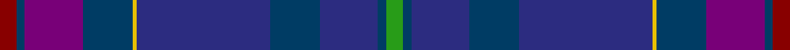

This page is one **sett** — a single exact thread-count. It belongs to the [tartan](/tartans/r4dt2dp14dt12ly1db32dt12db14dt2g4/)
(the same proportion at any scale), whose colour order is pattern [GBBBBYBBBR](/stripes/gbbbbybbbr/).

Sourced from tartans-authority.  It is a [10 stripe tartan](/stripes/stripes10/).

Original link http://www.tartansauthority.com/tartan-ferret/display/8447/

## Register references

External register numbers recorded for this tartan.

- Scottish Register of Tartans: [8447](https://www.tartanregister.gov.uk/tartanDetails?ref=8447)
- Scottish Tartans Authority (ITI): 8447

## Thread count
DR/8 DBa4 P28 DBa24 Y2 DB64 DBa24 DB28 DBa4 G/8

## Palette

Palette: <strong>Tartan Register</strong>
<table><thead><tr><th>Colour</th><th>Threads</th><th>Shade</th><th>Base</th><th>OKLCh</th></tr></thead><tbody><tr><td>DR/</td><td style="text-align:right;font-variant-numeric:tabular-nums">8</td><td><code style="background-color:#880000;">#880000</code> <small style="color:#888">#880000</small></td><td>R <code style="background-color:#CC0000;">#CC0000</code></td><td><small style="color:#888">oklch(39.4% 0.162 29.2)</small></td></tr><tr><td>DBa</td><td style="text-align:right;font-variant-numeric:tabular-nums">4</td><td><code style="background-color:#003C64;">#003C64</code> <small style="color:#888">#003C64</small></td><td>B <code style="background-color:#2A418A;">#2A418A</code></td><td><small style="color:#888">oklch(34.5% 0.089 246.0)</small></td></tr><tr><td>P</td><td style="text-align:right;font-variant-numeric:tabular-nums">28</td><td><code style="background-color:#780078;">#780078</code> <small style="color:#888">#780078</small></td><td>B <code style="background-color:#2A418A;">#2A418A</code></td><td><small style="color:#888">oklch(40.2% 0.185 328.4)</small></td></tr><tr><td>DBa</td><td style="text-align:right;font-variant-numeric:tabular-nums">24</td><td><code style="background-color:#003C64;">#003C64</code> <small style="color:#888">#003C64</small></td><td>B <code style="background-color:#2A418A;">#2A418A</code></td><td><small style="color:#888">oklch(34.5% 0.089 246.0)</small></td></tr><tr><td>Y</td><td style="text-align:right;font-variant-numeric:tabular-nums">2</td><td><code style="background-color:#E8C000;">#E8C000</code> <small style="color:#888">#E8C000</small></td><td>Y <code style="background-color:#F2BF00;">#F2BF00</code></td><td><small style="color:#888">oklch(81.9% 0.168 93.7)</small></td></tr><tr><td>DB</td><td style="text-align:right;font-variant-numeric:tabular-nums">64</td><td><code style="background-color:#2C2C80;">#2C2C80</code> <small style="color:#888">#2C2C80</small></td><td>B <code style="background-color:#2A418A;">#2A418A</code></td><td><small style="color:#888">oklch(35.0% 0.138 276.6)</small></td></tr><tr><td>DBa</td><td style="text-align:right;font-variant-numeric:tabular-nums">24</td><td><code style="background-color:#003C64;">#003C64</code> <small style="color:#888">#003C64</small></td><td>B <code style="background-color:#2A418A;">#2A418A</code></td><td><small style="color:#888">oklch(34.5% 0.089 246.0)</small></td></tr><tr><td>DB</td><td style="text-align:right;font-variant-numeric:tabular-nums">28</td><td><code style="background-color:#2C2C80;">#2C2C80</code> <small style="color:#888">#2C2C80</small></td><td>B <code style="background-color:#2A418A;">#2A418A</code></td><td><small style="color:#888">oklch(35.0% 0.138 276.6)</small></td></tr><tr><td>DBa</td><td style="text-align:right;font-variant-numeric:tabular-nums">4</td><td><code style="background-color:#003C64;">#003C64</code> <small style="color:#888">#003C64</small></td><td>B <code style="background-color:#2A418A;">#2A418A</code></td><td><small style="color:#888">oklch(34.5% 0.089 246.0)</small></td></tr><tr><td>G/</td><td style="text-align:right;font-variant-numeric:tabular-nums">8</td><td><code style="background-color:#289C18;">#289C18</code> <small style="color:#888">#289C18</small></td><td>G <code style="background-color:#006100;">#006100</code></td><td><small style="color:#888">oklch(60.6% 0.191 141.6)</small></td></tr></tbody></table>

## Nearest tartans

The nearest existing variants by ΔTartan distance, with this tartan at the top so the swatches line up against it.

ΔTartan

Tartan

Sett

—

<a href="/ttd/edit/#slug=r4dt2dp14dt12ly1db32dt12db14dt2g4~x2">Timmins (Personal)</a> <a class="nn-out" href="/setts/s10/r4dt2dp14dt12ly1db32dt12db14dt2g4~x2/" title="open its dictionary page">↗</a>

1.51

<a href="/ttd/edit/#slug=dbi12r1k4r2dbi10db20dbii3db9w1~x2">Japan–Scotland Society, The</a> <a class="nn-out" href="/setts/s9/dbi12r1k4r2dbi10db20dbii3db9w1~x2/" title="open its dictionary page">↗</a>

1.62

<a href="/ttd/edit/#slug=db40n16k5dt16w2dp6~x2">McFarland-Collins</a> <a class="nn-out" href="/setts/s6/db40n16k5dt16w2dp6~x2/" title="open its dictionary page">↗</a>

1.81

<a href="/ttd/edit/#slug=db6k2dp9lb1dp9k2dt4k6dt24w1db6~x2">Newlands, Charlie (Personal)</a> <a class="nn-out" href="/setts/s11/db6k2dp9lb1dp9k2dt4k6dt24w1db6~x2/" title="open its dictionary page">↗</a>

1.81

<a href="/ttd/edit/#slug=k4dp2r7dp60y15dt60n5w3">Albannach (Corporate)</a> <a class="nn-out" href="/setts/s8/k4dp2r7dp60y15dt60n5w3/" title="open its dictionary page">↗</a>

1.82

<a href="/ttd/edit/#slug=t4dbi19g1db2g2db18dp24g1dbi2~x2">Spirit of Alba (Fashion)</a> <a class="nn-out" href="/setts/s9/t4dbi19g1db2g2db18dp24g1dbi2~x2/" title="open its dictionary page">↗</a>

1.89

<a href="/ttd/edit/#slug=k4r1db3dbi28db36k3r2o1~x2">ODL (Corporate)</a> <a class="nn-out" href="/setts/s8/k4r1db3dbi28db36k3r2o1~x2/" title="open its dictionary page">↗</a>

1.94

<a href="/setts/s12/g2db1dbi29db2g9db26ly2~x2/">Scottish Canals Corporate Tartan Tartan Number: 3916. Earliest known date: 2001 Designed by Claire Donaldson of House of Edgar for BWB. Initially called Highland Canals, later changed (April 2002) to Caledonian Canal and then in January 2003 to Scottish Canals. See products available Copyright © Blair Urquhart, Comrie, 2015</a>

1.97

<a href="/setts/s16/t4dbi19g1db2g2db18dp24g1dbi2~x2/">Spirit of Alba</a>

1.98

<a href="/ttd/edit/#slug=dbi7w1k3dp3k3dbi3k13dp2k2dp2k2dp23db3dp2m2~x2">Passion of Scotland, Purple (Fashion</a> <a class="nn-out" href="/setts/s15/dbi7w1k3dp3k3dbi3k13dp2k2dp2k2dp23db3dp2m2~x2/" title="open its dictionary page">↗</a>

1.99

<a href="/ttd/edit/#slug=dt4dp2dt22k2dt1db2dt1k2db24w2~x2">Spirit of Wales (Fashion)</a> <a class="nn-out" href="/setts/s10/dt4dp2dt22k2dt1db2dt1k2db24w2~x2/" title="open its dictionary page">↗</a>

## Neighbour map

Every grey dot is one of 14359 variants placed by the first two principal components of the ΔTartan feature space (44% of its variance). Red is this tartan; blue dots are its nearest — click one to open its page.

<svg viewBox="0 0 640 380" role="img" style="max-width:100%;height:auto;border:1px solid #e0e0e0;border-radius:4px;display:block" xmlns="http://www.w3.org/2000/svg"><image href="/nn/cloud.v1.png" width="640" height="380"/><a href="/setts/s9/dbi12r1k4r2dbi10db20dbii3db9w1~x2/"><circle cx="341.9" cy="203.7" r="4" fill="#3465a4"><title>Japan–Scotland Society, The</title></circle></a><a href="/setts/s6/db40n16k5dt16w2dp6~x2/"><circle cx="303.2" cy="203.8" r="4" fill="#3465a4"><title>McFarland-Collins</title></circle></a><a href="/setts/s11/db6k2dp9lb1dp9k2dt4k6dt24w1db6~x2/"><circle cx="309.1" cy="184.4" r="4" fill="#3465a4"><title>Newlands, Charlie (Personal)</title></circle></a><a href="/setts/s8/k4dp2r7dp60y15dt60n5w3/"><circle cx="330.3" cy="149.8" r="4" fill="#3465a4"><title>Albannach (Corporate)</title></circle></a><a href="/setts/s9/t4dbi19g1db2g2db18dp24g1dbi2~x2/"><circle cx="296.9" cy="181.4" r="4" fill="#3465a4"><title>Spirit of Alba (Fashion)</title></circle></a><a href="/setts/s8/k4r1db3dbi28db36k3r2o1~x2/"><circle cx="453.0" cy="184.3" r="4" fill="#3465a4"><title>ODL (Corporate)</title></circle></a><a href="/setts/s12/g2db1dbi29db2g9db26ly2~x2/"><circle cx="376.9" cy="198.4" r="4" fill="#3465a4"><title>Scottish Canals Corporate Tartan Tartan Number: 3916. Earliest known date: 2001 Designed by Claire Donaldson of House of Edgar for BWB. Initially called Highland Canals, later changed (April 2002) to Caledonian Canal and then in January 2003 to Scottish Canals. See products available Copyright © Blair Urquhart, Comrie, 2015</title></circle></a><a href="/setts/s16/t4dbi19g1db2g2db18dp24g1dbi2~x2/"><circle cx="302.2" cy="165.8" r="4" fill="#3465a4"><title>Spirit of Alba</title></circle></a><a href="/setts/s15/dbi7w1k3dp3k3dbi3k13dp2k2dp2k2dp23db3dp2m2~x2/"><circle cx="325.2" cy="137.2" r="4" fill="#3465a4"><title>Passion of Scotland, Purple (Fashion</title></circle></a><a href="/setts/s10/dt4dp2dt22k2dt1db2dt1k2db24w2~x2/"><circle cx="398.3" cy="182.8" r="4" fill="#3465a4"><title>Spirit of Wales (Fashion)</title></circle></a><circle cx="342.3" cy="169.2" r="5" fill="#c00000"/></svg>

ID: /setts/s10/r4dt2dp14dt12ly1db32dt12db14dt2g4~x2/
