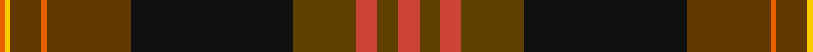

In pattern [RGRGKGRGYR](/patterns/rgrgkgrgyr/).

This was sourced from tartans-authority.  It is a [10 stripes tartan](/stripes/stripes10/).

Original link http://www.tartansauthority.com/tartan-ferret/display/8711/

## Thread count
O/2 Y2 Ta12 O2 Ta32 K62 T24 R8 T8 R/8

## Palette
Each colour and its ΔE from the base-6 reference it is a variant of.

| Colour | Shade | Base | ΔE (OKLab) |
|---|---|---|---|
| K | <code style="background-color:#101010;">#101010</code> `#101010` | K <code style="background-color:#000000;">#000000</code> | 0.17 |
| O | <code style="background-color:#E86000;">#E86000</code> `#E86000` | R <code style="background-color:#CC0000;">#CC0000</code> | 0.14 |
| R | <code style="background-color:#CC4438;">#CC4438</code> `#CC4438` | R <code style="background-color:#CC0000;">#CC0000</code> | 0.06 |
| T | <code style="background-color:#604000;">#604000</code> `#604000` | G <code style="background-color:#006100;">#006100</code> | 0.14 |
| Ta | <code style="background-color:#603800;">#603800</code> `#603800` | G <code style="background-color:#006100;">#006100</code> | 0.16 |
| Y | <code style="background-color:#FCCC00;">#FCCC00</code> `#FCCC00` | Y <code style="background-color:#F2BF00;">#F2BF00</code> | 0.04 |

## Nearest tartans

The nearest existing variants by ΔTartan distance.

1. [Aberuchill](/setts/s8/r8k2g10b30g30ga55k4y6~b440044-g603800-ga006818-k101010-rb468ac-yd87c00/) — ΔT 1.20
1. [Hard Rock Café](/setts/s10/r4b4r4b12k32g15ra1g7y1ra1x2~b4c3428-g603800-k101010-r800028-rafa4b00-yd8b000/) — ΔT 1.31
1. [Livingstone (Australia) Dress](/setts/s11/g15r25g4k2y1b1y1k2g4b12w1x2~b242e2c-g04220c-k141a1c-rbd133b-wefece4-ye1ad29/) — ΔT 1.33
1. [Livingstone - Australia (Personal)](/setts/s11/g15r25g4k2y1b1y1k2g4b12w1x2~b2c2c80-g00643c-k101010-r901c38-we0e0e0-ybc8c00/) — ΔT 1.37
1. [Ryutokukan High School](/setts/s12/b3ba20r1ba4r2ba2r4ba2r5y2bb20w3x2~b444444-ba2f4f4f-bb660022-r990033-wffffff-y809c64/) — ΔT 1.39
1. [Hard Rock Cafe (Corporate)](/setts/s10/r4b4r4b12k32y15ra1y7ya1ra1x2~b441800-k101010-r901c38-rae86000-ya08858-yabc8c00/) — ΔT 1.43
1. [Caithness District Tartan Tartan Number: 2466. Earliest known date: (Feb, 2001) Designed by Trudi Mann of Wick and incorporating colours of Caithness, including the unique blue grey Caithness flagstone. See products available Copyright © Blair Urquhart, Comrie, 2015](/setts/s15/g28r3b2ra2b2r3ra8y2b8y5b3w2b2y3b1x2~b441800-g604000-rc80000-ra888888-we0e0e0-ya08858/) — ΔT 1.43
1. [Father's Pride, The](/setts/s11/k90b8ka10b3ka4g4ka3r16ka14y6ka28~b5c5c5c-g006818-k300500-ka101010-rc80000-yfccc00/) — ΔT 1.43
1. [Scottish Register of Tartans (Corp)](/setts/s15/r11w4r8g1r1g28y2g28k2g2k23r3ya6r3k5x2~g604000-k101010-rb03040-we0e0e0-ya08858-yabc8c00/) — ΔT 1.45
1. [Hay-Gray (Personal)](/setts/s14/b18k2b2k2b9g10y2g10ba11k9ba2k2ba1r3x2~b441800-ba780078-g285800-k101010-rc80000-ye8c000/) — ΔT 1.48

## Neighbour map

Every grey dot is one of 15726 variants placed by the first two principal components of the ΔTartan feature space (44% of its variance). Red is this tartan; blue dots are its nearest — click one to open its page.

<svg viewBox="0 0 640 380" role="img" style="max-width:100%;height:auto;border:1px solid #e0e0e0;border-radius:4px;display:block" xmlns="http://www.w3.org/2000/svg"><image href="/nn/cloud.v1.png" width="640" height="380"/><a href="/setts/s8/r8k2g10b30g30ga55k4y6~b440044-g603800-ga006818-k101010-rb468ac-yd87c00/"><circle cx="230.4" cy="134.1" r="4" fill="#3465a4"><title>Aberuchill</title></circle></a><a href="/setts/s10/r4b4r4b12k32g15ra1g7y1ra1x2~b4c3428-g603800-k101010-r800028-rafa4b00-yd8b000/"><circle cx="293.2" cy="125.0" r="4" fill="#3465a4"><title>Hard Rock Café</title></circle></a><a href="/setts/s11/g15r25g4k2y1b1y1k2g4b12w1x2~b242e2c-g04220c-k141a1c-rbd133b-wefece4-ye1ad29/"><circle cx="220.5" cy="93.0" r="4" fill="#3465a4"><title>Livingstone (Australia) Dress</title></circle></a><a href="/setts/s11/g15r25g4k2y1b1y1k2g4b12w1x2~b2c2c80-g00643c-k101010-r901c38-we0e0e0-ybc8c00/"><circle cx="240.8" cy="104.1" r="4" fill="#3465a4"><title>Livingstone - Australia (Personal)</title></circle></a><a href="/setts/s12/b3ba20r1ba4r2ba2r4ba2r5y2bb20w3x2~b444444-ba2f4f4f-bb660022-r990033-wffffff-y809c64/"><circle cx="248.9" cy="112.2" r="4" fill="#3465a4"><title>Ryutokukan High School</title></circle></a><a href="/setts/s10/r4b4r4b12k32y15ra1y7ya1ra1x2~b441800-k101010-r901c38-rae86000-ya08858-yabc8c00/"><circle cx="220.9" cy="92.0" r="4" fill="#3465a4"><title>Hard Rock Cafe (Corporate)</title></circle></a><a href="/setts/s15/g28r3b2ra2b2r3ra8y2b8y5b3w2b2y3b1x2~b441800-g604000-rc80000-ra888888-we0e0e0-ya08858/"><circle cx="234.6" cy="75.6" r="4" fill="#3465a4"><title>Caithness District Tartan Tartan Number: 2466. Earliest known date: (Feb, 2001) Designed by Trudi Mann of Wick and incorporating colours of Caithness, including the unique blue grey Caithness flagstone. See products available Copyright © Blair Urquhart, Comrie, 2015</title></circle></a><a href="/setts/s11/k90b8ka10b3ka4g4ka3r16ka14y6ka28~b5c5c5c-g006818-k300500-ka101010-rc80000-yfccc00/"><circle cx="324.6" cy="96.4" r="4" fill="#3465a4"><title>Father's Pride, The</title></circle></a><a href="/setts/s15/r11w4r8g1r1g28y2g28k2g2k23r3ya6r3k5x2~g604000-k101010-rb03040-we0e0e0-ya08858-yabc8c00/"><circle cx="263.5" cy="87.0" r="4" fill="#3465a4"><title>Scottish Register of Tartans (Corp)</title></circle></a><a href="/setts/s14/b18k2b2k2b9g10y2g10ba11k9ba2k2ba1r3x2~b441800-ba780078-g285800-k101010-rc80000-ye8c000/"><circle cx="180.7" cy="133.2" r="4" fill="#3465a4"><title>Hay-Gray (Personal)</title></circle></a><circle cx="254.0" cy="110.0" r="5" fill="#c00000"/></svg>

ID: /setts/s10/r4g4r4g12k31ga16ra1ga6y1ra1x2~g604000-ga603800-k101010-rcc4438-rae86000-yfccc00/
