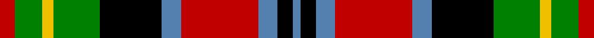

In pattern [BKBRBKGYGR](/stripes/bkbrbkgygr/).

This was sourced from weddslist.  It is a [10 stripe tartan](/stripes/stripes10/).

Original link http://www.weddslist.com/cgi-bin/tartans/pg.pl?source=sts

## Also known as

This cloth is also recorded under:

- Unidentified
- Unidentified #9

## Attestations

This cloth appears in 2 source records; the oldest owns this page.

- undated — Unidentified 25 (weddslist, [record](http://www.weddslist.com/cgi-bin/tartans/pg.pl?source=sts))
- undated — Unidentified Canadian Tartan Tartan Number: 276. Earliest known date: 1978 This is a duplicate of 277 using ancient azure blue. See products available Copyright © Blair Urquhart, Comrie, 2015 (house-of-tartan, [record](http://www.house-of-tartan.scotland.net/house/TartanViewjs.asp?colr=Def&tnam=276))

## Thread count
R/8 G14 Y6 G24 K32 B10 R40 B10 K8 B/4

## Palette
Each colour and the base-6 reference it is a variant of.

| Colour | Shade | Base |
|---|---|---|
| B | <code style="background-color:#5480B0;">#5480B0</code> `oklch(58.8% 0.089 251.5)` <small>#5480B0</small> | B <code style="background-color:#2A418A;">#2A418A</code> |
| G | <code style="background-color:#008000;">#008000</code> `oklch(52.0% 0.177 142.5)` <small>#008000</small> | G <code style="background-color:#006100;">#006100</code> |
| K | <code style="background-color:#000000;">#000000</code> `oklch(0.0% 0.000 0.0)` <small>#000000</small> | K <code style="background-color:#000000;">#000000</code> |
| R | <code style="background-color:#C00000;">#C00000</code> `oklch(50.7% 0.208 29.2)` <small>#C00000</small> | R <code style="background-color:#CC0000;">#CC0000</code> |
| Y | <code style="background-color:#F0C000;">#F0C000</code> `oklch(82.7% 0.169 90.5)` <small>#F0C000</small> | Y <code style="background-color:#F2BF00;">#F2BF00</code> |

## Nearest tartans

The nearest existing variants by ΔTartan distance, with this tartan at the top so the swatches line up against it.

ΔTartan

Tartan

Sett

—

<a href="/ttd/edit/#slug=r4g7ly3g12k16t5r20t5k4t2~x2">Unidentified 25</a> <a class="nn-out" href="/setts/s10/r4g7ly3g12k16t5r20t5k4t2~x2/" title="open its dictionary page">↗</a>

0.45

<a href="/ttd/edit/#slug=r4lb1r4dg10ly1k10lb4k2lb4">Cumming LO</a> <a class="nn-out" href="/setts/s9/r4lb1r4dg10ly1k10lb4k2lb4/" title="open its dictionary page">↗</a>

0.80

<a href="/ttd/edit/#slug=r4dg7ly3dg12k16t5r20t5k4t2~x2">Unidentified #9</a> <a class="nn-out" href="/setts/s10/r4dg7ly3dg12k16t5r20t5k4t2~x2/" title="open its dictionary page">↗</a>

0.93

<a href="/ttd/edit/#slug=r16t10k14w2k4w3k4g26r11k4r4w2~x2">Stewart - Pr Ch Ed (Error?)</a> <a class="nn-out" href="/setts/s12/r16t10k14w2k4w3k4g26r11k4r4w2~x2/" title="open its dictionary page">↗</a>

0.98

<a href="/ttd/edit/#slug=r4g6ly3g12k14db5r20db5k4db2~x2">Etienne-Carter, Sir George</a> <a class="nn-out" href="/setts/s10/r4g6ly3g12k14db5r20db5k4db2~x2/" title="open its dictionary page">↗</a>

0.98

<a href="/ttd/edit/#slug=r8w2r22k8dg6k6dg6k6dg8lg3dg3lg3~x2">Wcwm 1712</a> <a class="nn-out" href="/setts/s12/r8w2r22k8dg6k6dg6k6dg8lg3dg3lg3~x2/" title="open its dictionary page">↗</a>

1.03

<a href="/ttd/edit/#slug=r4k1r4g8k6lb3db2lb11db1r2~x4">MacDuff Dress #2</a> <a class="nn-out" href="/setts/s10/r4k1r4g8k6lb3db2lb11db1r2~x4/" title="open its dictionary page">↗</a>

1.05

<a href="/ttd/edit/#slug=r5db1r5g13db8t5r5w1db3~x2">Unidentified #27</a> <a class="nn-out" href="/setts/s9/r5db1r5g13db8t5r5w1db3~x2/" title="open its dictionary page">↗</a>

1.06

<a href="/ttd/edit/#slug=o10k24o5k13o24k5dg52k5db18w8">Leitrim County, Crest Range</a> <a class="nn-out" href="/setts/s10/o10k24o5k13o24k5dg52k5db18w8/" title="open its dictionary page">↗</a>

1.07

<a href="/ttd/edit/#slug=r4w1r4g10ly1k10t4k2t4~x4">Comyn, Cumming</a> <a class="nn-out" href="/setts/s9/r4w1r4g10ly1k10t4k2t4~x4/" title="open its dictionary page">↗</a>

1.08

<a href="/setts/s14/k10ly2dg11r11w1r1w1k9~x4/">Norwich No.005</a>

## Neighbour map

Every grey dot is one of 14299 variants placed by the first two principal components of the ΔTartan feature space (44% of its variance). Red is this tartan; blue dots are its nearest — click one to open its page.

<svg viewBox="0 0 640 380" role="img" style="max-width:100%;height:auto;border:1px solid #e0e0e0;border-radius:4px;display:block" xmlns="http://www.w3.org/2000/svg"><image href="/nn/cloud.v1.png" width="640" height="380"/><a href="/setts/s9/r4lb1r4dg10ly1k10lb4k2lb4/"><circle cx="80.8" cy="163.1" r="4" fill="#3465a4"><title>Cumming LO</title></circle></a><a href="/setts/s10/r4dg7ly3dg12k16t5r20t5k4t2~x2/"><circle cx="114.5" cy="168.0" r="4" fill="#3465a4"><title>Unidentified #9</title></circle></a><a href="/setts/s12/r16t10k14w2k4w3k4g26r11k4r4w2~x2/"><circle cx="124.4" cy="139.4" r="4" fill="#3465a4"><title>Stewart - Pr Ch Ed (Error?)</title></circle></a><a href="/setts/s10/r4g6ly3g12k14db5r20db5k4db2~x2/"><circle cx="124.8" cy="172.3" r="4" fill="#3465a4"><title>Etienne-Carter, Sir George</title></circle></a><a href="/setts/s12/r8w2r22k8dg6k6dg6k6dg8lg3dg3lg3~x2/"><circle cx="138.9" cy="158.8" r="4" fill="#3465a4"><title>Wcwm 1712</title></circle></a><a href="/setts/s10/r4k1r4g8k6lb3db2lb11db1r2~x4/"><circle cx="103.8" cy="157.1" r="4" fill="#3465a4"><title>MacDuff Dress #2</title></circle></a><a href="/setts/s9/r5db1r5g13db8t5r5w1db3~x2/"><circle cx="119.9" cy="162.7" r="4" fill="#3465a4"><title>Unidentified #27</title></circle></a><a href="/setts/s10/o10k24o5k13o24k5dg52k5db18w8/"><circle cx="124.7" cy="166.5" r="4" fill="#3465a4"><title>Leitrim County, Crest Range</title></circle></a><a href="/setts/s9/r4w1r4g10ly1k10t4k2t4~x4/"><circle cx="65.0" cy="154.5" r="4" fill="#3465a4"><title>Comyn, Cumming</title></circle></a><a href="/setts/s14/k10ly2dg11r11w1r1w1k9~x4/"><circle cx="121.7" cy="130.6" r="4" fill="#3465a4"><title>Norwich No.005</title></circle></a><circle cx="94.4" cy="161.1" r="5" fill="#c00000"/></svg>

ID: /setts/s10/r4g7ly3g12k16t5r20t5k4t2~x2/
