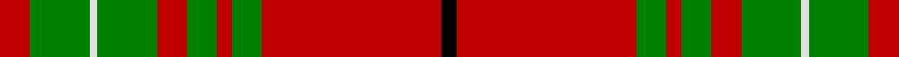

In pattern [KRGRGRGWGR](/stripes/krgrgrgwgr/).

This was sourced from weddslist.  It is a [10 stripe tartan](/stripes/stripes10/).

Original link http://www.weddslist.com/cgi-bin/tartans/pg.pl?source=sts

## Also known as

This cloth is also recorded under:

- Cumming, Comyn
- Cumming/Comyn

## Attestations

This cloth appears in 2 source records; the oldest owns this page.

- undated — Cumming, Comyn (weddslist, [record](http://www.weddslist.com/cgi-bin/tartans/pg.pl?source=sts))
- undated — Cumming Clan Tartan Tartan Number: 1158. Earliest known date: 1842 John, Lord of Badenoch - the Red Comyn, fought Robert the Bruce for the Scottish throne, and died in the attempt. The Comyns of Altyre became Chiefs of the Clan. The true origins of the tartan are unknown as the claims of antiquity made in the Vestiarium Scoticum, where this version of the tartan was first recorded, are unreliable. Ref: The Setts No 32. See products available Copyright © Blair Urquhart, Comrie, 2015 (house-of-tartan, [record](http://www.house-of-tartan.scotland.net/house/TartanViewjs.asp?colr=Def&tnam=1158))

## Thread count
R/8 G16 LN2 G16 R8 G8 R4 G8 R48 K/4

## Palette
Each colour and the base-6 reference it is a variant of.

| Colour | Shade | Base |
|---|---|---|
| G | <code style="background-color:#008000;">#008000</code> `oklch(52.0% 0.177 142.5)` <small>#008000</small> | G <code style="background-color:#006100;">#006100</code> |
| K | <code style="background-color:#000000;">#000000</code> `oklch(0.0% 0.000 0.0)` <small>#000000</small> | K <code style="background-color:#000000;">#000000</code> |
| LN | <code style="background-color:#E0E0E0;">#E0E0E0</code> `oklch(90.7% 0.000 89.9)` <small>#E0E0E0</small> | W <code style="background-color:#F7F7F7;">#F7F7F7</code> |
| R | <code style="background-color:#C00000;">#C00000</code> `oklch(50.7% 0.208 29.2)` <small>#C00000</small> | R <code style="background-color:#CC0000;">#CC0000</code> |

## Nearest tartans

The nearest existing variants by ΔTartan distance.

1. [Scott - 1842 (Clan)](/setts/s10/r4g4w3g4r4g14r28k1r3g4~x2/) — ΔT 0.52
1. [Cumming VS](/setts/s10/r4dg8lb1dg8r4dg4r2dg4r24k2~x2/) — ΔT 0.67
1. [Scott](/setts/s10/dg4r3k1r28dg14r4dg4lb3dg4r4~x2/) — ΔT 0.70
1. [Cumming/Comyn](/setts/s10/r4dg8w1dg8r4dg4r2dg4r24k2~x2/) — ΔT 0.75
1. [MacPhie/Macfie](/setts/s9/w1r12g2r1g16r1g2r12ly1~x4/) — ΔT 0.76
1. [MacPhee, MacFie](/setts/s9/w1r12g2r1g16r1g2r12ly1~x2/) — ΔT 0.80
1. [MacFie](/setts/s9/ly1r12dg2r1dg16r1dg2r12lb1/) — ΔT 0.82
1. [Scott](/setts/s12/g4r3k1r28g14r4g4w3g4r4g4w3~x2/) — ΔT 0.86
1. [Baluch Regiment (Military)](/setts/s9/r5g20r5g3r4g5r36do2w4~x2/) — ΔT 0.90
1. [Burnett](/setts/s8/r2g6ly1g6r3g2r16db1~x4/) — ΔT 0.93

## Neighbour map

Every grey dot is one of 14299 variants placed by the first two principal components of the ΔTartan feature space (44% of its variance). Red is this tartan; blue dots are its nearest — click one to open its page.

<svg viewBox="0 0 640 380" role="img" style="max-width:100%;height:auto;border:1px solid #e0e0e0;border-radius:4px;display:block" xmlns="http://www.w3.org/2000/svg"><image href="/nn/cloud.v1.png" width="640" height="380"/><a href="/setts/s10/r4g4w3g4r4g14r28k1r3g4~x2/"><circle cx="381.8" cy="123.4" r="4" fill="#3465a4"><title>Scott - 1842 (Clan)</title></circle></a><a href="/setts/s10/r4dg8lb1dg8r4dg4r2dg4r24k2~x2/"><circle cx="372.2" cy="137.5" r="4" fill="#3465a4"><title>Cumming VS</title></circle></a><a href="/setts/s10/dg4r3k1r28dg14r4dg4lb3dg4r4~x2/"><circle cx="383.6" cy="124.8" r="4" fill="#3465a4"><title>Scott</title></circle></a><a href="/setts/s10/r4dg8w1dg8r4dg4r2dg4r24k2~x2/"><circle cx="371.6" cy="133.8" r="4" fill="#3465a4"><title>Cumming/Comyn</title></circle></a><a href="/setts/s9/w1r12g2r1g16r1g2r12ly1~x4/"><circle cx="361.5" cy="155.1" r="4" fill="#3465a4"><title>MacPhie/Macfie</title></circle></a><a href="/setts/s9/w1r12g2r1g16r1g2r12ly1~x2/"><circle cx="360.4" cy="155.6" r="4" fill="#3465a4"><title>MacPhee, MacFie</title></circle></a><a href="/setts/s9/ly1r12dg2r1dg16r1dg2r12lb1/"><circle cx="360.1" cy="154.6" r="4" fill="#3465a4"><title>MacFie</title></circle></a><a href="/setts/s12/g4r3k1r28g14r4g4w3g4r4g4w3~x2/"><circle cx="334.7" cy="109.0" r="4" fill="#3465a4"><title>Scott</title></circle></a><a href="/setts/s9/r5g20r5g3r4g5r36do2w4~x2/"><circle cx="384.0" cy="141.4" r="4" fill="#3465a4"><title>Baluch Regiment (Military)</title></circle></a><a href="/setts/s8/r2g6ly1g6r3g2r16db1~x4/"><circle cx="371.9" cy="166.7" r="4" fill="#3465a4"><title>Burnett</title></circle></a><circle cx="366.5" cy="135.5" r="5" fill="#c00000"/></svg>

ID: /setts/s10/r4g8w1g8r4g4r2g4r24k2~x2/
