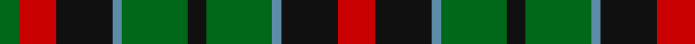

In pattern [GRKBGKGBKR](/stripes/grkbgkgbkr/).

This was sourced from register-of-tartans.  It is a [10 stripe tartan](/stripes/stripes10/).

Original link https://www.tartanregister.gov.uk/tartanDetails.aspx?ref=4478

## Register references

External register numbers recorded for this tartan.

- Scottish Register of Tartans: [4478](https://www.tartanregister.gov.uk/tartanDetails.aspx?ref=4478)
- Scottish Tartans Authority (ITI): 999
- Scottish Tartans World Register: 999

## Thread count
R/16 K24 B4 G28 K8 G28 B4 K24 R16 G/8

## Palette
Each colour and the base-6 reference it is a variant of.

| Colour | Shade | Base |
|---|---|---|
| B | <code style="background-color:#5C8CA8;">#5C8CA8</code> `oklch(61.7% 0.067 235.0)` <small>#5C8CA8</small> | B <code style="background-color:#2A418A;">#2A418A</code> |
| G | <code style="background-color:#006818;">#006818</code> `oklch(45.0% 0.142 145.0)` <small>#006818</small> | G <code style="background-color:#006100;">#006100</code> |
| K | <code style="background-color:#101010;">#101010</code> `oklch(17.3% 0.000 89.9)` <small>#101010</small> | K <code style="background-color:#000000;">#000000</code> |
| R | <code style="background-color:#C80000;">#C80000</code> `oklch(52.3% 0.215 29.2)` <small>#C80000</small> | R <code style="background-color:#CC0000;">#CC0000</code> |

## Nearest tartans

The nearest existing variants by ΔTartan distance, with this tartan at the top so the swatches line up against it.

ΔTartan

Tartan

Sett

—

<a href="/ttd/edit/#slug=r4k6t1g7k2g7t1k6r4g2~x4">Walker James</a> <a class="nn-out" href="/setts/s10/r4k6t1g7k2g7t1k6r4g2~x4/" title="open its dictionary page">↗</a>

0.76

<a href="/ttd/edit/#slug=r3k6r3k6dg6k1w1k1dg6r1~x2">MacDiarmid #3</a> <a class="nn-out" href="/setts/s10/r3k6r3k6dg6k1w1k1dg6r1~x2/" title="open its dictionary page">↗</a>

1.03

<a href="/ttd/edit/#slug=dp12k13dg12ly2dg12k13dg12ly2dg12k13dp12k2~x2">Wilson's No.064</a> <a class="nn-out" href="/setts/s12/dp12k13dg12ly2dg12k13dg12ly2dg12k13dp12k2~x2/" title="open its dictionary page">↗</a>

1.06

<a href="/ttd/edit/#slug=dg12k14y11r3y3r3y11k14dg12y3~x2">Wilson's No.112 (Light Blue)</a> <a class="nn-out" href="/setts/s10/dg12k14y11r3y3r3y11k14dg12y3~x2/" title="open its dictionary page">↗</a>

1.14

<a href="/ttd/edit/#slug=dp12k13g12lb2g12k13g12lb2g12k13dp12k2~x2">Wilson's No.064 #2</a> <a class="nn-out" href="/setts/s12/dp12k13g12lb2g12k13g12lb2g12k13dp12k2~x2/" title="open its dictionary page">↗</a>

1.19

<a href="/ttd/edit/#slug=o6k2dg12lo8o5k2dg3~x4">Londonderry, County</a> <a class="nn-out" href="/setts/s7/o6k2dg12lo8o5k2dg3~x4/" title="open its dictionary page">↗</a>

1.22

<a href="/ttd/edit/#slug=lo4g10k3g3k3g3k9dr11k3~x4">Martin</a> <a class="nn-out" href="/setts/s9/lo4g10k3g3k3g3k9dr11k3~x4/" title="open its dictionary page">↗</a>

1.23

<a href="/setts/s10/k3r1g5k3w1dp3~x2/">Wilson's No.194</a>

1.24

<a href="/ttd/edit/#slug=k13g12w2g12k13dp12k2~x2">MacLaggan</a> <a class="nn-out" href="/setts/s7/k13g12w2g12k13dp12k2~x2/" title="open its dictionary page">↗</a>

1.26

<a href="/ttd/edit/#slug=g4db9r9g9k2r2k2g9r9db8g4r2~x4">Stewart/Stuart C18th - Cf 1314 &amp; 4454</a> <a class="nn-out" href="/setts/s12/g4db9r9g9k2r2k2g9r9db8g4r2~x4/" title="open its dictionary page">↗</a>

1.27

<a href="/ttd/edit/#slug=r12g16r3g16r3g16r4db16r5k9r12g3r12~x2">Grant of Monymusk</a> <a class="nn-out" href="/setts/s13/r12g16r3g16r3g16r4db16r5k9r12g3r12~x2/" title="open its dictionary page">↗</a>

## Neighbour map

Every grey dot is one of 14299 variants placed by the first two principal components of the ΔTartan feature space (44% of its variance). Red is this tartan; blue dots are its nearest — click one to open its page.

<svg viewBox="0 0 640 380" role="img" style="max-width:100%;height:auto;border:1px solid #e0e0e0;border-radius:4px;display:block" xmlns="http://www.w3.org/2000/svg"><image href="/nn/cloud.v1.png" width="640" height="380"/><a href="/setts/s10/r3k6r3k6dg6k1w1k1dg6r1~x2/"><circle cx="180.4" cy="223.9" r="4" fill="#3465a4"><title>MacDiarmid #3</title></circle></a><a href="/setts/s12/dp12k13dg12ly2dg12k13dg12ly2dg12k13dp12k2~x2/"><circle cx="169.1" cy="247.6" r="4" fill="#3465a4"><title>Wilson's No.064</title></circle></a><a href="/setts/s10/dg12k14y11r3y3r3y11k14dg12y3~x2/"><circle cx="113.7" cy="248.3" r="4" fill="#3465a4"><title>Wilson's No.112 (Light Blue)</title></circle></a><a href="/setts/s12/dp12k13g12lb2g12k13g12lb2g12k13dp12k2~x2/"><circle cx="168.7" cy="252.4" r="4" fill="#3465a4"><title>Wilson's No.064 #2</title></circle></a><a href="/setts/s7/o6k2dg12lo8o5k2dg3~x4/"><circle cx="170.3" cy="240.6" r="4" fill="#3465a4"><title>Londonderry, County</title></circle></a><a href="/setts/s9/lo4g10k3g3k3g3k9dr11k3~x4/"><circle cx="143.7" cy="263.4" r="4" fill="#3465a4"><title>Martin</title></circle></a><a href="/setts/s10/k3r1g5k3w1dp3~x2/"><circle cx="109.1" cy="220.6" r="4" fill="#3465a4"><title>Wilson's No.194</title></circle></a><a href="/setts/s7/k13g12w2g12k13dp12k2~x2/"><circle cx="185.5" cy="266.3" r="4" fill="#3465a4"><title>MacLaggan</title></circle></a><a href="/setts/s12/g4db9r9g9k2r2k2g9r9db8g4r2~x4/"><circle cx="145.0" cy="238.7" r="4" fill="#3465a4"><title>Stewart/Stuart C18th - Cf 1314 &amp; 4454</title></circle></a><a href="/setts/s13/r12g16r3g16r3g16r4db16r5k9r12g3r12~x2/"><circle cx="153.1" cy="220.4" r="4" fill="#3465a4"><title>Grant of Monymusk</title></circle></a><circle cx="171.3" cy="231.4" r="5" fill="#c00000"/></svg>

ID: /setts/s10/r4k6t1g7k2g7t1k6r4g2~x4/
