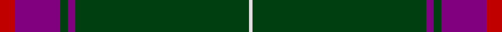

In pattern [RBGBGGGGGW](/stripes/rbgbgggggw/).

This was sourced from weddslist.  It is a [10 stripe tartan](/stripes/stripes10/).

Original link http://www.weddslist.com/cgi-bin/tartans/pg.pl?source=sts

## Thread count
R/8 P24 DG4 P4 DG48 DG4 DG4 DG32 DG4 LN/2

## Palette
Each colour and the base-6 reference it is a variant of.

| Colour | Shade | Base |
|---|---|---|
| DG | <code style="background-color:#004010;">#004010</code> `oklch(32.3% 0.098 146.3)` <small>#004010</small> | G <code style="background-color:#006100;">#006100</code> |
| LN | <code style="background-color:#E0E0E0;">#E0E0E0</code> `oklch(90.7% 0.000 89.9)` <small>#E0E0E0</small> | W <code style="background-color:#F7F7F7;">#F7F7F7</code> |
| P | <code style="background-color:#800080;">#800080</code> `oklch(42.1% 0.193 328.4)` <small>#800080</small> | B <code style="background-color:#2A418A;">#2A418A</code> |
| R | <code style="background-color:#C00000;">#C00000</code> `oklch(50.7% 0.208 29.2)` <small>#C00000</small> | R <code style="background-color:#CC0000;">#CC0000</code> |

## Nearest tartans

The nearest existing variants by ΔTartan distance, with this tartan at the top so the swatches line up against it.

ΔTartan

Tartan

Sett

—

<a href="/ttd/edit/#slug=r4p12dg2p2dg24dg2dg2dg16dg2w1~x2">Kinfauns Castle</a> <a class="nn-out" href="/setts/s10/r4p12dg2p2dg24dg2dg2dg16dg2w1~x2/" title="open its dictionary page">↗</a>

1.15

<a href="/ttd/edit/#slug=r2n2k2n28k8n9k1lo2~x2">Highland Autumn (Fashion)</a> <a class="nn-out" href="/setts/s8/r2n2k2n28k8n9k1lo2~x2/" title="open its dictionary page">↗</a>

1.20

<a href="/ttd/edit/#slug=r4g3dp3g44dp16g10w2g2dp2~x2">Glenfeshie (Personal)</a> <a class="nn-out" href="/setts/s9/r4g3dp3g44dp16g10w2g2dp2~x2/" title="open its dictionary page">↗</a>

1.24

<a href="/ttd/edit/#slug=k14n2k2n5k25w1n9m3k3w1k14~x2">Springbank</a> <a class="nn-out" href="/setts/s11/k14n2k2n5k25w1n9m3k3w1k14~x2/" title="open its dictionary page">↗</a>

1.25

<a href="/ttd/edit/#slug=k49o8k4n6o4n6k4o8k49o2">Harley Davidson</a> <a class="nn-out" href="/setts/s10/k49o8k4n6o4n6k4o8k49o2/" title="open its dictionary page">↗</a>

1.31

<a href="/ttd/edit/#slug=dg18r6dg75b6dg13lo35dg12b6">Glenlivet Check (Corporate)</a> <a class="nn-out" href="/setts/s8/dg18r6dg75b6dg13lo35dg12b6/" title="open its dictionary page">↗</a>

1.31

<a href="/ttd/edit/#slug=y5k1y33dp1y9k9dp5k1r2k4~x2">Lochnagar Dress (Fashion)</a> <a class="nn-out" href="/setts/s10/y5k1y33dp1y9k9dp5k1r2k4~x2/" title="open its dictionary page">↗</a>

1.36

<a href="/ttd/edit/#slug=k14n2k2n5k25w1n9p3k3w1k14~x2">Springbank</a> <a class="nn-out" href="/setts/s11/k14n2k2n5k25w1n9p3k3w1k14~x2/" title="open its dictionary page">↗</a>

1.38

<a href="/ttd/edit/#slug=k10n2o2n2k14n2k2lp1n12k24m2~x2">Pride of Scotland Platinum</a> <a class="nn-out" href="/setts/s11/k10n2o2n2k14n2k2lp1n12k24m2~x2/" title="open its dictionary page">↗</a>

1.42

<a href="/ttd/edit/#slug=k3n6k8lr2k8n3k5n36k2n3~x2">City Building (Glasgow) LLP</a> <a class="nn-out" href="/setts/s10/k3n6k8lr2k8n3k5n36k2n3~x2/" title="open its dictionary page">↗</a>

1.42

<a href="/ttd/edit/#slug=w3dg35db3dg2db3dg10r3dg2r3dg2r3dg10lo2~x2">Glencross (Kirkbampton) (Personal)</a> <a class="nn-out" href="/setts/s13/w3dg35db3dg2db3dg10r3dg2r3dg2r3dg10lo2~x2/" title="open its dictionary page">↗</a>

## Neighbour map

Every grey dot is one of 14299 variants placed by the first two principal components of the ΔTartan feature space (44% of its variance). Red is this tartan; blue dots are its nearest — click one to open its page.

<svg viewBox="0 0 640 380" role="img" style="max-width:100%;height:auto;border:1px solid #e0e0e0;border-radius:4px;display:block" xmlns="http://www.w3.org/2000/svg"><image href="/nn/cloud.v1.png" width="640" height="380"/><a href="/setts/s8/r2n2k2n28k8n9k1lo2~x2/"><circle cx="518.2" cy="164.7" r="4" fill="#3465a4"><title>Highland Autumn (Fashion)</title></circle></a><a href="/setts/s9/r4g3dp3g44dp16g10w2g2dp2~x2/"><circle cx="449.9" cy="147.7" r="4" fill="#3465a4"><title>Glenfeshie (Personal)</title></circle></a><a href="/setts/s11/k14n2k2n5k25w1n9m3k3w1k14~x2/"><circle cx="476.0" cy="165.9" r="4" fill="#3465a4"><title>Springbank</title></circle></a><a href="/setts/s10/k49o8k4n6o4n6k4o8k49o2/"><circle cx="508.2" cy="154.7" r="4" fill="#3465a4"><title>Harley Davidson</title></circle></a><a href="/setts/s8/dg18r6dg75b6dg13lo35dg12b6/"><circle cx="424.2" cy="201.4" r="4" fill="#3465a4"><title>Glenlivet Check (Corporate)</title></circle></a><a href="/setts/s10/y5k1y33dp1y9k9dp5k1r2k4~x2/"><circle cx="468.2" cy="137.2" r="4" fill="#3465a4"><title>Lochnagar Dress (Fashion)</title></circle></a><a href="/setts/s11/k14n2k2n5k25w1n9p3k3w1k14~x2/"><circle cx="467.4" cy="161.0" r="4" fill="#3465a4"><title>Springbank</title></circle></a><a href="/setts/s11/k10n2o2n2k14n2k2lp1n12k24m2~x2/"><circle cx="431.2" cy="147.6" r="4" fill="#3465a4"><title>Pride of Scotland Platinum</title></circle></a><a href="/setts/s10/k3n6k8lr2k8n3k5n36k2n3~x2/"><circle cx="452.9" cy="179.3" r="4" fill="#3465a4"><title>City Building (Glasgow) LLP</title></circle></a><a href="/setts/s13/w3dg35db3dg2db3dg10r3dg2r3dg2r3dg10lo2~x2/"><circle cx="477.4" cy="138.5" r="4" fill="#3465a4"><title>Glencross (Kirkbampton) (Personal)</title></circle></a><circle cx="476.6" cy="164.0" r="5" fill="#c00000"/></svg>

ID: /setts/s10/r4p12dg2p2dg24dg2dg2dg16dg2w1~x2/
