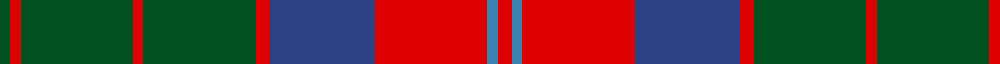

**Bands:** [GRGRGRBRBR](/stripes/grgrgrbrbr/) · **Stripes:** [DG R DG R DG R DB R T R](/stripes/stripes10/) DG R DG R DG R DB R T R

This was sourced from register-of-tartans.  It is a [10 band tartan](/bands/bands10/).

Original link https://www.tartanregister.gov.uk/tartanDetails.aspx?ref=4348

## Register references

External register numbers recorded for this tartan.

- Scottish Register of Tartans: [4348](https://www.tartanregister.gov.uk/tartanDetails.aspx?ref=4348)
- Scottish Tartans World Register: 884

## Thread count
G/6 R6 G64 R6 G64 R8 B60 R64 Ba6 R/8

## Palette
Each colour and its ΔE from the base-6 reference it is a variant of.

| Colour | Shade | Base | ΔE (OKLab) |
|---|---|---|---|
| B | <code style="background-color:#2C4084;">#2C4084</code> `#2C4084` | B <code style="background-color:#2A418A;">#2A418A</code> | 0.01 |
| Ba | <code style="background-color:#3C82AF;">#3C82AF</code> `#3C82AF` | B <code style="background-color:#2A418A;">#2A418A</code> | 0.19 |
| G | <code style="background-color:#005020;">#005020</code> `#005020` | G <code style="background-color:#006100;">#006100</code> | 0.07 |
| R | <code style="background-color:#DC0000;">#DC0000</code> `#DC0000` | R <code style="background-color:#CC0000;">#CC0000</code> | 0.03 |

## Nearest tartans

The nearest existing variants by ΔTartan distance.

1. [MacKillop (Clan)](/setts/s10/g3r2db2r14b1db4r2g12r2db2~x8/) — ΔT 0.83
1. [Unidentified Plaid 6](/setts/s10/r4t3r32db30r4g32r3g32r3g3~x2/) — ΔT 0.87
1. [MacKillen](/setts/s9/k4lo15dg5k3dg7k3dg30r20dg3~x2/) — ΔT 0.89
1. [Shieldhall (Fashion)](/setts/s12/do12r1do2r1do2lb2do3o9r1o2r1o3~x4/) — ΔT 0.89
1. [Cape Breton University Chemistry Society](/setts/s10/db4o17db4y4db2y4db4y27db4ly4~x2/) — ΔT 0.89
1. [Leitrim](/setts/s10/lo3dr2y18y3r13y4dr3y4dr18y3~x2/) — ΔT 0.95
1. [Glenfinnan (Clan?)](/setts/s10/n28r26w2n5w2r26lg28r5w2r5~x2/) — ΔT 0.98
1. [Daks (Blue Loden)](/setts/s8/lo3t7do2m2do14t2do2lo3~x2/) — ΔT 0.98
1. [Convention of the Baronage (Corp)](/setts/s9/g3r9t1g9r1g1r9db9r1~x4/) — ΔT 0.99
1. [Leach (1999)](/setts/s12/k6r3k3r24t4g10r2g4r2g24r6t2~x2/) — ΔT 1.00

## Neighbour map

Every grey dot is one of 14313 variants placed by the first two principal components of the ΔTartan feature space (44% of its variance). Red is this tartan; blue dots are its nearest — click one to open its page.

<svg viewBox="0 0 640 380" role="img" style="max-width:100%;height:auto;border:1px solid #e0e0e0;border-radius:4px;display:block" xmlns="http://www.w3.org/2000/svg"><image href="/nn/cloud.v1.png" width="640" height="380"/><a href="/setts/s10/g3r2db2r14b1db4r2g12r2db2~x8/"><circle cx="278.8" cy="162.7" r="4" fill="#3465a4"><title>MacKillop (Clan)</title></circle></a><a href="/setts/s10/r4t3r32db30r4g32r3g32r3g3~x2/"><circle cx="261.5" cy="183.0" r="4" fill="#3465a4"><title>Unidentified Plaid 6</title></circle></a><a href="/setts/s9/k4lo15dg5k3dg7k3dg30r20dg3~x2/"><circle cx="269.3" cy="196.4" r="4" fill="#3465a4"><title>MacKillen</title></circle></a><a href="/setts/s12/do12r1do2r1do2lb2do3o9r1o2r1o3~x4/"><circle cx="304.2" cy="168.6" r="4" fill="#3465a4"><title>Shieldhall (Fashion)</title></circle></a><a href="/setts/s10/db4o17db4y4db2y4db4y27db4ly4~x2/"><circle cx="281.0" cy="175.4" r="4" fill="#3465a4"><title>Cape Breton University Chemistry Society</title></circle></a><a href="/setts/s10/lo3dr2y18y3r13y4dr3y4dr18y3~x2/"><circle cx="248.0" cy="185.5" r="4" fill="#3465a4"><title>Leitrim</title></circle></a><a href="/setts/s10/n28r26w2n5w2r26lg28r5w2r5~x2/"><circle cx="274.0" cy="167.7" r="4" fill="#3465a4"><title>Glenfinnan (Clan?)</title></circle></a><a href="/setts/s8/lo3t7do2m2do14t2do2lo3~x2/"><circle cx="267.2" cy="206.4" r="4" fill="#3465a4"><title>Daks (Blue Loden)</title></circle></a><a href="/setts/s9/g3r9t1g9r1g1r9db9r1~x4/"><circle cx="252.1" cy="197.2" r="4" fill="#3465a4"><title>Convention of the Baronage (Corp)</title></circle></a><a href="/setts/s12/k6r3k3r24t4g10r2g4r2g24r6t2~x2/"><circle cx="256.4" cy="158.7" r="4" fill="#3465a4"><title>Leach (1999)</title></circle></a><circle cx="266.3" cy="183.7" r="5" fill="#c00000"/></svg>

ID: /setts/s10/r4t3r32db30r4dg32r3dg32r3dg3~x2/
