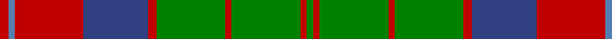

This page is one **sett** — a single exact thread-count. It belongs to the [tartan](/tartans/r4ba3r32b30r4g32r3g32r3g3/)
(the same proportion at any scale), whose colour order is pattern [GRGRGRBRBR](/stripes/grgrgrbrbr/).

Sourced from weddslist.  It is a [10 stripe tartan](/stripes/stripes10/).

Original link http://www.weddslist.com/cgi-bin/tartans/pg.pl?source=sts

## Also known as

This cloth is also recorded under:

- Unidentified Plaid #15

## Thread count
R/8 Ba6 R64 B60 R8 G64 R6 G64 R6 G/6

## Palette
Each colour and the base-6 reference it is a variant of.

| Colour | Shade | Base |
|---|---|---|
| B | <code style="background-color:#304080;">#304080</code> `oklch(39.4% 0.109 270.2)` <small>#304080</small> | B <code style="background-color:#2A418A;">#2A418A</code> |
| Ba | <code style="background-color:#5480B0;">#5480B0</code> `oklch(58.8% 0.089 251.5)` <small>#5480B0</small> | B <code style="background-color:#2A418A;">#2A418A</code> |
| G | <code style="background-color:#008000;">#008000</code> `oklch(52.0% 0.177 142.5)` <small>#008000</small> | G <code style="background-color:#006100;">#006100</code> |
| R | <code style="background-color:#C00000;">#C00000</code> `oklch(50.7% 0.208 29.2)` <small>#C00000</small> | R <code style="background-color:#CC0000;">#CC0000</code> |

## Nearest tartans

The nearest existing variants by ΔTartan distance, with this tartan at the top so the swatches line up against it.

ΔTartan

Tartan

Sett

—

<a href="/ttd/edit/#slug=r4t3r32db30r4g32r3g32r3g3~x2">Unidentified Plaid 6</a> <a class="nn-out" href="/setts/s10/r4t3r32db30r4g32r3g32r3g3~x2/" title="open its dictionary page">↗</a>

0.87

<a href="/ttd/edit/#slug=r4t3r32db30r4dg32r3dg32r3dg3~x2">Unidentified Plaid #15</a> <a class="nn-out" href="/setts/s10/r4t3r32db30r4dg32r3dg32r3dg3~x2/" title="open its dictionary page">↗</a>

0.90

<a href="/ttd/edit/#slug=r6g3k3o24g4k10g4r2g24r6g2~x2">MacNeish Htg</a> <a class="nn-out" href="/setts/s11/r6g3k3o24g4k10g4r2g24r6g2~x2/" title="open its dictionary page">↗</a>

0.96

<a href="/ttd/edit/#slug=w1r1g1r11t6r1g14r1g1w1~x4">Glen Tilt #2</a> <a class="nn-out" href="/setts/s10/w1r1g1r11t6r1g14r1g1w1~x4/" title="open its dictionary page">↗</a>

0.96

<a href="/ttd/edit/#slug=db4o17db4g4db2g4db4g27db4ly4~x2">Cape Breton University</a> <a class="nn-out" href="/setts/s10/db4o17db4g4db2g4db4g27db4ly4~x2/" title="open its dictionary page">↗</a>

0.96

<a href="/ttd/edit/#slug=g28r12g4db20ly2db3ly2db3g7~x2">Cork</a> <a class="nn-out" href="/setts/s9/g28r12g4db20ly2db3ly2db3g7~x2/" title="open its dictionary page">↗</a>

1.01

<a href="/ttd/edit/#slug=k6r3k3r24t4g10r2g4r2g24r6t2~x2">Leach (1999)</a> <a class="nn-out" href="/setts/s12/k6r3k3r24t4g10r2g4r2g24r6t2~x2/" title="open its dictionary page">↗</a>

1.02

<a href="/ttd/edit/#slug=ly5dg14dy4db4dy27dg3dy4ly5">Invertere Corporate Tartan Tartan Number: 1882. Earliest known date: 1988 Overstripes are yellow in warp See products available Copyright © Blair Urquhart, Comrie, 2015</a> <a class="nn-out" href="/setts/s8/ly5dg14dy4db4dy27dg3dy4ly5/" title="open its dictionary page">↗</a>

1.05

<a href="/ttd/edit/#slug=r3k2r3g12r3w1r1g1~x4">MacCall/McCall</a> <a class="nn-out" href="/setts/s8/r3k2r3g12r3w1r1g1~x4/" title="open its dictionary page">↗</a>

1.06

<a href="/ttd/edit/#slug=db10r2g2r6g16r1g2r1g3r6~x2">Nithsdale</a> <a class="nn-out" href="/setts/s10/db10r2g2r6g16r1g2r1g3r6~x2/" title="open its dictionary page">↗</a>

1.07

<a href="/ttd/edit/#slug=ly5dg14o4db4o27dg3o4ly5~x2">Invertere</a> <a class="nn-out" href="/setts/s8/ly5dg14o4db4o27dg3o4ly5~x2/" title="open its dictionary page">↗</a>

## Neighbour map

Every grey dot is one of 14299 variants placed by the first two principal components of the ΔTartan feature space (44% of its variance). Red is this tartan; blue dots are its nearest — click one to open its page.

<svg viewBox="0 0 640 380" role="img" style="max-width:100%;height:auto;border:1px solid #e0e0e0;border-radius:4px;display:block" xmlns="http://www.w3.org/2000/svg"><image href="/nn/cloud.v1.png" width="640" height="380"/><a href="/setts/s10/r4t3r32db30r4dg32r3dg32r3dg3~x2/"><circle cx="266.1" cy="183.6" r="4" fill="#3465a4"><title>Unidentified Plaid #15</title></circle></a><a href="/setts/s11/r6g3k3o24g4k10g4r2g24r6g2~x2/"><circle cx="234.9" cy="177.7" r="4" fill="#3465a4"><title>MacNeish Htg</title></circle></a><a href="/setts/s10/w1r1g1r11t6r1g14r1g1w1~x4/"><circle cx="267.0" cy="153.6" r="4" fill="#3465a4"><title>Glen Tilt #2</title></circle></a><a href="/setts/s10/db4o17db4g4db2g4db4g27db4ly4~x2/"><circle cx="251.5" cy="159.3" r="4" fill="#3465a4"><title>Cape Breton University</title></circle></a><a href="/setts/s9/g28r12g4db20ly2db3ly2db3g7~x2/"><circle cx="274.5" cy="177.8" r="4" fill="#3465a4"><title>Cork</title></circle></a><a href="/setts/s12/k6r3k3r24t4g10r2g4r2g24r6t2~x2/"><circle cx="256.2" cy="158.7" r="4" fill="#3465a4"><title>Leach (1999)</title></circle></a><a href="/setts/s8/ly5dg14dy4db4dy27dg3dy4ly5/"><circle cx="289.4" cy="201.7" r="4" fill="#3465a4"><title>Invertere Corporate Tartan Tartan Number: 1882. Earliest known date: 1988 Overstripes are yellow in warp See products available Copyright © Blair Urquhart, Comrie, 2015</title></circle></a><a href="/setts/s8/r3k2r3g12r3w1r1g1~x4/"><circle cx="307.8" cy="182.7" r="4" fill="#3465a4"><title>MacCall/McCall</title></circle></a><a href="/setts/s10/db10r2g2r6g16r1g2r1g3r6~x2/"><circle cx="301.7" cy="184.7" r="4" fill="#3465a4"><title>Nithsdale</title></circle></a><a href="/setts/s8/ly5dg14o4db4o27dg3o4ly5~x2/"><circle cx="271.1" cy="188.9" r="4" fill="#3465a4"><title>Invertere</title></circle></a><circle cx="261.3" cy="183.0" r="5" fill="#c00000"/></svg>

ID: /setts/s10/r4t3r32db30r4g32r3g32r3g3~x2/
