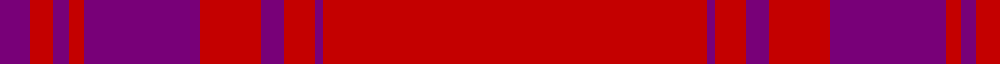

In pattern [BRBRBRBRBR](/patterns/brbrbrbrbr/).

This was sourced from tartans-authority.  It is a [10 stripes tartan](/stripes/stripes10/).

Original link http://www.tartansauthority.com/tartan-ferret/display/7197/

## Thread count
P/8 R6 P4 R4 P30 R16 P6 R8 P2 R/100

## Palette
Each colour and its ΔE from the base-6 reference it is a variant of.

| Colour | Shade | Base | ΔE (OKLab) |
|---|---|---|---|
| P | <code style="background-color:#780078;">#780078</code> `#780078` | B <code style="background-color:#2A418A;">#2A418A</code> | 0.17 |
| R | <code style="background-color:#C40000;">#C40000</code> `#C40000` | R <code style="background-color:#CC0000;">#CC0000</code> | 0.02 |

## Nearest tartans

The nearest existing variants by ΔTartan distance.

1. [Lomond](/setts/s8/r32b5r2b5r6b2r1b7~b5c5c5c-rc80000~x4/) — ΔT 1.63
1. [Kyle Blue (Clan)](/setts/s8/r54b6r5b6r10b3r2b18~b580058-rc80000~x2/) — ΔT 1.86
1. [KaDeWe](/setts/s8/r100g4r8g18r3g18r8g4~g003820-r880000~x2/) — ΔT 2.35
1. [Kyle (Blue)](/setts/s8/r54b6r5b6r10b3r2b18~b440044-rc80000~x2/) — ΔT 2.43
1. [Inverness, Earl of](/setts/s8/r42b4y1b6g1b1g1r12~b304080-g008000-rc00000-yf0c000~x2/) — ΔT 2.65
1. [Earl of Inverness (Artefact)](/setts/s8/r42b4y1b6g1b1g1r12~b440044-g006818-rc80000-yd8b000~x2/) — ΔT 2.65
1. [Fitzgibbon Red](/setts/s9/r2b6r24g2r2ra1r6b1ra2~b2d2d2d-g1c5627-ra3262a-rabd2125~x2/) — ΔT 2.66
1. [Bennet](/setts/s11/r64b18r2b3r2b3r14ba8r2ba4r2~b202060-ba2888c4-ra00048~x2/) — ΔT 2.73
1. [Fitzgibbon Red (Name)](/setts/s9/r2k6r24g2r2ra1r6k1ra2~g006818-k101010-r880000-rac80000~x2/) — ΔT 2.81
1. [Kirtle](/setts/s11/r42ra10b2ra2ba2ra2r10ba6ra2ba3r2~b5c5c5c-ba1c0070-ra80000-ra800028~x2/) — ΔT 2.87

## Neighbour map

Every grey dot is one of 15726 variants placed by the first two principal components of the ΔTartan feature space (44% of its variance). Red is this tartan; blue dots are its nearest — click one to open its page.

<svg viewBox="0 0 640 380" role="img" style="max-width:100%;height:auto;border:1px solid #e0e0e0;border-radius:4px;display:block" xmlns="http://www.w3.org/2000/svg"><image href="/nn/cloud.v1.png" width="640" height="380"/><a href="/setts/s8/r32b5r2b5r6b2r1b7~b5c5c5c-rc80000~x4/"><circle cx="610.6" cy="190.9" r="4" fill="#3465a4"><title>Lomond</title></circle></a><a href="/setts/s8/r54b6r5b6r10b3r2b18~b580058-rc80000~x2/"><circle cx="567.9" cy="179.7" r="4" fill="#3465a4"><title>Kyle Blue (Clan)</title></circle></a><a href="/setts/s8/r100g4r8g18r3g18r8g4~g003820-r880000~x2/"><circle cx="626.0" cy="190.0" r="4" fill="#3465a4"><title>KaDeWe</title></circle></a><a href="/setts/s8/r54b6r5b6r10b3r2b18~b440044-rc80000~x2/"><circle cx="547.9" cy="173.2" r="4" fill="#3465a4"><title>Kyle (Blue)</title></circle></a><a href="/setts/s8/r42b4y1b6g1b1g1r12~b304080-g008000-rc00000-yf0c000~x2/"><circle cx="625.3" cy="119.9" r="4" fill="#3465a4"><title>Inverness, Earl of</title></circle></a><a href="/setts/s8/r42b4y1b6g1b1g1r12~b440044-g006818-rc80000-yd8b000~x2/"><circle cx="626.0" cy="116.7" r="4" fill="#3465a4"><title>Earl of Inverness (Artefact)</title></circle></a><a href="/setts/s9/r2b6r24g2r2ra1r6b1ra2~b2d2d2d-g1c5627-ra3262a-rabd2125~x2/"><circle cx="603.9" cy="172.3" r="4" fill="#3465a4"><title>Fitzgibbon Red</title></circle></a><a href="/setts/s11/r64b18r2b3r2b3r14ba8r2ba4r2~b202060-ba2888c4-ra00048~x2/"><circle cx="550.0" cy="131.8" r="4" fill="#3465a4"><title>Bennet</title></circle></a><a href="/setts/s9/r2k6r24g2r2ra1r6k1ra2~g006818-k101010-r880000-rac80000~x2/"><circle cx="565.9" cy="159.2" r="4" fill="#3465a4"><title>Fitzgibbon Red (Name)</title></circle></a><a href="/setts/s11/r42ra10b2ra2ba2ra2r10ba6ra2ba3r2~b5c5c5c-ba1c0070-ra80000-ra800028~x2/"><circle cx="511.4" cy="145.2" r="4" fill="#3465a4"><title>Kirtle</title></circle></a><circle cx="626.0" cy="149.0" r="5" fill="#c00000"/></svg>

ID: /setts/s10/r50b1r4b3r8b15r2b2r3b4~b780078-rc40000~x2/
