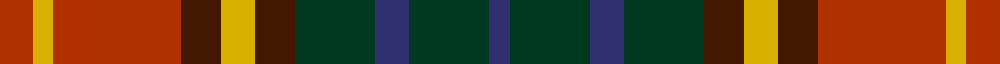

**Bands:** [RYRBYBGBGB](/stripes/ryrbybgbgb/) · **Stripes:** [R LY R DO LY DO DG DB DG DB](/stripes/stripes10/) R LY R DO LY DO DG DB DG DB

This was sourced from register-of-tartans.  It is a [10 band tartan](/bands/bands10/).

Original link https://www.tartanregister.gov.uk/tartanDetails.aspx?ref=3546

## Attestations

This cloth appears in 2 source records; the oldest owns this page.

- 01/01/1996 — Roscommon, County (register-of-tartans, [record](https://www.tartanregister.gov.uk/tartanDetails.aspx?ref=3546))
- 1997 — Roscommon, County (District) (tartans-authority, [record](http://www.tartansauthority.com/tartan-ferret/display/2246/))

## Register references

External register numbers recorded for this tartan.

- Scottish Register of Tartans: [3546](https://www.tartanregister.gov.uk/tartanDetails.aspx?ref=3546)
- Scottish Tartans Authority (ITI): 2246
- Scottish Tartans World Register: 2246

## Thread count
R/10 Y6 R38 DR12 Y10 DR12 DG24 DB10 DG24 DB/6

## Palette
Each colour and its ΔE from the base-6 reference it is a variant of.

| Colour | Shade | Base | ΔE (OKLab) |
|---|---|---|---|
| DB | <code style="background-color:#303070;">#303070</code> `#303070` | B <code style="background-color:#2A418A;">#2A418A</code> | 0.06 |
| DG | <code style="background-color:#003820;">#003820</code> `#003820` | G <code style="background-color:#006100;">#006100</code> | 0.15 |
| DR | <code style="background-color:#441800;">#441800</code> `#441800` | B <code style="background-color:#2A418A;">#2A418A</code> | 0.23 |
| R | <code style="background-color:#B03000;">#B03000</code> `#B03000` | R <code style="background-color:#CC0000;">#CC0000</code> | 0.06 |
| Y | <code style="background-color:#D8B000;">#D8B000</code> `#D8B000` | Y <code style="background-color:#F2BF00;">#F2BF00</code> | 0.06 |

## Nearest tartans

The nearest existing variants by ΔTartan distance.

1. [Maple Leaf](/setts/s12/dg19r3dg3r15lo13r15dg3r3dg19ly6lo6dy6~x2/) — ΔT 0.96
1. [Murdoch (Dalgliesh)](/setts/s10/k5do1g3do1g3do1k5r1r5r1~x4/) — ΔT 1.05
1. [Hueg (Personal)](/setts/s11/r10k10r4g2r2k2r4g12dt12g3dt4~x2/) — ΔT 1.06
1. [Fitzsimmons Red (Name)](/setts/s10/dy3y2lo18k4r15k4dy6k4lo2y3~x2/) — ΔT 1.10
1. [Etienne-Carter, Sir George](/setts/s10/r4g6ly3g12k14db5r20db5k4db2~x2/) — ΔT 1.14
1. [Kinloch Anderson](/setts/s12/r4dy14lo2dy4lo2k6dy3k6db14r2db4r4~x2/) — ΔT 1.15
1. [Maple Leaf Canadian District Tartan Tartan Number: 2034. Earliest known date: 1964 In creating the Maple Leaf Tartan fabric, David Weiser captured the natural phenomena of these leaves turning from summer into autumn. (The Office of the High Commissioner for Canada.) The sett is now regarded as a National tartan. See products available Copyright © Blair Urquhart, Comrie, 2015](/setts/s12/dg6m1dg1m4g4m4dg1m1dg6dy2g2ly2~x8/) — ΔT 1.15
1. [Maple Leaf MINI Canadian District Tartan Tartan Number: 20355. Earliest known date: 1964 Generated for Dupion Silk List for display purpose. See products available Copyright © Blair Urquhart, Comrie, 2015](/setts/s12/dg6m1dg1m4g4m4dg1m1dg6dy2g2ly2~x4/) — ΔT 1.15
1. [Glen Chalmadale](/setts/s9/g13w2g10k5r13k3r5dt15o5~x2/) — ΔT 1.15
1. [Monaghan Irish County Tartan Tartan Number: 2267. Earliest known date: 1996 One of a series of Irish District tartans designed by Polly Wittering of the House of Edgar, with colours reminiscent of the Country with soft warm colours dominating. See products available Copyright © Blair Urquhart, Comrie, 2015](/setts/s9/lo3dy2o14dg17dy14lo8o14dy2lo3~x2/) — ΔT 1.17

## Neighbour map

Every grey dot is one of 14299 variants placed by the first two principal components of the ΔTartan feature space (44% of its variance). Red is this tartan; blue dots are its nearest — click one to open its page.

<svg viewBox="0 0 640 380" role="img" style="max-width:100%;height:auto;border:1px solid #e0e0e0;border-radius:4px;display:block" xmlns="http://www.w3.org/2000/svg"><image href="/nn/cloud.v1.png" width="640" height="380"/><a href="/setts/s12/dg19r3dg3r15lo13r15dg3r3dg19ly6lo6dy6~x2/"><circle cx="161.9" cy="200.9" r="4" fill="#3465a4"><title>Maple Leaf</title></circle></a><a href="/setts/s10/k5do1g3do1g3do1k5r1r5r1~x4/"><circle cx="147.9" cy="224.4" r="4" fill="#3465a4"><title>Murdoch (Dalgliesh)</title></circle></a><a href="/setts/s11/r10k10r4g2r2k2r4g12dt12g3dt4~x2/"><circle cx="130.0" cy="220.0" r="4" fill="#3465a4"><title>Hueg (Personal)</title></circle></a><a href="/setts/s10/dy3y2lo18k4r15k4dy6k4lo2y3~x2/"><circle cx="156.5" cy="174.7" r="4" fill="#3465a4"><title>Fitzsimmons Red (Name)</title></circle></a><a href="/setts/s10/r4g6ly3g12k14db5r20db5k4db2~x2/"><circle cx="124.8" cy="172.3" r="4" fill="#3465a4"><title>Etienne-Carter, Sir George</title></circle></a><a href="/setts/s12/r4dy14lo2dy4lo2k6dy3k6db14r2db4r4~x2/"><circle cx="138.5" cy="193.0" r="4" fill="#3465a4"><title>Kinloch Anderson</title></circle></a><a href="/setts/s12/dg6m1dg1m4g4m4dg1m1dg6dy2g2ly2~x8/"><circle cx="163.8" cy="211.6" r="4" fill="#3465a4"><title>Maple Leaf Canadian District Tartan Tartan Number: 2034. Earliest known date: 1964 In creating the Maple Leaf Tartan fabric, David Weiser captured the natural phenomena of these leaves turning from summer into autumn. (The Office of the High Commissioner for Canada.) The sett is now regarded as a National tartan. See products available Copyright © Blair Urquhart, Comrie, 2015</title></circle></a><a href="/setts/s12/dg6m1dg1m4g4m4dg1m1dg6dy2g2ly2~x4/"><circle cx="163.8" cy="211.6" r="4" fill="#3465a4"><title>Maple Leaf MINI Canadian District Tartan Tartan Number: 20355. Earliest known date: 1964 Generated for Dupion Silk List for display purpose. See products available Copyright © Blair Urquhart, Comrie, 2015</title></circle></a><a href="/setts/s9/g13w2g10k5r13k3r5dt15o5~x2/"><circle cx="91.3" cy="197.2" r="4" fill="#3465a4"><title>Glen Chalmadale</title></circle></a><a href="/setts/s9/lo3dy2o14dg17dy14lo8o14dy2lo3~x2/"><circle cx="187.0" cy="221.3" r="4" fill="#3465a4"><title>Monaghan Irish County Tartan Tartan Number: 2267. Earliest known date: 1996 One of a series of Irish District tartans designed by Polly Wittering of the House of Edgar, with colours reminiscent of the Country with soft warm colours dominating. See products available Copyright © Blair Urquhart, Comrie, 2015</title></circle></a><circle cx="116.9" cy="208.2" r="5" fill="#c00000"/></svg>

ID: /setts/s10/r5ly3r19do6ly5do6dg12db5dg12db3~x2/
