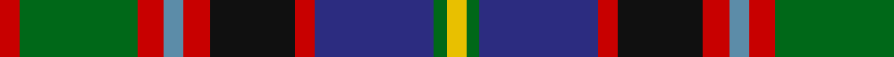

In pattern [RGRBRKRBGY](/patterns/rgrbrkrbgy/).

This was sourced from house-of-tartan.  It is a [10 stripes tartan](/stripes/stripes10/).

Original link http://www.house-of-tartan.scotland.net/house/TartanViewjs.asp?colr=Def&tnam=1536

## Thread count
R/6 G36 R8 B6 R8 K26 R6 DB36 G4 Y/6

## Palette
Each colour and its ΔE from the base-6 reference it is a variant of.

| Colour | Shade | Base | ΔE (OKLab) |
|---|---|---|---|
| B | <code style="background-color:#5C8CA8;">#5C8CA8</code> `#5C8CA8` | B <code style="background-color:#2C4084;">#2C4084</code> | 0.23 |
| DB | <code style="background-color:#2C2C80;">#2C2C80</code> `#2C2C80` | B <code style="background-color:#2C4084;">#2C4084</code> | 0.05 |
| G | <code style="background-color:#006818;">#006818</code> `#006818` | G <code style="background-color:#006400;">#006400</code> | 0.02 |
| K | <code style="background-color:#101010;">#101010</code> `#101010` | K <code style="background-color:#000000;">#000000</code> | 0.17 |
| R | <code style="background-color:#C80000;">#C80000</code> `#C80000` | R <code style="background-color:#C80000;">#C80000</code> | 0.00 |
| Y | <code style="background-color:#E8C000;">#E8C000</code> `#E8C000` | Y <code style="background-color:#E8C000;">#E8C000</code> | 0.00 |

## Nearest tartans

The nearest existing variants by ΔTartan distance.

1. [Gordonstoun (Corporate)](/setts/s12/y10g38r4b22w4r22g22r4k40r4k4w4-b5c8ca8-g408060-k101010-r800028-wa8ace8-ye8c000/) — ΔT 0.76
1. [Comyn/Cumming](/setts/s9/b16k8b16k40y4g40r16w4r16-b3c82af-g005020-k101010-rdc0000-we0e0e0-ye8c000/) — ΔT 0.77
1. [Stirling, and Bannockburn](/setts/s10/r6g36r8b6r8k26r6ba36g4y6-b5480b0-ba304080-g008000-k000000-rc00000-yf0c000/) — ΔT 0.79
1. [Dunedin](/setts/s9/k6r6g42ra16r6ra8k6b52w6-b304080-g008000-k000000-rc00000-ra900030-we0e0e0/) — ΔT 0.83
1. [Black Hills (Corporate)](/setts/s9/b6w4g28r28k4b14k18y4k4-b2c2c80-g408060-k101010-rc80000-we0e0e0-ye8c000/) — ΔT 0.87
1. [George Brown Family Tartan Tartan Number: 1853. Earliest known date: 1983 Design copyright is owned by Thomas Kempsill Gemmell and Davina Creighton Gemmell. Designed in traditional tartan colours. See products available Copyright © Blair Urquhart, Comrie, 2015](/setts/s9/y6b58k30r8g50r16k8r6w4-b2c2c80-g006818-k101010-rc80000-we0e0e0-ye8c000/) — ΔT 0.88
1. [MacLean](/setts/s11/b16k16y4k6w6k6g48r32b6r8k4-b2c4084-g005020-k101010-rdc0000-we0e0e0-ye8c000/) — ΔT 0.90
1. [Cowan of Inveresk Family Tartan Tartan Number: 1549. Earliest known date: 1979 This is a modern family tartan designed by the representer of the family of Cowan of Inveresk, in the parish of that name in Musselburgh, Mr Robert Cowan of Atlanta, Georgia. Cowans are a Sept of the Colquhouns, variously spelt Macillechomhghain, Comhain, Comhan and Cowen. Cowans not associated with the Inveresk branch of the family may wear the Colquhoun tartan on which this design is based. See products available Copyright © Blair Urquhart, Comrie, 2015](/setts/s8/r8g32w4k30b30k4b4y4-b2c2c80-g006818-k101010-rc80000-we0e0e0-ye8c000/) — ΔT 0.90
1. [National Trade Tartan Tartan Number: 1775. Earliest known date: 1934 This sett was designed by the National Association of Scottish Woollen Manufacturers in 1934. (STS archives) Some 60 years later (1994) a new 'National' tartan has been developed. See 'Scottish National' and 'Scottish National Dress'. See products available Copyright © Blair Urquhart, Comrie, 2015](/setts/s9/w4b6r12k16g24y2b8k4w4-b2c2c80-g006818-k101010-rc80000-we0e0e0-ye8c000/) — ΔT 0.92
1. [Black Hills](/setts/s9/b6w4g28r28k4b14k18y4k4-b2c2c80-g408060-k101010-rc80000-wffffff-ye8c000/) — ΔT 0.93

## Neighbour map

Every grey dot is one of 15726 variants placed by the first two principal components of the ΔTartan feature space (44% of its variance). Red is this tartan; blue dots are its nearest — click one to open its page.

<svg viewBox="0 0 640 380" role="img" style="max-width:100%;height:auto;border:1px solid #e0e0e0;border-radius:4px;display:block" xmlns="http://www.w3.org/2000/svg"><image href="/nn/cloud.v1.png" width="640" height="380"/><a href="/setts/s12/y10g38r4b22w4r22g22r4k40r4k4w4-b5c8ca8-g408060-k101010-r800028-wa8ace8-ye8c000/"><circle cx="103.7" cy="137.4" r="4" fill="#3465a4"><title>Gordonstoun (Corporate)</title></circle></a><a href="/setts/s9/b16k8b16k40y4g40r16w4r16-b3c82af-g005020-k101010-rdc0000-we0e0e0-ye8c000/"><circle cx="81.9" cy="161.5" r="4" fill="#3465a4"><title>Comyn/Cumming</title></circle></a><a href="/setts/s10/r6g36r8b6r8k26r6ba36g4y6-b5480b0-ba304080-g008000-k000000-rc00000-yf0c000/"><circle cx="66.3" cy="144.3" r="4" fill="#3465a4"><title>Stirling, and Bannockburn</title></circle></a><a href="/setts/s9/k6r6g42ra16r6ra8k6b52w6-b304080-g008000-k000000-rc00000-ra900030-we0e0e0/"><circle cx="123.8" cy="145.1" r="4" fill="#3465a4"><title>Dunedin</title></circle></a><a href="/setts/s9/b6w4g28r28k4b14k18y4k4-b2c2c80-g408060-k101010-rc80000-we0e0e0-ye8c000/"><circle cx="58.5" cy="163.7" r="4" fill="#3465a4"><title>Black Hills (Corporate)</title></circle></a><a href="/setts/s9/y6b58k30r8g50r16k8r6w4-b2c2c80-g006818-k101010-rc80000-we0e0e0-ye8c000/"><circle cx="127.1" cy="136.2" r="4" fill="#3465a4"><title>George Brown Family Tartan Tartan Number: 1853. Earliest known date: 1983 Design copyright is owned by Thomas Kempsill Gemmell and Davina Creighton Gemmell. Designed in traditional tartan colours. See products available Copyright © Blair Urquhart, Comrie, 2015</title></circle></a><a href="/setts/s11/b16k16y4k6w6k6g48r32b6r8k4-b2c4084-g005020-k101010-rdc0000-we0e0e0-ye8c000/"><circle cx="115.9" cy="125.1" r="4" fill="#3465a4"><title>MacLean</title></circle></a><a href="/setts/s8/r8g32w4k30b30k4b4y4-b2c2c80-g006818-k101010-rc80000-we0e0e0-ye8c000/"><circle cx="99.5" cy="171.1" r="4" fill="#3465a4"><title>Cowan of Inveresk Family Tartan Tartan Number: 1549. Earliest known date: 1979 This is a modern family tartan designed by the representer of the family of Cowan of Inveresk, in the parish of that name in Musselburgh, Mr Robert Cowan of Atlanta, Georgia. Cowans are a Sept of the Colquhouns, variously spelt Macillechomhghain, Comhain, Comhan and Cowen. Cowans not associated with the Inveresk branch of the family may wear the Colquhoun tartan on which this design is based. See products available Copyright © Blair Urquhart, Comrie, 2015</title></circle></a><a href="/setts/s9/w4b6r12k16g24y2b8k4w4-b2c2c80-g006818-k101010-rc80000-we0e0e0-ye8c000/"><circle cx="76.7" cy="147.9" r="4" fill="#3465a4"><title>National Trade Tartan Tartan Number: 1775. Earliest known date: 1934 This sett was designed by the National Association of Scottish Woollen Manufacturers in 1934. (STS archives) Some 60 years later (1994) a new 'National' tartan has been developed. See 'Scottish National' and 'Scottish National Dress'. See products available Copyright © Blair Urquhart, Comrie, 2015</title></circle></a><a href="/setts/s9/b6w4g28r28k4b14k18y4k4-b2c2c80-g408060-k101010-rc80000-wffffff-ye8c000/"><circle cx="55.4" cy="162.2" r="4" fill="#3465a4"><title>Black Hills</title></circle></a><circle cx="87.9" cy="152.3" r="5" fill="#c00000"/></svg>

ID: /setts/s10/r6g36r8b6r8k26r6ba36g4y6-b5c8ca8-ba2c2c80-g006818-k101010-rc80000-ye8c000/
