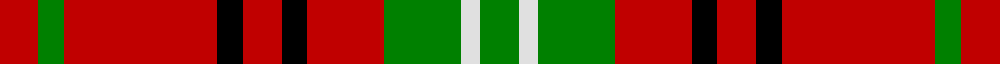

In pattern [GWGRKRKRGR](/stripes/gwgrkrkrgr/).

This was sourced from weddslist.  It is a [10 stripe tartan](/stripes/stripes10/).

Original link http://www.weddslist.com/cgi-bin/tartans/pg.pl?source=sts

## Also known as

This cloth is also recorded under:

- Morrison Old
- Morrison, Ancient

## Attestations

This cloth appears in 2 source records; the oldest owns this page.

- undated — Morrison, Ancient (weddslist, [record](http://www.weddslist.com/cgi-bin/tartans/pg.pl?source=sts))
- undated — Morrison Old Clan Tartan Tartan Number: 933. Earliest known date: 1745 This sett is very similar to the single green stripe version recorded by Lord Lyon in 1968. The date given by MacKinlay is 1745 whereas Lord Lyon gives 1747. Both setts are clearly based on the same pattern which was found in an old Morrison family bible during demolition work on a Black House in Lewis in 1935. [50%] See products available Copyright © Blair Urquhart, Comrie, 2015 (house-of-tartan, [record](http://www.house-of-tartan.scotland.net/house/TartanViewjs.asp?colr=Def&tnam=933))

## Thread count
R/6 G4 R24 K4 R6 K4 R12 G12 LN3 G/6

## Palette
Each colour and the base-6 reference it is a variant of.

| Colour | Shade | Base |
|---|---|---|
| G | <code style="background-color:#008000;">#008000</code> `oklch(52.0% 0.177 142.5)` <small>#008000</small> | G <code style="background-color:#006100;">#006100</code> |
| K | <code style="background-color:#000000;">#000000</code> `oklch(0.0% 0.000 0.0)` <small>#000000</small> | K <code style="background-color:#000000;">#000000</code> |
| LN | <code style="background-color:#E0E0E0;">#E0E0E0</code> `oklch(90.7% 0.000 89.9)` <small>#E0E0E0</small> | W <code style="background-color:#F7F7F7;">#F7F7F7</code> |
| R | <code style="background-color:#C00000;">#C00000</code> `oklch(50.7% 0.208 29.2)` <small>#C00000</small> | R <code style="background-color:#CC0000;">#CC0000</code> |

## Nearest tartans

The nearest existing variants by ΔTartan distance.

1. [Nicolson, MacNicol](/setts/s12/r6g1r6k4r1t1r1g8r6k1r6g1~x2/) — ΔT 0.55
1. [Morrison LC](/setts/s9/dg9lb4dg15r17k5r7k5r32dg5/) — ΔT 0.55
1. [Morrison Ancient](/setts/s10/dg6w3dg12r12k4r6k4r24dg4r6/) — ΔT 0.68
1. [Morrison](/setts/s9/g5w2g8r9k3r4k3r17g3~x2/) — ΔT 0.72
1. [MacNicol](/setts/s12/r6dg1r6k4r1lb1r1dg8r6k1r6dg1/) — ΔT 0.80
1. [MacQuarrie, Ancient](/setts/s12/r2db1r10k4r2g8r2g8r7k1r2db1~x2/) — ΔT 1.00
1. [Morrison LC](/setts/s9/dg9lr4dg15r17k5r7k5r32dg5~x2/) — ΔT 1.08
1. [Morrison LC](/setts/s9/dg9lr4dg15r17k5r7k5r32dg5/) — ΔT 1.08
1. [Nicolson (McIan)](/setts/s12/r6g1r6k4r1t1r1g8r6k1r6g1~x6/) — ΔT 1.10
1. [Comyn](/setts/s8/k1r9dg2r2dg4lb1dg4r1~x2/) — ΔT 1.12

## Neighbour map

Every grey dot is one of 14299 variants placed by the first two principal components of the ΔTartan feature space (44% of its variance). Red is this tartan; blue dots are its nearest — click one to open its page.

<svg viewBox="0 0 640 380" role="img" style="max-width:100%;height:auto;border:1px solid #e0e0e0;border-radius:4px;display:block" xmlns="http://www.w3.org/2000/svg"><image href="/nn/cloud.v1.png" width="640" height="380"/><a href="/setts/s12/r6g1r6k4r1t1r1g8r6k1r6g1~x2/"><circle cx="304.4" cy="180.2" r="4" fill="#3465a4"><title>Nicolson, MacNicol</title></circle></a><a href="/setts/s9/dg9lb4dg15r17k5r7k5r32dg5/"><circle cx="281.5" cy="188.7" r="4" fill="#3465a4"><title>Morrison LC</title></circle></a><a href="/setts/s10/dg6w3dg12r12k4r6k4r24dg4r6/"><circle cx="301.3" cy="186.8" r="4" fill="#3465a4"><title>Morrison Ancient</title></circle></a><a href="/setts/s9/g5w2g8r9k3r4k3r17g3~x2/"><circle cx="286.1" cy="194.9" r="4" fill="#3465a4"><title>Morrison</title></circle></a><a href="/setts/s12/r6dg1r6k4r1lb1r1dg8r6k1r6dg1/"><circle cx="306.2" cy="179.5" r="4" fill="#3465a4"><title>MacNicol</title></circle></a><a href="/setts/s12/r2db1r10k4r2g8r2g8r7k1r2db1~x2/"><circle cx="258.9" cy="171.1" r="4" fill="#3465a4"><title>MacQuarrie, Ancient</title></circle></a><a href="/setts/s9/dg9lr4dg15r17k5r7k5r32dg5~x2/"><circle cx="298.5" cy="201.1" r="4" fill="#3465a4"><title>Morrison LC</title></circle></a><a href="/setts/s9/dg9lr4dg15r17k5r7k5r32dg5/"><circle cx="298.5" cy="201.1" r="4" fill="#3465a4"><title>Morrison LC</title></circle></a><a href="/setts/s12/r6g1r6k4r1t1r1g8r6k1r6g1~x6/"><circle cx="328.6" cy="190.1" r="4" fill="#3465a4"><title>Nicolson (McIan)</title></circle></a><a href="/setts/s8/k1r9dg2r2dg4lb1dg4r1~x2/"><circle cx="283.3" cy="191.8" r="4" fill="#3465a4"><title>Comyn</title></circle></a><circle cx="288.0" cy="185.1" r="5" fill="#c00000"/></svg>

ID: /setts/s10/r6g4r24k4r6k4r12g12w3g6/
