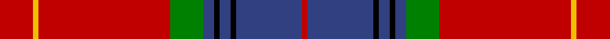

In pattern [RBKBKBGRYR](/stripes/rbkbkbgryr/).

This was sourced from weddslist.  It is a [10 stripe tartan](/stripes/stripes10/).

Original link http://www.weddslist.com/cgi-bin/tartans/pg.pl?source=sts

## Thread count
R/12 Y2 R48 G12 B4 K2 B4 K2 B24 R/2

## Palette
Each colour and the base-6 reference it is a variant of.

| Colour | Shade | Base |
|---|---|---|
| B | <code style="background-color:#304080;">#304080</code> `oklch(39.4% 0.109 270.2)` <small>#304080</small> | B <code style="background-color:#2A418A;">#2A418A</code> |
| G | <code style="background-color:#008000;">#008000</code> `oklch(52.0% 0.177 142.5)` <small>#008000</small> | G <code style="background-color:#006100;">#006100</code> |
| K | <code style="background-color:#000000;">#000000</code> `oklch(0.0% 0.000 0.0)` <small>#000000</small> | K <code style="background-color:#000000;">#000000</code> |
| R | <code style="background-color:#C00000;">#C00000</code> `oklch(50.7% 0.208 29.2)` <small>#C00000</small> | R <code style="background-color:#CC0000;">#CC0000</code> |
| Y | <code style="background-color:#F0C000;">#F0C000</code> `oklch(82.7% 0.169 90.5)` <small>#F0C000</small> | Y <code style="background-color:#F2BF00;">#F2BF00</code> |

## Nearest tartans

The nearest existing variants by ΔTartan distance.

1. [Chisholm #2](/setts/s10/r6w1r24db6dg2k1dg2k1dg12r1~x2/) — ΔT 0.56
1. [Chisholm VS](/setts/s10/r6lb1r24db6dg2k1dg2k1dg12r1/) — ΔT 0.74
1. [MacDonald of Glenaladale](/setts/s11/db3t1r30db32r3w1r3dg23r31db3w1/) — ΔT 0.76
1. [Chisholm VS](/setts/s10/r6lr1r24db6dg2k1dg2k1dg12r1~x2/) — ΔT 0.82
1. [Chisholm VS](/setts/s10/r6lr1r24db6dg2k1dg2k1dg12r1/) — ΔT 0.82
1. [MacDonald of Glenaladale](/setts/s11/db3t1r30db32r3w1r3g23r31db3w1/) — ΔT 0.89
1. [Chisholm](/setts/s10/r6w1r24db6g2k1g2k1g12r1~x2/) — ΔT 0.95
1. [Aberdeen F.C. Corporate Tartan Tartan Number: 2694. Earliest known date: 1997 The Aberdeen Football Club commissioned this design to include the colours of the teams away strip - navy and gold. See products available Copyright © Blair Urquhart, Comrie, 2015](/setts/s8/lo5dt1r2dt4r36dt22w4ly2~x2/) — ΔT 0.98
1. [MacLeay (Clan)](/setts/s7/r27g4k4g4k4db6lo1~x4/) — ΔT 0.98
1. [Chisholm D](/setts/s10/r6lb1r24dp6dg2dp1dg2dp1dg12r1/) — ΔT 0.99

## Neighbour map

Every grey dot is one of 14299 variants placed by the first two principal components of the ΔTartan feature space (44% of its variance). Red is this tartan; blue dots are its nearest — click one to open its page.

<svg viewBox="0 0 640 380" role="img" style="max-width:100%;height:auto;border:1px solid #e0e0e0;border-radius:4px;display:block" xmlns="http://www.w3.org/2000/svg"><image href="/nn/cloud.v1.png" width="640" height="380"/><a href="/setts/s10/r6w1r24db6dg2k1dg2k1dg12r1~x2/"><circle cx="340.8" cy="103.0" r="4" fill="#3465a4"><title>Chisholm #2</title></circle></a><a href="/setts/s10/r6lb1r24db6dg2k1dg2k1dg12r1/"><circle cx="331.5" cy="102.7" r="4" fill="#3465a4"><title>Chisholm VS</title></circle></a><a href="/setts/s11/db3t1r30db32r3w1r3dg23r31db3w1/"><circle cx="320.8" cy="100.0" r="4" fill="#3465a4"><title>MacDonald of Glenaladale</title></circle></a><a href="/setts/s10/r6lr1r24db6dg2k1dg2k1dg12r1~x2/"><circle cx="350.0" cy="115.8" r="4" fill="#3465a4"><title>Chisholm VS</title></circle></a><a href="/setts/s10/r6lr1r24db6dg2k1dg2k1dg12r1/"><circle cx="350.0" cy="115.8" r="4" fill="#3465a4"><title>Chisholm VS</title></circle></a><a href="/setts/s11/db3t1r30db32r3w1r3g23r31db3w1/"><circle cx="326.9" cy="106.3" r="4" fill="#3465a4"><title>MacDonald of Glenaladale</title></circle></a><a href="/setts/s10/r6w1r24db6g2k1g2k1g12r1~x2/"><circle cx="335.6" cy="104.4" r="4" fill="#3465a4"><title>Chisholm</title></circle></a><a href="/setts/s8/lo5dt1r2dt4r36dt22w4ly2~x2/"><circle cx="328.4" cy="94.5" r="4" fill="#3465a4"><title>Aberdeen F.C. Corporate Tartan Tartan Number: 2694. Earliest known date: 1997 The Aberdeen Football Club commissioned this design to include the colours of the teams away strip - navy and gold. See products available Copyright © Blair Urquhart, Comrie, 2015</title></circle></a><a href="/setts/s7/r27g4k4g4k4db6lo1~x4/"><circle cx="325.9" cy="120.6" r="4" fill="#3465a4"><title>MacLeay (Clan)</title></circle></a><a href="/setts/s10/r6lb1r24dp6dg2dp1dg2dp1dg12r1/"><circle cx="373.1" cy="125.5" r="4" fill="#3465a4"><title>Chisholm D</title></circle></a><circle cx="343.7" cy="106.6" r="5" fill="#c00000"/></svg>

ID: /setts/s10/r6ly1r24g6db2k1db2k1db12r1~x2/
