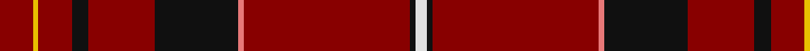

**Bands:** [RYRKRKRRKW](/stripes/ryrkrkrrkw/) · **Stripes:** [R LY R K R K R R K W](/stripes/stripes10/) R LY R K R K R R K W

This was sourced from register-of-tartans.  It is a [10 band tartan](/bands/bands10/).

Original link https://www.tartanregister.gov.uk/tartanDetails.aspx?ref=3026

## Attestations

This cloth appears in 2 source records; the oldest owns this page.

- 01/01/2004 — Motherwell Football Club 1991 (register-of-tartans, [record](https://www.tartanregister.gov.uk/tartanDetails.aspx?ref=3026))
- pre 2004 — Motherwell Football Club 1991 (Sport (tartans-authority, [record](http://www.tartansauthority.com/tartan-ferret/display/7013/))

## Register references

External register numbers recorded for this tartan.

- Scottish Register of Tartans: [3026](https://www.tartanregister.gov.uk/tartanDetails.aspx?ref=3026)
- Scottish Tartans Authority (ITI): 7013

## Thread count
DR/12 Y2 DR12 K6 DR24 K30 LR2 DR60 K2 LN/4

## Palette
Each colour and its ΔE from the base-6 reference it is a variant of.

| Colour | Shade | Base | ΔE (OKLab) |
|---|---|---|---|
| DR | <code style="background-color:#880000;">#880000</code> `#880000` | R <code style="background-color:#CC0000;">#CC0000</code> | 0.15 |
| K | <code style="background-color:#101010;">#101010</code> `#101010` | K <code style="background-color:#000000;">#000000</code> | 0.17 |
| LN | <code style="background-color:#E0E0E0;">#E0E0E0</code> `#E0E0E0` | W <code style="background-color:#F7F7F7;">#F7F7F7</code> | 0.07 |
| LR | <code style="background-color:#E87878;">#E87878</code> `#E87878` | R <code style="background-color:#CC0000;">#CC0000</code> | 0.19 |
| Y | <code style="background-color:#E8C000;">#E8C000</code> `#E8C000` | Y <code style="background-color:#F2BF00;">#F2BF00</code> | 0.02 |

## Nearest tartans

The nearest existing variants by ΔTartan distance.

1. [Fernie (Personal)](/setts/s10/r25dt5o2r12o1w1o1r12o2dt5~x2/) — ΔT 1.12
1. [New York Caledonian Club Dress](/setts/s11/r9db1r2db3r28k12lb1r6lb1db6r1~x2/) — ΔT 1.32
1. [Glencross (Haverlands House) (Personal)](/setts/s13/w3r35y3r2y3r10dg3r2dg3r2dg3r10ly2~x2/) — ΔT 1.44
1. [De Nardi #2 (Personal)](/setts/s8/r68db27r5ly3r5g3r13t3~x2/) — ΔT 1.45
1. [Wilding, Michael John (Personal)](/setts/s13/w2k2t2ly2k2r6k1r12k2r6w1r23k1~x2/) — ΔT 1.45
1. [Wilding, Michael John (Personal)](/setts/s13/w2k2t2ly2k2r7k1r12k2r6w1r23k1~x2/) — ΔT 1.54
1. [Perthshire Clayquhat District Tartan Tartan Number: 2800. Earliest known date: c.1739 Early historic plaid woven for (or by) Janet Craigie (nee Spalding) from the Braes of Clayquhat (now Cloquhat) in East Perthshire. Two pieces are now in the possession of the Scottish Tartans Authority (2014). See http://scottishtartans.co.uk/An_Unnamed_C18th_Plaid_from_Bridge_of_Cally.pdf See products available Copyright © Blair Urquhart, Comrie, 2015](/setts/s7/r23k1g9r3db1lr1r1~x4/) — ΔT 1.54
1. [Stuart of Bute](/setts/s9/r12dg6k1dg2k1dg1k6r24lr2~x2/) — ΔT 1.55
1. [Highlands of Wyomissing (Corporate)](/setts/s8/r35lb3r8ly2dg11ly2r8lb3~x2/) — ΔT 1.58
1. [De Nardi (Personal)](/setts/s8/r68db26r5ly3r5g3r13o3~x2/) — ΔT 1.59

## Neighbour map

Every grey dot is one of 14313 variants placed by the first two principal components of the ΔTartan feature space (44% of its variance). Red is this tartan; blue dots are its nearest — click one to open its page.

<svg viewBox="0 0 640 380" role="img" style="max-width:100%;height:auto;border:1px solid #e0e0e0;border-radius:4px;display:block" xmlns="http://www.w3.org/2000/svg"><image href="/nn/cloud.v1.png" width="640" height="380"/><a href="/setts/s10/r25dt5o2r12o1w1o1r12o2dt5~x2/"><circle cx="509.5" cy="139.4" r="4" fill="#3465a4"><title>Fernie (Personal)</title></circle></a><a href="/setts/s11/r9db1r2db3r28k12lb1r6lb1db6r1~x2/"><circle cx="426.3" cy="117.1" r="4" fill="#3465a4"><title>New York Caledonian Club Dress</title></circle></a><a href="/setts/s13/w3r35y3r2y3r10dg3r2dg3r2dg3r10ly2~x2/"><circle cx="481.9" cy="110.6" r="4" fill="#3465a4"><title>Glencross (Haverlands House) (Personal)</title></circle></a><a href="/setts/s8/r68db27r5ly3r5g3r13t3~x2/"><circle cx="476.2" cy="114.4" r="4" fill="#3465a4"><title>De Nardi #2 (Personal)</title></circle></a><a href="/setts/s13/w2k2t2ly2k2r6k1r12k2r6w1r23k1~x2/"><circle cx="467.9" cy="95.8" r="4" fill="#3465a4"><title>Wilding, Michael John (Personal)</title></circle></a><a href="/setts/s13/w2k2t2ly2k2r7k1r12k2r6w1r23k1~x2/"><circle cx="478.3" cy="95.4" r="4" fill="#3465a4"><title>Wilding, Michael John (Personal)</title></circle></a><a href="/setts/s7/r23k1g9r3db1lr1r1~x4/"><circle cx="465.3" cy="121.0" r="4" fill="#3465a4"><title>Perthshire Clayquhat District Tartan Tartan Number: 2800. Earliest known date: c.1739 Early historic plaid woven for (or by) Janet Craigie (nee Spalding) from the Braes of Clayquhat (now Cloquhat) in East Perthshire. Two pieces are now in the possession of the Scottish Tartans Authority (2014). See http://scottishtartans.co.uk/An_Unnamed_C18th_Plaid_from_Bridge_of_Cally.pdf See products available Copyright © Blair Urquhart, Comrie, 2015</title></circle></a><a href="/setts/s9/r12dg6k1dg2k1dg1k6r24lr2~x2/"><circle cx="414.4" cy="129.9" r="4" fill="#3465a4"><title>Stuart of Bute</title></circle></a><a href="/setts/s8/r35lb3r8ly2dg11ly2r8lb3~x2/"><circle cx="448.7" cy="151.3" r="4" fill="#3465a4"><title>Highlands of Wyomissing (Corporate)</title></circle></a><a href="/setts/s8/r68db26r5ly3r5g3r13o3~x2/"><circle cx="490.4" cy="118.2" r="4" fill="#3465a4"><title>De Nardi (Personal)</title></circle></a><circle cx="471.8" cy="122.1" r="5" fill="#c00000"/></svg>

ID: /setts/s10/r6ly1r6k3r12k15r1r30k1w2~x2/
