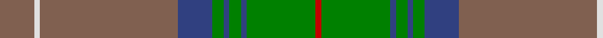

In pattern [RGBGBGBRWR](/patterns/rgbgbgbrwr/).

This was sourced from weddslist.  It is a [10 stripes tartan](/stripes/stripes10/).

Original link http://www.weddslist.com/cgi-bin/tartans/pg.pl?source=sts

## Thread count
LT/12 LN2 LT48 B12 G4 B2 G4 B2 G24 R/2

## Palette
Each colour and its ΔE from the base-6 reference it is a variant of.

| Colour | Shade | Base | ΔE (OKLab) |
|---|---|---|---|
| B | <code style="background-color:#304080;">#304080</code> `#304080` | B <code style="background-color:#2A418A;">#2A418A</code> | 0.02 |
| G | <code style="background-color:#008000;">#008000</code> `#008000` | G <code style="background-color:#006100;">#006100</code> | 0.10 |
| LN | <code style="background-color:#E0E0E0;">#E0E0E0</code> `#E0E0E0` | W <code style="background-color:#F7F7F7;">#F7F7F7</code> | 0.07 |
| LT | <code style="background-color:#806050;">#806050</code> `#806050` | R <code style="background-color:#CC0000;">#CC0000</code> | 0.17 |
| R | <code style="background-color:#C00000;">#C00000</code> `#C00000` | R <code style="background-color:#CC0000;">#CC0000</code> | 0.03 |

## Nearest tartans

The nearest existing variants by ΔTartan distance.

1. [Chisholm Hunting Clan Tartan Tartan Number: 1458. Earliest known date: 1906 This is a classic example of the process that began during the late Victorian period when the new analine dyes of the 1860s were considered to be too bright. Subtler forms of the tartan were produced, often replacing the red ground with green or brown. See products available Copyright © Blair Urquhart, Comrie, 2015](/setts/s10/g6w1g24b6ga2b1ga2b1ga12r1~b2c2c80-g604000-ga006818-rc80000-we0e0e0~x2/) — ΔT 0.84
1. [Inchforth (Personal)](/setts/s9/r4g2r7b30r8b7ga5g1w2~b5c5c5c-g003820-ga006818-r888888-wfcfcfc~x2/) — ΔT 0.98
1. [Westmeath Irish County Tartan Tartan Number: 2278. Earliest known date: 1996 One of a series of Irish District tartans designed by Polly Wittering of the House of Edgar, with colours reminiscent of the Country with soft warm colours dominating. See products available Copyright © Blair Urquhart, Comrie, 2015](/setts/s14/g11r6b6ga2g3ga2b6r6g36y2ga3y2b5r5~b004874-g3c6838-ga28200c-r8c0020-ycc9c10~x2/) — ΔT 1.11
1. [Rikaco Eve (Fashion)](/setts/s10/g4b4g2y36b14y2ba4g7r5y3~b5c5c5c-ba2888c4-g006818-rc80000-ya08858~x2/) — ΔT 1.11
1. [Manitoba Province](/setts/s14/r12g1ga3g20b1g1b3g1b1g20ga3g1r12y3~b5c8ca8-g006818-ga285800-r901c38-ybc8c00~x4/) — ΔT 1.14
1. [Hickory](/setts/s10/b4g30ba2g2ba14w2ba2w1ba6ga3~b141e46-ba4c3428-g786557-ga767e52-wf0e0c8~x2/) — ΔT 1.16
1. [Bressuire (District)](/setts/s7/r1g4y1g3r4b15w1~b506878-g006818-r880000-we0e0e0-ybc8c00~x4/) — ΔT 1.28
1. [Sarna](/setts/s13/g8y2r4b4g3b4r42g4ra3g4r4b5ra3~b800080-g008000-r806050-rac00000-yf0c000/) — ΔT 1.28
1. [Toyokawa Check](/setts/s11/b36ba10y2ba5g2ba5y10b5y2b10w2~b5c5c5c-ba680028-g408060-we0e0e0-ya08858~x2/) — ΔT 1.31
1. [Manitoba Province (District)](/setts/s14/r12g1ga3g20b1g1b3g1b1g20ga3g1r12y3~b5c8ca8-g006818-ga003820-r901c38-ybc8c00~x4/) — ΔT 1.34

## Neighbour map

Every grey dot is one of 15726 variants placed by the first two principal components of the ΔTartan feature space (44% of its variance). Red is this tartan; blue dots are its nearest — click one to open its page.

<svg viewBox="0 0 640 380" role="img" style="max-width:100%;height:auto;border:1px solid #e0e0e0;border-radius:4px;display:block" xmlns="http://www.w3.org/2000/svg"><image href="/nn/cloud.v1.png" width="640" height="380"/><a href="/setts/s10/g6w1g24b6ga2b1ga2b1ga12r1~b2c2c80-g604000-ga006818-rc80000-we0e0e0~x2/"><circle cx="388.9" cy="149.6" r="4" fill="#3465a4"><title>Chisholm Hunting Clan Tartan Tartan Number: 1458. Earliest known date: 1906 This is a classic example of the process that began during the late Victorian period when the new analine dyes of the 1860s were considered to be too bright. Subtler forms of the tartan were produced, often replacing the red ground with green or brown. See products available Copyright © Blair Urquhart, Comrie, 2015</title></circle></a><a href="/setts/s9/r4g2r7b30r8b7ga5g1w2~b5c5c5c-g003820-ga006818-r888888-wfcfcfc~x2/"><circle cx="408.0" cy="150.7" r="4" fill="#3465a4"><title>Inchforth (Personal)</title></circle></a><a href="/setts/s14/g11r6b6ga2g3ga2b6r6g36y2ga3y2b5r5~b004874-g3c6838-ga28200c-r8c0020-ycc9c10~x2/"><circle cx="339.4" cy="137.3" r="4" fill="#3465a4"><title>Westmeath Irish County Tartan Tartan Number: 2278. Earliest known date: 1996 One of a series of Irish District tartans designed by Polly Wittering of the House of Edgar, with colours reminiscent of the Country with soft warm colours dominating. See products available Copyright © Blair Urquhart, Comrie, 2015</title></circle></a><a href="/setts/s10/g4b4g2y36b14y2ba4g7r5y3~b5c5c5c-ba2888c4-g006818-rc80000-ya08858~x2/"><circle cx="355.5" cy="154.0" r="4" fill="#3465a4"><title>Rikaco Eve (Fashion)</title></circle></a><a href="/setts/s14/r12g1ga3g20b1g1b3g1b1g20ga3g1r12y3~b5c8ca8-g006818-ga285800-r901c38-ybc8c00~x4/"><circle cx="348.9" cy="136.9" r="4" fill="#3465a4"><title>Manitoba Province</title></circle></a><a href="/setts/s10/b4g30ba2g2ba14w2ba2w1ba6ga3~b141e46-ba4c3428-g786557-ga767e52-wf0e0c8~x2/"><circle cx="364.2" cy="126.1" r="4" fill="#3465a4"><title>Hickory</title></circle></a><a href="/setts/s7/r1g4y1g3r4b15w1~b506878-g006818-r880000-we0e0e0-ybc8c00~x4/"><circle cx="331.2" cy="176.1" r="4" fill="#3465a4"><title>Bressuire (District)</title></circle></a><a href="/setts/s13/g8y2r4b4g3b4r42g4ra3g4r4b5ra3~b800080-g008000-r806050-rac00000-yf0c000/"><circle cx="379.1" cy="115.0" r="4" fill="#3465a4"><title>Sarna</title></circle></a><a href="/setts/s11/b36ba10y2ba5g2ba5y10b5y2b10w2~b5c5c5c-ba680028-g408060-we0e0e0-ya08858~x2/"><circle cx="383.9" cy="150.5" r="4" fill="#3465a4"><title>Toyokawa Check</title></circle></a><a href="/setts/s14/r12g1ga3g20b1g1b3g1b1g20ga3g1r12y3~b5c8ca8-g006818-ga003820-r901c38-ybc8c00~x4/"><circle cx="340.1" cy="133.1" r="4" fill="#3465a4"><title>Manitoba Province (District)</title></circle></a><circle cx="381.6" cy="143.0" r="5" fill="#c00000"/></svg>

ID: /setts/s10/r6w1r24b6g2b1g2b1g12ra1~b304080-g008000-r806050-rac00000-we0e0e0~x2/
