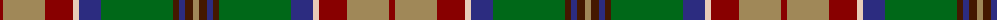

In pattern [RYRWBGBBBY](/patterns/ryrwbgbbby/).

This was sourced from tartans-authority.  It is a [10 stripes tartan](/stripes/stripes10/).

Original link http://www.tartansauthority.com/tartan-ferret/display/8623/

## Thread count
DRa/6 LT42 DRa28 LR6 DB22 G72 DR6 DB6 DR8 LT/6

## Palette
Each colour and its ΔE from the base-6 reference it is a variant of.

| Colour | Shade | Base | ΔE (OKLab) |
|---|---|---|---|
| DB | <code style="background-color:#2C2C80;">#2C2C80</code> `#2C2C80` | B <code style="background-color:#2A418A;">#2A418A</code> | 0.06 |
| DR | <code style="background-color:#441800;">#441800</code> `#441800` | B <code style="background-color:#2A418A;">#2A418A</code> | 0.23 |
| DRa | <code style="background-color:#880000;">#880000</code> `#880000` | R <code style="background-color:#CC0000;">#CC0000</code> | 0.15 |
| G | <code style="background-color:#006818;">#006818</code> `#006818` | G <code style="background-color:#006100;">#006100</code> | 0.02 |
| LR | <code style="background-color:#E8CCB8;">#E8CCB8</code> `#E8CCB8` | W <code style="background-color:#F7F7F7;">#F7F7F7</code> | 0.12 |
| LT | <code style="background-color:#A08858;">#A08858</code> `#A08858` | Y <code style="background-color:#F2BF00;">#F2BF00</code> | 0.21 |

## Nearest tartans

The nearest existing variants by ΔTartan distance.

1. [Royal Pharmaceutical Society (Corp)](/setts/s9/g4r4ga38r12ga4r12y28ra8w4-g604000-ga003820-r888888-ra901c38-we0e0e0-ya08858/) — ΔT 0.72
1. [Royal Pharmaceutical Society](/setts/s9/g6r4ga38r12ga4r12y28ra8w4-g604000-ga003820-r888888-ra901c38-we0e0e0-ya08858/) — ΔT 0.73
1. [State Seal of New Mexico (Fashion)](/setts/s8/w10r98w6g48ra10y8ga60w8-g003820-ga604000-r888888-ra880000-we8ccb8-ybc8c00/) — ΔT 0.94
1. [Wcwm 9275-1258](/setts/s12/g32ga8k16y4k4w4k4b32g12k4g4w4-b4c3428-g8c7038-ga006818-k101010-wc0c0c0-yd09800/) — ΔT 0.96
1. [Goddin mab Gododdin (Personal)](/setts/s8/r8y6b48g52ga6y42ba4y8-b1c1c1c-ba780078-g604000-ga006818-ra00000-ya08858/) — ΔT 0.97
1. [Murphy (District)](/setts/s12/k16r4k12y4k4w4k4g32ga48r4ga8k4-g84642c-ga347430-k101010-rc80000-wfcfcfc-yd8b000/) — ΔT 1.04
1. [Bruce of Kinnaird (Vivienne Westwood Design)](/setts/s10/g44ga44b4w12b4y4b32gb10g16w4-b501400-g604000-ga8c7038-gb0098a0-wc0c0c0-yd09800/) — ΔT 1.06
1. [Isle of Skye](/setts/s11/r40b4r4b4r6b16g18ga16gb16g2y4-b300030-g003000-ga008000-gb607030-r806050-yb0b0b0/) — ΔT 1.06
1. [Royal Pharmaceutical Society Commemorative Tartan Tartan Number: 2091. Earliest known date: 1991 Created by Kinloch Anderson of Edinburgh for the 150th Anniversary of the Royal Pharmaceutical Society of Great Britain which was held at Scone Palace, Perthshire in 1991. See products available Copyright © Blair Urquhart, Comrie, 2015](/setts/s10/b6ba4g38ba12g4ba12y28w4bb8w4-b441800-ba2c2c80-bb780078-g006818-we0e0e0-ya08858/) — ΔT 1.09
1. [Gallagher Irish Fashion Tartan Tartan Number: 4053. Earliest known date: 2001 February See products available Copyright © Blair Urquhart, Comrie, 2015](/setts/s9/b8g82y8ga8y8ga18r36y8w8-b202060-g005448-ga008c54-rdc6854-we0e0e0-ya08858/) — ΔT 1.10

## Neighbour map

Every grey dot is one of 15726 variants placed by the first two principal components of the ΔTartan feature space (44% of its variance). Red is this tartan; blue dots are its nearest — click one to open its page.

<svg viewBox="0 0 640 380" role="img" style="max-width:100%;height:auto;border:1px solid #e0e0e0;border-radius:4px;display:block" xmlns="http://www.w3.org/2000/svg"><image href="/nn/cloud.v1.png" width="640" height="380"/><a href="/setts/s9/g4r4ga38r12ga4r12y28ra8w4-g604000-ga003820-r888888-ra901c38-we0e0e0-ya08858/"><circle cx="153.3" cy="158.8" r="4" fill="#3465a4"><title>Royal Pharmaceutical Society (Corp)</title></circle></a><a href="/setts/s9/g6r4ga38r12ga4r12y28ra8w4-g604000-ga003820-r888888-ra901c38-we0e0e0-ya08858/"><circle cx="147.5" cy="161.2" r="4" fill="#3465a4"><title>Royal Pharmaceutical Society</title></circle></a><a href="/setts/s8/w10r98w6g48ra10y8ga60w8-g003820-ga604000-r888888-ra880000-we8ccb8-ybc8c00/"><circle cx="192.8" cy="132.8" r="4" fill="#3465a4"><title>State Seal of New Mexico (Fashion)</title></circle></a><a href="/setts/s12/g32ga8k16y4k4w4k4b32g12k4g4w4-b4c3428-g8c7038-ga006818-k101010-wc0c0c0-yd09800/"><circle cx="144.2" cy="147.7" r="4" fill="#3465a4"><title>Wcwm 9275-1258</title></circle></a><a href="/setts/s8/r8y6b48g52ga6y42ba4y8-b1c1c1c-ba780078-g604000-ga006818-ra00000-ya08858/"><circle cx="171.3" cy="156.3" r="4" fill="#3465a4"><title>Goddin mab Gododdin (Personal)</title></circle></a><a href="/setts/s12/k16r4k12y4k4w4k4g32ga48r4ga8k4-g84642c-ga347430-k101010-rc80000-wfcfcfc-yd8b000/"><circle cx="170.5" cy="122.1" r="4" fill="#3465a4"><title>Murphy (District)</title></circle></a><a href="/setts/s10/g44ga44b4w12b4y4b32gb10g16w4-b501400-g604000-ga8c7038-gb0098a0-wc0c0c0-yd09800/"><circle cx="166.4" cy="155.7" r="4" fill="#3465a4"><title>Bruce of Kinnaird (Vivienne Westwood Design)</title></circle></a><a href="/setts/s11/r40b4r4b4r6b16g18ga16gb16g2y4-b300030-g003000-ga008000-gb607030-r806050-yb0b0b0/"><circle cx="187.2" cy="133.0" r="4" fill="#3465a4"><title>Isle of Skye</title></circle></a><a href="/setts/s10/b6ba4g38ba12g4ba12y28w4bb8w4-b441800-ba2c2c80-bb780078-g006818-we0e0e0-ya08858/"><circle cx="124.0" cy="148.8" r="4" fill="#3465a4"><title>Royal Pharmaceutical Society Commemorative Tartan Tartan Number: 2091. Earliest known date: 1991 Created by Kinloch Anderson of Edinburgh for the 150th Anniversary of the Royal Pharmaceutical Society of Great Britain which was held at Scone Palace, Perthshire in 1991. See products available Copyright © Blair Urquhart, Comrie, 2015</title></circle></a><a href="/setts/s9/b8g82y8ga8y8ga18r36y8w8-b202060-g005448-ga008c54-rdc6854-we0e0e0-ya08858/"><circle cx="205.1" cy="143.1" r="4" fill="#3465a4"><title>Gallagher Irish Fashion Tartan Tartan Number: 4053. Earliest known date: 2001 February See products available Copyright © Blair Urquhart, Comrie, 2015</title></circle></a><circle cx="159.8" cy="138.5" r="5" fill="#c00000"/></svg>

ID: /setts/s10/r6y42r28w6b22g72ba6b6ba8y6-b2c2c80-ba441800-g006818-r880000-we8ccb8-ya08858/
