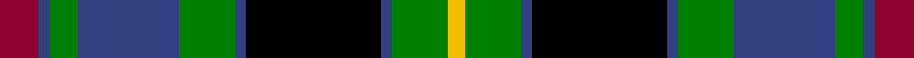

In pattern [RBGBGBKBGY](/stripes/rbgbgbkbgy/).

This was sourced from weddslist.  It is a [10 stripe tartan](/stripes/stripes10/).

Original link http://www.weddslist.com/cgi-bin/tartans/pg.pl?source=sts

## Thread count
DR/14 B4 G10 B36 G20 B4 K48 B4 G20 Y/6

## Palette
Each colour and the base-6 reference it is a variant of.

| Colour | Shade | Base |
|---|---|---|
| B | <code style="background-color:#304080;">#304080</code> `oklch(39.4% 0.109 270.2)` <small>#304080</small> | B <code style="background-color:#2A418A;">#2A418A</code> |
| DR | <code style="background-color:#900030;">#900030</code> `oklch(41.6% 0.166 13.6)` <small>#900030</small> | R <code style="background-color:#CC0000;">#CC0000</code> |
| G | <code style="background-color:#008000;">#008000</code> `oklch(52.0% 0.177 142.5)` <small>#008000</small> | G <code style="background-color:#006100;">#006100</code> |
| K | <code style="background-color:#000000;">#000000</code> `oklch(0.0% 0.000 0.0)` <small>#000000</small> | K <code style="background-color:#000000;">#000000</code> |
| Y | <code style="background-color:#F0C000;">#F0C000</code> `oklch(82.7% 0.169 90.5)` <small>#F0C000</small> | Y <code style="background-color:#F2BF00;">#F2BF00</code> |

## Nearest tartans

The nearest existing variants by ΔTartan distance.

1. [Grant, hunting](/setts/s11/db11k2db2k2db2k11g11r2g3k1ly3~x2/) — ΔT 0.35
1. [MacLaren](/setts/s11/db22k4db4k4db4k22g22r6g6k2ly3~x2/) — ΔT 0.37
1. [Grant](/setts/s11/db24k4db4k4db4k24g24r5g6k2ly2~x2/) — ΔT 0.56
1. [MacDonell of Glengarry](/setts/s11/db8r4db12r1k12g12r3g2r1g4w1~x2/) — ΔT 0.61
1. [Borrodale](/setts/s8/r5db3r3db29k29g29w4r4~x2/) — ΔT 0.67
1. [Biskup](/setts/s10/db12r4db18r2k19g18r4g3ly2g8~x2/) — ΔT 0.68
1. [Unnamed, No 22](/setts/s11/t2k1t1db2k8r2g8db2t1k1t2~x2/) — ΔT 0.77
1. [MacEwen / MacEwan](/setts/s13/r2k1g12k12db12k1db2k1db12k12g12k1ly2~x2/) — ΔT 0.78
1. [MacDonald of Clanranald 2](/setts/s13/db8r1db2r3db12r1k12w1g12r3g2r1g8~x2/) — ΔT 0.79
1. [Clerke of Ulva](/setts/s11/t3g3k4g14k4g3k14db18r1db4r2~x2/) — ΔT 0.79

## Neighbour map

Every grey dot is one of 14299 variants placed by the first two principal components of the ΔTartan feature space (44% of its variance). Red is this tartan; blue dots are its nearest — click one to open its page.

<svg viewBox="0 0 640 380" role="img" style="max-width:100%;height:auto;border:1px solid #e0e0e0;border-radius:4px;display:block" xmlns="http://www.w3.org/2000/svg"><image href="/nn/cloud.v1.png" width="640" height="380"/><a href="/setts/s11/db11k2db2k2db2k11g11r2g3k1ly3~x2/"><circle cx="119.9" cy="156.3" r="4" fill="#3465a4"><title>Grant, hunting</title></circle></a><a href="/setts/s11/db22k4db4k4db4k22g22r6g6k2ly3~x2/"><circle cx="127.7" cy="157.0" r="4" fill="#3465a4"><title>MacLaren</title></circle></a><a href="/setts/s11/db24k4db4k4db4k24g24r5g6k2ly2~x2/"><circle cx="144.2" cy="150.7" r="4" fill="#3465a4"><title>Grant</title></circle></a><a href="/setts/s11/db8r4db12r1k12g12r3g2r1g4w1~x2/"><circle cx="127.0" cy="157.5" r="4" fill="#3465a4"><title>MacDonell of Glengarry</title></circle></a><a href="/setts/s8/r5db3r3db29k29g29w4r4~x2/"><circle cx="114.3" cy="167.9" r="4" fill="#3465a4"><title>Borrodale</title></circle></a><a href="/setts/s10/db12r4db18r2k19g18r4g3ly2g8~x2/"><circle cx="116.6" cy="176.9" r="4" fill="#3465a4"><title>Biskup</title></circle></a><a href="/setts/s11/t2k1t1db2k8r2g8db2t1k1t2~x2/"><circle cx="104.9" cy="162.5" r="4" fill="#3465a4"><title>Unnamed, No 22</title></circle></a><a href="/setts/s13/r2k1g12k12db12k1db2k1db12k12g12k1ly2~x2/"><circle cx="138.1" cy="154.8" r="4" fill="#3465a4"><title>MacEwen / MacEwan</title></circle></a><a href="/setts/s13/db8r1db2r3db12r1k12w1g12r3g2r1g8~x2/"><circle cx="132.8" cy="147.3" r="4" fill="#3465a4"><title>MacDonald of Clanranald 2</title></circle></a><a href="/setts/s11/t3g3k4g14k4g3k14db18r1db4r2~x2/"><circle cx="148.3" cy="145.0" r="4" fill="#3465a4"><title>Clerke of Ulva</title></circle></a><circle cx="118.8" cy="160.3" r="5" fill="#c00000"/></svg>

ID: /setts/s10/r7db2g5db18g10db2k24db2g10ly3~x2/
