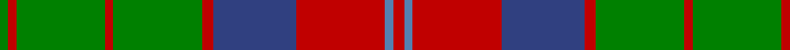

In pattern [GRGRGRBRBR](/patterns/grgrgrbrbr/).

This was sourced from weddslist.  It is a [10 stripes tartan](/stripes/stripes10/).

Original link http://www.weddslist.com/cgi-bin/tartans/pg.pl?source=sts

## Thread count
G/6 R6 G64 R6 G64 R8 B60 R64 Ba6 R/8

## Palette
Each colour and its ΔE from the base-6 reference it is a variant of.

| Colour | Shade | Base | ΔE (OKLab) |
|---|---|---|---|
| B | <code style="background-color:#304080;">#304080</code> `#304080` | B <code style="background-color:#2C4084;">#2C4084</code> | 0.01 |
| Ba | <code style="background-color:#5480B0;">#5480B0</code> `#5480B0` | B <code style="background-color:#2C4084;">#2C4084</code> | 0.20 |
| G | <code style="background-color:#008000;">#008000</code> `#008000` | G <code style="background-color:#006400;">#006400</code> | 0.09 |
| R | <code style="background-color:#C00000;">#C00000</code> `#C00000` | R <code style="background-color:#C80000;">#C80000</code> | 0.02 |

## Nearest tartans

The nearest existing variants by ΔTartan distance.

1. [Unidentified Plaid #15](/setts/s10/r8b6r64ba60r8g64r6g64r6g6-b3c82af-ba2c4084-g005020-rdc0000/) — ΔT 0.87
1. [MacNeish Htg](/setts/s11/r12g6k6ra48g8k20g8r4g48r12g4-g006818-k101010-r880000-ra888888/) — ΔT 0.90
1. [Cape Breton University](/setts/s10/b8r34b8g8b4g8b8g54b8y8-b202060-g006818-re86000-yfccc00/) — ΔT 0.95
1. [Glen Tilt #2](/setts/s10/w4g4r4g56r4b24r44g4r4w4-b2888c4-g006818-r880000-we0e0e0/) — ΔT 0.95
1. [Cork](/setts/s9/g56r24g8b40y4b6y4b6g14-b304080-g008000-rc00000-yf0c000/) — ΔT 0.96
1. [Leach (1999)](/setts/s12/k12r6k6r48b8g20r4g8r4g48r12b4-b2888c4-g006818-k101010-rc80000/) — ΔT 1.00
1. [Invertere Corporate Tartan Tartan Number: 1882. Earliest known date: 1988 Overstripes are yellow in warp See products available Copyright © Blair Urquhart, Comrie, 2015](/setts/s8/y5g14ga4b4ga27g3ga4y5-b202060-g003820-ga604000-ye8c000/) — ΔT 1.02
1. [MacCall/McCall](/setts/s8/r12k8r12g48r12w4r4g4-g006818-k101010-r880000-wffffff/) — ΔT 1.05
1. [Nithsdale](/setts/s10/b20r4g4r12g32r2g4r2g6r12-b304080-g008000-rc00000/) — ΔT 1.06
1. [Invertere](/setts/s8/y10g28r8b8r54g6r8y10-b000050-g003000-r806050-yf0c000/) — ΔT 1.07

## Neighbour map

Every grey dot is one of 15726 variants placed by the first two principal components of the ΔTartan feature space (44% of its variance). Red is this tartan; blue dots are its nearest — click one to open its page.

<svg viewBox="0 0 640 380" role="img" style="max-width:100%;height:auto;border:1px solid #e0e0e0;border-radius:4px;display:block" xmlns="http://www.w3.org/2000/svg"><image href="/nn/cloud.v1.png" width="640" height="380"/><a href="/setts/s10/r8b6r64ba60r8g64r6g64r6g6-b3c82af-ba2c4084-g005020-rdc0000/"><circle cx="263.7" cy="181.2" r="4" fill="#3465a4"><title>Unidentified Plaid #15</title></circle></a><a href="/setts/s11/r12g6k6ra48g8k20g8r4g48r12g4-g006818-k101010-r880000-ra888888/"><circle cx="231.1" cy="174.1" r="4" fill="#3465a4"><title>MacNeish Htg</title></circle></a><a href="/setts/s10/b8r34b8g8b4g8b8g54b8y8-b202060-g006818-re86000-yfccc00/"><circle cx="248.5" cy="158.1" r="4" fill="#3465a4"><title>Cape Breton University</title></circle></a><a href="/setts/s10/w4g4r4g56r4b24r44g4r4w4-b2888c4-g006818-r880000-we0e0e0/"><circle cx="263.5" cy="151.2" r="4" fill="#3465a4"><title>Glen Tilt #2</title></circle></a><a href="/setts/s9/g56r24g8b40y4b6y4b6g14-b304080-g008000-rc00000-yf0c000/"><circle cx="271.3" cy="175.2" r="4" fill="#3465a4"><title>Cork</title></circle></a><a href="/setts/s12/k12r6k6r48b8g20r4g8r4g48r12b4-b2888c4-g006818-k101010-rc80000/"><circle cx="253.8" cy="157.4" r="4" fill="#3465a4"><title>Leach (1999)</title></circle></a><a href="/setts/s8/y5g14ga4b4ga27g3ga4y5-b202060-g003820-ga604000-ye8c000/"><circle cx="287.7" cy="199.5" r="4" fill="#3465a4"><title>Invertere Corporate Tartan Tartan Number: 1882. Earliest known date: 1988 Overstripes are yellow in warp See products available Copyright © Blair Urquhart, Comrie, 2015</title></circle></a><a href="/setts/s8/r12k8r12g48r12w4r4g4-g006818-k101010-r880000-wffffff/"><circle cx="305.7" cy="180.8" r="4" fill="#3465a4"><title>MacCall/McCall</title></circle></a><a href="/setts/s10/b20r4g4r12g32r2g4r2g6r12-b304080-g008000-rc00000/"><circle cx="299.7" cy="182.6" r="4" fill="#3465a4"><title>Nithsdale</title></circle></a><a href="/setts/s8/y10g28r8b8r54g6r8y10-b000050-g003000-r806050-yf0c000/"><circle cx="269.5" cy="188.4" r="4" fill="#3465a4"><title>Invertere</title></circle></a><circle cx="258.8" cy="180.7" r="5" fill="#c00000"/></svg>

ID: /setts/s10/r8b6r64ba60r8g64r6g64r6g6-b5480b0-ba304080-g008000-rc00000/
