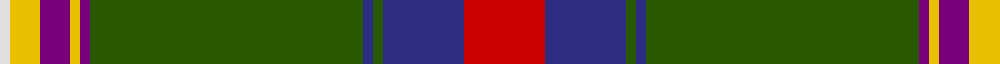

In pattern [RBGBGBYBYW](/stripes/rbgbgbybyw/).

This was sourced from register-of-tartans.  It is a [10 stripe tartan](/stripes/stripes10/).

Original link https://www.tartanregister.gov.uk/tartanDetails.aspx?ref=10764

## Also known as

This cloth is also recorded under:

- Holyoke St. Patrick's

## Attestations

This cloth appears in 3 source records; the oldest owns this page.

- 17/03/2002 — Holyoke St. Patrick's (register-of-tartans, [record](https://www.tartanregister.gov.uk/tartanDetails.aspx?ref=10764))
- 2002 — Holyoke St Patrick's (Corporate) (tartans-authority, [record](http://www.tartansauthority.com/tartan-ferret/display/10764/))
- undated — Holyoke St Patrick's Corporate Tartan Tartan Number: 5780. Earliest known date: 2002 Designed in 2002 by Gerald D Healy (2002 President) & Ralf L Hartwell Jnr for the Holyoke St Patrick's Committee in Holyoke Massachusetts which is home to the second largest St Patrick's parade in the USA. Colours chosen: red, white & blue from the US flag; green white and gold from the Irish flag and the Parade Committee; green & white from the Holyoke Community College; purple & white from the Holyoke Catholic High School and black & gold from the Dean Vocational High School. See products available Copyright © Blair Urquhart, Comrie, 2015 (house-of-tartan, [record](http://www.house-of-tartan.scotland.net/house/TartanViewjs.asp?colr=Def&tnam=5780))

## Register references

External register numbers recorded for this tartan.

- Scottish Register of Tartans: [10764](https://www.tartanregister.gov.uk/tartanDetails.aspx?ref=10764)

## Thread count
R/16 DB16 G2 DB2 G54 P2 Y2 P6 Y6 LN/2

## Palette
Each colour and the base-6 reference it is a variant of.

| Colour | Shade | Base |
|---|---|---|
| DB | <code style="background-color:#2C2C80;">#2C2C80</code> `oklch(35.0% 0.138 276.6)` <small>#2C2C80</small> | B <code style="background-color:#2A418A;">#2A418A</code> |
| G | <code style="background-color:#285800;">#285800</code> `oklch(41.0% 0.122 135.8)` <small>#285800</small> | G <code style="background-color:#006100;">#006100</code> |
| LN | <code style="background-color:#E0E0E0;">#E0E0E0</code> `oklch(90.7% 0.000 89.9)` <small>#E0E0E0</small> | W <code style="background-color:#F7F7F7;">#F7F7F7</code> |
| P | <code style="background-color:#780078;">#780078</code> `oklch(40.2% 0.185 328.4)` <small>#780078</small> | B <code style="background-color:#2A418A;">#2A418A</code> |
| R | <code style="background-color:#C80000;">#C80000</code> `oklch(52.3% 0.215 29.2)` <small>#C80000</small> | R <code style="background-color:#CC0000;">#CC0000</code> |
| Y | <code style="background-color:#E8C000;">#E8C000</code> `oklch(81.9% 0.168 93.7)` <small>#E8C000</small> | Y <code style="background-color:#F2BF00;">#F2BF00</code> |

## Nearest tartans

The nearest existing variants by ΔTartan distance, with this tartan at the top so the swatches line up against it.

ΔTartan

Tartan

Sett

—

<a href="/ttd/edit/#slug=r8db8dg1db1dg27dp1ly1dp3ly3w1~x2">Holyoke St. Patrick's</a> <a class="nn-out" href="/setts/s10/r8db8dg1db1dg27dp1ly1dp3ly3w1~x2/" title="open its dictionary page">↗</a>

1.01

<a href="/ttd/edit/#slug=w4k1db16k1dg32r6k6o6dg4o2dg1~x2">Zambia</a> <a class="nn-out" href="/setts/s11/w4k1db16k1dg32r6k6o6dg4o2dg1~x2/" title="open its dictionary page">↗</a>

1.10

<a href="/ttd/edit/#slug=ly3g6dg32r4ly2r2dp7dg2w2~x2">Pienaar (Personal)</a> <a class="nn-out" href="/setts/s9/ly3g6dg32r4ly2r2dp7dg2w2~x2/" title="open its dictionary page">↗</a>

1.10

<a href="/ttd/edit/#slug=w2db4r16k12g36ly1db6k2w2~x2">National Millennium</a> <a class="nn-out" href="/setts/s9/w2db4r16k12g36ly1db6k2w2~x2/" title="open its dictionary page">↗</a>

1.18

<a href="/ttd/edit/#slug=r10db4r3db6w3db4w3db40dg73k4db2ly6">Johnston, Diana Dress (Personal)</a> <a class="nn-out" href="/setts/s12/r10db4r3db6w3db4w3db40dg73k4db2ly6/" title="open its dictionary page">↗</a>

1.24

<a href="/ttd/edit/#slug=db8t1k6ly1k2w2k2g12o28w1o4~x2">MacLean of Kingairloch</a> <a class="nn-out" href="/setts/s11/db8t1k6ly1k2w2k2g12o28w1o4~x2/" title="open its dictionary page">↗</a>

1.26

<a href="/ttd/edit/#slug=dy29g17k1w3k1ly2k10t8dy4t8k10ly2k1w3dy29~x2">Massie/Massey</a> <a class="nn-out" href="/setts/s15/dy29g17k1w3k1ly2k10t8dy4t8k10ly2k1w3dy29~x2/" title="open its dictionary page">↗</a>

1.27

<a href="/ttd/edit/#slug=ly2dg4dt1r3dt3dg3g1r32dt14w3ly2~x2">Banause-Zunft zu Olte</a> <a class="nn-out" href="/setts/s11/ly2dg4dt1r3dt3dg3g1r32dt14w3ly2~x2/" title="open its dictionary page">↗</a>

1.30

<a href="/ttd/edit/#slug=g20lr1lb2lr1lb2db4r1db1r1db1r1db1r2w2~x4">Mighty Men (Corporate)</a> <a class="nn-out" href="/setts/s14/g20lr1lb2lr1lb2db4r1db1r1db1r1db1r2w2~x4/" title="open its dictionary page">↗</a>

1.30

<a href="/ttd/edit/#slug=r3lb3k3lb3r3db8k1ly2k1db8k2g30k1g10k2~x2">Coigach</a> <a class="nn-out" href="/setts/s15/r3lb3k3lb3r3db8k1ly2k1db8k2g30k1g10k2~x2/" title="open its dictionary page">↗</a>

1.31

<a href="/ttd/edit/#slug=dt8k3y1k1y39k3r3y2dt11k8y2k3w2~x2">Afghanistan Memorial</a> <a class="nn-out" href="/setts/s13/dt8k3y1k1y39k3r3y2dt11k8y2k3w2~x2/" title="open its dictionary page">↗</a>

## Neighbour map

Every grey dot is one of 14299 variants placed by the first two principal components of the ΔTartan feature space (44% of its variance). Red is this tartan; blue dots are its nearest — click one to open its page.

<svg viewBox="0 0 640 380" role="img" style="max-width:100%;height:auto;border:1px solid #e0e0e0;border-radius:4px;display:block" xmlns="http://www.w3.org/2000/svg"><image href="/nn/cloud.v1.png" width="640" height="380"/><a href="/setts/s11/w4k1db16k1dg32r6k6o6dg4o2dg1~x2/"><circle cx="250.8" cy="91.3" r="4" fill="#3465a4"><title>Zambia</title></circle></a><a href="/setts/s9/ly3g6dg32r4ly2r2dp7dg2w2~x2/"><circle cx="286.7" cy="112.0" r="4" fill="#3465a4"><title>Pienaar (Personal)</title></circle></a><a href="/setts/s9/w2db4r16k12g36ly1db6k2w2~x2/"><circle cx="236.7" cy="88.9" r="4" fill="#3465a4"><title>National Millennium</title></circle></a><a href="/setts/s12/r10db4r3db6w3db4w3db40dg73k4db2ly6/"><circle cx="283.4" cy="64.8" r="4" fill="#3465a4"><title>Johnston, Diana Dress (Personal)</title></circle></a><a href="/setts/s11/db8t1k6ly1k2w2k2g12o28w1o4~x2/"><circle cx="219.7" cy="66.8" r="4" fill="#3465a4"><title>MacLean of Kingairloch</title></circle></a><a href="/setts/s15/dy29g17k1w3k1ly2k10t8dy4t8k10ly2k1w3dy29~x2/"><circle cx="240.2" cy="88.0" r="4" fill="#3465a4"><title>Massie/Massey</title></circle></a><a href="/setts/s11/ly2dg4dt1r3dt3dg3g1r32dt14w3ly2~x2/"><circle cx="309.9" cy="73.2" r="4" fill="#3465a4"><title>Banause-Zunft zu Olte</title></circle></a><a href="/setts/s14/g20lr1lb2lr1lb2db4r1db1r1db1r1db1r2w2~x4/"><circle cx="252.8" cy="66.0" r="4" fill="#3465a4"><title>Mighty Men (Corporate)</title></circle></a><a href="/setts/s15/r3lb3k3lb3r3db8k1ly2k1db8k2g30k1g10k2~x2/"><circle cx="258.5" cy="74.3" r="4" fill="#3465a4"><title>Coigach</title></circle></a><a href="/setts/s13/dt8k3y1k1y39k3r3y2dt11k8y2k3w2~x2/"><circle cx="330.8" cy="76.7" r="4" fill="#3465a4"><title>Afghanistan Memorial</title></circle></a><circle cx="287.6" cy="86.6" r="5" fill="#c00000"/></svg>

ID: /setts/s10/r8db8dg1db1dg27dp1ly1dp3ly3w1~x2/
