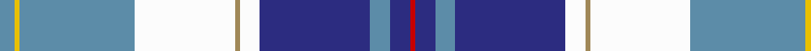

In pattern [BYBWYWBBBR](/stripes/bybwywbbbr/).

This was sourced from register-of-tartans.  It is a [10 stripe tartan](/stripes/stripes10/).

Original link https://www.tartanregister.gov.uk/tartanDetails.aspx?ref=1229

## Attestations

This cloth appears in 2 source records; the oldest owns this page.

- 01/03/2004 — Forfar (register-of-tartans, [record](https://www.tartanregister.gov.uk/tartanDetails.aspx?ref=1229))
- March 2004 — Forfar (District) (tartans-authority, [record](http://www.tartansauthority.com/tartan-ferret/display/6238/))

## Register references

External register numbers recorded for this tartan.

- Scottish Register of Tartans: [1229](https://www.tartanregister.gov.uk/tartanDetails.aspx?ref=1229)
- Scottish Tartans Authority (ITI): 6238

## Thread count
B/6 Y2 B46 W40 LT2 W8 DB44 B8 DB8 R/2

## Palette
Each colour and its ΔE from the base-6 reference it is a variant of.

| Colour | Shade | Base | ΔE (OKLab) |
|---|---|---|---|
| B | <code style="background-color:#5C8CA8;">#5C8CA8</code> `#5C8CA8` | B <code style="background-color:#2A418A;">#2A418A</code> | 0.23 |
| DB | <code style="background-color:#2C2C80;">#2C2C80</code> `#2C2C80` | B <code style="background-color:#2A418A;">#2A418A</code> | 0.06 |
| LT | <code style="background-color:#A08858;">#A08858</code> `#A08858` | Y <code style="background-color:#F2BF00;">#F2BF00</code> | 0.21 |
| R | <code style="background-color:#C80000;">#C80000</code> `#C80000` | R <code style="background-color:#CC0000;">#CC0000</code> | 0.01 |
| W | <code style="background-color:#FCFCFC;">#FCFCFC</code> `#FCFCFC` | W <code style="background-color:#F7F7F7;">#F7F7F7</code> | 0.01 |
| Y | <code style="background-color:#E8C000;">#E8C000</code> `#E8C000` | Y <code style="background-color:#F2BF00;">#F2BF00</code> | 0.02 |

## Nearest tartans

The nearest existing variants by ΔTartan distance.

1. [Alberta Dress](/setts/s10/w4g3w19g8k1r4k1db18k1lo2~x2/) — ΔT 0.99
1. [Jubilee, South Canterbury Centre Piping & Dancing Association](/setts/s8/b36db5g5w2r4w2m9w22~x2/) — ΔT 1.07
1. [Galego](/setts/s11/db16r4db2ly4db8w8db2w24b2w1b8~x2/) — ΔT 1.10
1. [Payeur, Francois (Personal)](/setts/s12/w6r2w24dt12db3dt2db2dt2db12lo1db1lo3~x2/) — ΔT 1.14
1. [South Canterbury Jubillee (Corporate](/setts/s8/t36db5g5w2r4w2r9w22~x2/) — ΔT 1.17
1. [Xain (Personal)](/setts/s10/t63dp21w16dp2w4dp4w12o6w16k21~x2/) — ΔT 1.19
1. [Nova Scotia Dress (District)](/setts/s11/b2w20r1ly2dg8g4dg2g2dg2b20w2~x2/) — ΔT 1.21
1. [Jong Nederland Born Union (Corp)](/setts/s10/r2w1r1w13t12ly2k2t2k1ly1~x4/) — ΔT 1.23
1. [Nova Scotia Dress](/setts/s11/db2w20r1ly2dg8g4dg2g2dg2db20w2~x2/) — ΔT 1.23
1. [Minnesota Dress](/setts/s9/dp4k2w3k2db30g9k4w20ly3~x2/) — ΔT 1.25

## Neighbour map

Every grey dot is one of 14299 variants placed by the first two principal components of the ΔTartan feature space (44% of its variance). Red is this tartan; blue dots are its nearest — click one to open its page.

<svg viewBox="0 0 640 380" role="img" style="max-width:100%;height:auto;border:1px solid #e0e0e0;border-radius:4px;display:block" xmlns="http://www.w3.org/2000/svg"><image href="/nn/cloud.v1.png" width="640" height="380"/><a href="/setts/s10/w4g3w19g8k1r4k1db18k1lo2~x2/"><circle cx="137.5" cy="88.4" r="4" fill="#3465a4"><title>Alberta Dress</title></circle></a><a href="/setts/s8/b36db5g5w2r4w2m9w22~x2/"><circle cx="189.3" cy="113.5" r="4" fill="#3465a4"><title>Jubilee, South Canterbury Centre Piping &amp; Dancing Association</title></circle></a><a href="/setts/s11/db16r4db2ly4db8w8db2w24b2w1b8~x2/"><circle cx="197.0" cy="105.7" r="4" fill="#3465a4"><title>Galego</title></circle></a><a href="/setts/s12/w6r2w24dt12db3dt2db2dt2db12lo1db1lo3~x2/"><circle cx="202.4" cy="88.2" r="4" fill="#3465a4"><title>Payeur, Francois (Personal)</title></circle></a><a href="/setts/s8/t36db5g5w2r4w2r9w22~x2/"><circle cx="194.5" cy="115.3" r="4" fill="#3465a4"><title>South Canterbury Jubillee (Corporate</title></circle></a><a href="/setts/s10/t63dp21w16dp2w4dp4w12o6w16k21~x2/"><circle cx="188.7" cy="95.5" r="4" fill="#3465a4"><title>Xain (Personal)</title></circle></a><a href="/setts/s11/b2w20r1ly2dg8g4dg2g2dg2b20w2~x2/"><circle cx="144.7" cy="88.5" r="4" fill="#3465a4"><title>Nova Scotia Dress (District)</title></circle></a><a href="/setts/s10/r2w1r1w13t12ly2k2t2k1ly1~x4/"><circle cx="158.8" cy="100.4" r="4" fill="#3465a4"><title>Jong Nederland Born Union (Corp)</title></circle></a><a href="/setts/s11/db2w20r1ly2dg8g4dg2g2dg2db20w2~x2/"><circle cx="138.2" cy="83.8" r="4" fill="#3465a4"><title>Nova Scotia Dress</title></circle></a><a href="/setts/s9/dp4k2w3k2db30g9k4w20ly3~x2/"><circle cx="142.7" cy="105.8" r="4" fill="#3465a4"><title>Minnesota Dress</title></circle></a><circle cx="165.7" cy="88.8" r="5" fill="#c00000"/></svg>

ID: /setts/s10/t3ly1t23w20lo1w4db22t4db4r1~x2/
