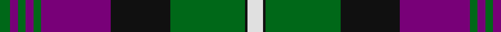

In pattern [GBGBGBKGKW](/patterns/gbgbgbkgkw/).

This was sourced from house-of-tartan.  It is a [10 stripes tartan](/stripes/stripes10/).

Original link http://www.house-of-tartan.scotland.net/house/TartanViewjs.asp?colr=Def&tnam=716

## Thread count
G/8 P6 G6 P6 G6 P54 K46 G58 K2 LN/12

## Palette
Each colour and its ΔE from the base-6 reference it is a variant of.

| Colour | Shade | Base | ΔE (OKLab) |
|---|---|---|---|
| G | <code style="background-color:#006818;">#006818</code> `#006818` | G <code style="background-color:#006400;">#006400</code> | 0.02 |
| K | <code style="background-color:#101010;">#101010</code> `#101010` | K <code style="background-color:#000000;">#000000</code> | 0.17 |
| LN | <code style="background-color:#E0E0E0;">#E0E0E0</code> `#E0E0E0` | W <code style="background-color:#F4F4F0;">#F4F4F0</code> | 0.06 |
| P | <code style="background-color:#780078;">#780078</code> `#780078` | B <code style="background-color:#2C4084;">#2C4084</code> | 0.16 |

## Nearest tartans

The nearest existing variants by ΔTartan distance.

1. [Rennie (Personal)](/setts/s10/w12k2g56k48b50g6b6g6b6g8-b440044-g5c6428-k101010-we0e0e0/) — ΔT 0.54
1. [Queen of Scots](/setts/s9/g44k6g2k6g4b16r2b16r32-b800080-g008000-k000000-r802040/) — ΔT 0.77
1. [Rennie](/setts/s10/w12k2g58k46b54g6b6g6b6g8-b800080-g008000-k000000-we0e0e0/) — ΔT 0.87
1. [Pride of Scotland Silver](/setts/s12/k18r4k4b4r36b4k4ra2k2k38b66ra4-b5c5c5c-k101010-r888888-rac80000/) — ΔT 1.03
1. [Urbino (Fashion)](/setts/s10/g12b8g8b8g8b80k80g88k4r12-b780078-g004c00-k000000-ra0783c/) — ΔT 1.05
1. [Greater St Louis Area Firefighters Highland Guard](/setts/s9/b6r6k76b50y6b12r14b6y4-b2f4f4f-k101010-rff0000-yffe600/) — ΔT 1.10
1. [Madras 3 (Fashion)](/setts/s9/k12b98g20k4g20k4y52k4g4-b2c2c80-g006818-k101010-yfcb464/) — ΔT 1.14
1. [Kunbi](/setts/s8/k76b11k3y6k3b13k11r76-b003c64-k101010-r888888-ye8c000/) — ΔT 1.17
1. [Greater St Louis Firefighters Corporate Tartan Tartan Number: 10336. Earliest known date: 2011 This tartan will be worn by members of the Greater St Louis Firefighters Highland Guard in memory of Firefighter-Paramedic Ryan Hummert of the Maplewood Missouri Fire Department. Firefighter-Paramedic Ryan Hummert was killed in the line of duty on the 21st July 2008 when a lone gunman ambushed emergency responders by setting a vehicle on fire and opening fire on firefighters and police officers when they arrived at the scene. Many of the band members were also involved in this call and the subsequent funeral and memorial services honouring Ryan. The Guard is honoured to design and wear this tartan in Ryan's memory. The tartan uses traditional fire department colours; red, black and gold. Charcoal grey is symbolic of smoke. See products available Copyright © Blair Urquhart, Comrie, 2015](/setts/s9/b6r6k76b50y6b12r14b6y4-b4f4f4f-k101010-rc80000-yfccc3c/) — ΔT 1.20
1. [Carson Red (Personal)](/setts/s8/b38r4b6r4b6k86r44g6-b446c84-g006818-k101010-rc80000/) — ΔT 1.22

## Neighbour map

Every grey dot is one of 15726 variants placed by the first two principal components of the ΔTartan feature space (44% of its variance). Red is this tartan; blue dots are its nearest — click one to open its page.

<svg viewBox="0 0 640 380" role="img" style="max-width:100%;height:auto;border:1px solid #e0e0e0;border-radius:4px;display:block" xmlns="http://www.w3.org/2000/svg"><image href="/nn/cloud.v1.png" width="640" height="380"/><a href="/setts/s10/w12k2g56k48b50g6b6g6b6g8-b440044-g5c6428-k101010-we0e0e0/"><circle cx="246.5" cy="137.3" r="4" fill="#3465a4"><title>Rennie (Personal)</title></circle></a><a href="/setts/s9/g44k6g2k6g4b16r2b16r32-b800080-g008000-k000000-r802040/"><circle cx="227.7" cy="147.3" r="4" fill="#3465a4"><title>Queen of Scots</title></circle></a><a href="/setts/s10/w12k2g58k46b54g6b6g6b6g8-b800080-g008000-k000000-we0e0e0/"><circle cx="213.8" cy="121.1" r="4" fill="#3465a4"><title>Rennie</title></circle></a><a href="/setts/s12/k18r4k4b4r36b4k4ra2k2k38b66ra4-b5c5c5c-k101010-r888888-rac80000/"><circle cx="286.5" cy="115.3" r="4" fill="#3465a4"><title>Pride of Scotland Silver</title></circle></a><a href="/setts/s10/g12b8g8b8g8b80k80g88k4r12-b780078-g004c00-k000000-ra0783c/"><circle cx="234.9" cy="141.3" r="4" fill="#3465a4"><title>Urbino (Fashion)</title></circle></a><a href="/setts/s9/b6r6k76b50y6b12r14b6y4-b2f4f4f-k101010-rff0000-yffe600/"><circle cx="267.1" cy="143.2" r="4" fill="#3465a4"><title>Greater St Louis Area Firefighters Highland Guard</title></circle></a><a href="/setts/s9/k12b98g20k4g20k4y52k4g4-b2c2c80-g006818-k101010-yfcb464/"><circle cx="249.6" cy="121.8" r="4" fill="#3465a4"><title>Madras 3 (Fashion)</title></circle></a><a href="/setts/s8/k76b11k3y6k3b13k11r76-b003c64-k101010-r888888-ye8c000/"><circle cx="294.6" cy="138.0" r="4" fill="#3465a4"><title>Kunbi</title></circle></a><a href="/setts/s9/b6r6k76b50y6b12r14b6y4-b4f4f4f-k101010-rc80000-yfccc3c/"><circle cx="282.6" cy="147.9" r="4" fill="#3465a4"><title>Greater St Louis Firefighters Corporate Tartan Tartan Number: 10336. Earliest known date: 2011 This tartan will be worn by members of the Greater St Louis Firefighters Highland Guard in memory of Firefighter-Paramedic Ryan Hummert of the Maplewood Missouri Fire Department. Firefighter-Paramedic Ryan Hummert was killed in the line of duty on the 21st July 2008 when a lone gunman ambushed emergency responders by setting a vehicle on fire and opening fire on firefighters and police officers when they arrived at the scene. Many of the band members were also involved in this call and the subsequent funeral and memorial services honouring Ryan. The Guard is honoured to design and wear this tartan in Ryan's memory. The tartan uses traditional fire department colours; red, black and gold. Charcoal grey is symbolic of smoke. See products available Copyright © Blair Urquhart, Comrie, 2015</title></circle></a><a href="/setts/s8/b38r4b6r4b6k86r44g6-b446c84-g006818-k101010-rc80000/"><circle cx="281.6" cy="146.1" r="4" fill="#3465a4"><title>Carson Red (Personal)</title></circle></a><circle cx="238.8" cy="130.8" r="5" fill="#c00000"/></svg>

ID: /setts/s10/w12k2g58k46b54g6b6g6b6g8-b780078-g006818-k101010-we0e0e0/
