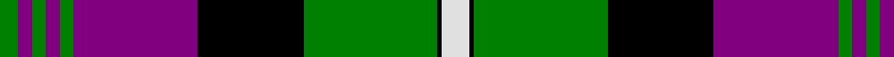

In pattern [GBGBGBKGKW](/patterns/gbgbgbkgkw/).

This was sourced from weddslist.  It is a [10 stripes tartan](/stripes/stripes10/).

Original link http://www.weddslist.com/cgi-bin/tartans/pg.pl?source=sts

## Thread count
G/8 P6 G6 P6 G6 P54 K46 G58 K2 LN/12

## Palette
Each colour and its ΔE from the base-6 reference it is a variant of.

| Colour | Shade | Base | ΔE (OKLab) |
|---|---|---|---|
| G | <code style="background-color:#008000;">#008000</code> `#008000` | G <code style="background-color:#006100;">#006100</code> | 0.10 |
| K | <code style="background-color:#000000;">#000000</code> `#000000` | K <code style="background-color:#000000;">#000000</code> | 0.00 |
| LN | <code style="background-color:#E0E0E0;">#E0E0E0</code> `#E0E0E0` | W <code style="background-color:#F7F7F7;">#F7F7F7</code> | 0.07 |
| P | <code style="background-color:#800080;">#800080</code> `#800080` | B <code style="background-color:#2A418A;">#2A418A</code> | 0.17 |

## Nearest tartans

The nearest existing variants by ΔTartan distance.

1. [Rennie Family Tartan Tartan Number: 716. Earliest known date: 1981. For Robin Rennie. The accreditation list gives the author and weaver, James Scarlett, as the designer in 1980. The tartan register records the designer as Peter MacDonald who worked as a weaver for the Scottish Tartans Society in 1981. Rennies, Rainys and Rainnies (from 'Ranald') are listed as a sept of MacDonell of Keppoch. See products available Copyright © Blair Urquhart, Comrie, 2015](/setts/s10/w12k2g58k46b54g6b6g6b6g8-b780078-g006818-k101010-we0e0e0/) — ΔT 0.87
1. [Southdown](/setts/s9/k16r2k6w10k10w6k10ra46r6-k000000-rc00000-ra806050-we0e0e0/) — ΔT 0.87
1. [Rangers F.C.](/setts/s11/r6g28k24b80k24g4k4g4k4g14r6-b304080-g30a010-k000000-rc00020/) — ΔT 1.05
1. [Christmas Morning](/setts/s9/g6r24g30r4w2b60w2g4r4-b000080-g008b00-rff0000-wffffff/) — ΔT 1.10
1. [Unidentified #49](/setts/s10/w64k16r4k8w4k24g24k4g24w4-g003014-k000000-rb43c00-wc8c8c8/) — ΔT 1.11
1. [Rangers F.C.](/setts/s11/r6g32k24b68k24g4k4g4k4g14r6-b304080-g30a010-k000000-rc00000/) — ΔT 1.14
1. [Madras 3 (Fashion)](/setts/s9/k12b98g20k4g20k4y52k4g4-b2c2c80-g006818-k101010-yfcb464/) — ΔT 1.19
1. [Common Kilt](/setts/s8/r6k4b50k56g50k4r2b4-b304080-g008000-k000000-rc00000/) — ΔT 1.20
1. [Queen of Scots](/setts/s9/g44k6g2k6g4b16r2b16r32-b800080-g008000-k000000-r802040/) — ΔT 1.22
1. [Southdown (Fashion)](/setts/s9/k6r2k6w10k10w6k10g46r6-g604000-k101010-rc80000-wf8f8f8/) — ΔT 1.22

## Neighbour map

Every grey dot is one of 15726 variants placed by the first two principal components of the ΔTartan feature space (44% of its variance). Red is this tartan; blue dots are its nearest — click one to open its page.

<svg viewBox="0 0 640 380" role="img" style="max-width:100%;height:auto;border:1px solid #e0e0e0;border-radius:4px;display:block" xmlns="http://www.w3.org/2000/svg"><image href="/nn/cloud.v1.png" width="640" height="380"/><a href="/setts/s10/w12k2g58k46b54g6b6g6b6g8-b780078-g006818-k101010-we0e0e0/"><circle cx="238.8" cy="130.8" r="4" fill="#3465a4"><title>Rennie Family Tartan Tartan Number: 716. Earliest known date: 1981. For Robin Rennie. The accreditation list gives the author and weaver, James Scarlett, as the designer in 1980. The tartan register records the designer as Peter MacDonald who worked as a weaver for the Scottish Tartans Society in 1981. Rennies, Rainys and Rainnies (from 'Ranald') are listed as a sept of MacDonell of Keppoch. See products available Copyright © Blair Urquhart, Comrie, 2015</title></circle></a><a href="/setts/s9/k16r2k6w10k10w6k10ra46r6-k000000-rc00000-ra806050-we0e0e0/"><circle cx="221.3" cy="133.0" r="4" fill="#3465a4"><title>Southdown</title></circle></a><a href="/setts/s11/r6g28k24b80k24g4k4g4k4g14r6-b304080-g30a010-k000000-rc00020/"><circle cx="216.4" cy="128.7" r="4" fill="#3465a4"><title>Rangers F.C.</title></circle></a><a href="/setts/s9/g6r24g30r4w2b60w2g4r4-b000080-g008b00-rff0000-wffffff/"><circle cx="256.5" cy="111.9" r="4" fill="#3465a4"><title>Christmas Morning</title></circle></a><a href="/setts/s10/w64k16r4k8w4k24g24k4g24w4-g003014-k000000-rb43c00-wc8c8c8/"><circle cx="190.8" cy="140.9" r="4" fill="#3465a4"><title>Unidentified #49</title></circle></a><a href="/setts/s11/r6g32k24b68k24g4k4g4k4g14r6-b304080-g30a010-k000000-rc00000/"><circle cx="182.4" cy="140.3" r="4" fill="#3465a4"><title>Rangers F.C.</title></circle></a><a href="/setts/s9/k12b98g20k4g20k4y52k4g4-b2c2c80-g006818-k101010-yfcb464/"><circle cx="249.6" cy="121.8" r="4" fill="#3465a4"><title>Madras 3 (Fashion)</title></circle></a><a href="/setts/s8/r6k4b50k56g50k4r2b4-b304080-g008000-k000000-rc00000/"><circle cx="219.5" cy="143.9" r="4" fill="#3465a4"><title>Common Kilt</title></circle></a><a href="/setts/s9/g44k6g2k6g4b16r2b16r32-b800080-g008000-k000000-r802040/"><circle cx="227.7" cy="147.3" r="4" fill="#3465a4"><title>Queen of Scots</title></circle></a><a href="/setts/s9/k6r2k6w10k10w6k10g46r6-g604000-k101010-rc80000-wf8f8f8/"><circle cx="250.5" cy="127.9" r="4" fill="#3465a4"><title>Southdown (Fashion)</title></circle></a><circle cx="213.8" cy="121.1" r="5" fill="#c00000"/></svg>

ID: /setts/s10/w12k2g58k46b54g6b6g6b6g8-b800080-g008000-k000000-we0e0e0/
