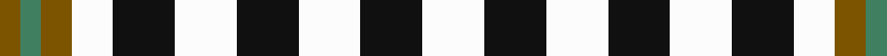

In pattern [GGGWKWKWKW](/patterns/gggwkwkwkw/).

This was sourced from tartans-authority.  It is a [10 stripes tartan](/stripes/stripes10/).

Original link http://www.tartansauthority.com/tartan-ferret/display/1736/

## Thread count
T/6 G6 T9 W12 K18 W18 K18 W18 K18 W/18

## Palette
Each colour and its ΔE from the base-6 reference it is a variant of.

| Colour | Shade | Base | ΔE (OKLab) |
|---|---|---|---|
| G | <code style="background-color:#408060;">#408060</code> `#408060` | G <code style="background-color:#006400;">#006400</code> | 0.13 |
| K | <code style="background-color:#101010;">#101010</code> `#101010` | K <code style="background-color:#000000;">#000000</code> | 0.17 |
| T | <code style="background-color:#7C5400;">#7C5400</code> `#7C5400` | G <code style="background-color:#006400;">#006400</code> | 0.15 |
| W | <code style="background-color:#FCFCFC;">#FCFCFC</code> `#FCFCFC` | W <code style="background-color:#F4F4F0;">#F4F4F0</code> | 0.03 |

ID: /setts/s10/w18k18w18k18w18k18w12g9ga6g6-g7c5400-ga408060-k101010-wfcfcfc/
