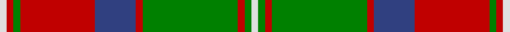

In pattern [WGRGRBRGRW](/stripes/wgrgrbrgrw/).

This was sourced from weddslist.  It is a [10 stripe tartan](/stripes/stripes10/).

Original link http://www.weddslist.com/cgi-bin/tartans/pg.pl?source=sts

## Also known as

This cloth is also recorded under:

- Unidentified Specimen #2
- Unidentified, Specimen

## Attestations

This cloth appears in 3 source records; the oldest owns this page.

- undated — Glen Tilt (weddslist, [record](http://www.weddslist.com/cgi-bin/tartans/pg.pl?source=sts))
- undated — Unidentified, Specimen (weddslist, [record](http://www.weddslist.com/cgi-bin/tartans/pg.pl?source=sts))
- undated — Glen Tilt District Tartan Tartan Number: 2076. Earliest known date: pre 1923 Recorded as having been woven at 'Clunes Farm' which is probably Clunes Lodge near the southern entrance to Glen Tilt. The thread count is taken from a home-woven, home dyed sample in the archives of Perth museum. See products available Copyright © Blair Urquhart, Comrie, 2015 (house-of-tartan, [record](http://www.house-of-tartan.scotland.net/house/TartanViewjs.asp?colr=Def&tnam=2076))

## Thread count
LN/4 R4 G4 R44 B24 R4 G56 R4 G4 LN/4

## Palette
Each colour and the base-6 reference it is a variant of.

| Colour | Shade | Base |
|---|---|---|
| B | <code style="background-color:#304080;">#304080</code> `oklch(39.4% 0.109 270.2)` <small>#304080</small> | B <code style="background-color:#2A418A;">#2A418A</code> |
| G | <code style="background-color:#008000;">#008000</code> `oklch(52.0% 0.177 142.5)` <small>#008000</small> | G <code style="background-color:#006100;">#006100</code> |
| LN | <code style="background-color:#E0E0E0;">#E0E0E0</code> `oklch(90.7% 0.000 89.9)` <small>#E0E0E0</small> | W <code style="background-color:#F7F7F7;">#F7F7F7</code> |
| R | <code style="background-color:#C00000;">#C00000</code> `oklch(50.7% 0.208 29.2)` <small>#C00000</small> | R <code style="background-color:#CC0000;">#CC0000</code> |

## Nearest tartans

The nearest existing variants by ΔTartan distance.

1. [Glen Tilt #2](/setts/s10/w1r1g1r11t6r1g14r1g1w1~x4/) — ΔT 0.67
1. [Unidentified Specimen #2](/setts/s10/w1dg1r1dg14r1db6r11dg1r1w1~x4/) — ΔT 0.82
1. [Leach (1999)](/setts/s12/k6r3k3r24t4g10r2g4r2g24r6t2~x2/) — ΔT 0.91
1. [Brisbane (Artefact)](/setts/s8/g18lb3ly1r2ly1r3ly1r10~x4/) — ΔT 0.95
1. [Fort William (Fashion)](/setts/s11/o10lb2lg3lb2do24lb4do4o34do2lb3do2~x2/) — ΔT 0.96
1. [MacMillan Society of Glasgow](/setts/s9/r16k3r16g44k3g8k3ly20k4~x2/) — ΔT 1.01
1. [Lindsay](/setts/s9/g12k1g1k1g1r5r10k1r2~x2/) — ΔT 1.02
1. [Cape Breton University](/setts/s10/db4o17db4g4db2g4db4g27db4ly4~x2/) — ΔT 1.03
1. [Mostyn](/setts/s9/r20k2r2k2r2k8g24db2g3~x2/) — ΔT 1.03
1. [Buccleuch (Fashion)](/setts/s8/lo15k1lo2k1lo2k10y14w2~x2/) — ΔT 1.03

## Neighbour map

Every grey dot is one of 14299 variants placed by the first two principal components of the ΔTartan feature space (44% of its variance). Red is this tartan; blue dots are its nearest — click one to open its page.

<svg viewBox="0 0 640 380" role="img" style="max-width:100%;height:auto;border:1px solid #e0e0e0;border-radius:4px;display:block" xmlns="http://www.w3.org/2000/svg"><image href="/nn/cloud.v1.png" width="640" height="380"/><a href="/setts/s10/w1r1g1r11t6r1g14r1g1w1~x4/"><circle cx="267.0" cy="153.6" r="4" fill="#3465a4"><title>Glen Tilt #2</title></circle></a><a href="/setts/s10/w1dg1r1dg14r1db6r11dg1r1w1~x4/"><circle cx="260.0" cy="141.9" r="4" fill="#3465a4"><title>Unidentified Specimen #2</title></circle></a><a href="/setts/s12/k6r3k3r24t4g10r2g4r2g24r6t2~x2/"><circle cx="256.2" cy="158.7" r="4" fill="#3465a4"><title>Leach (1999)</title></circle></a><a href="/setts/s8/g18lb3ly1r2ly1r3ly1r10~x4/"><circle cx="297.8" cy="146.2" r="4" fill="#3465a4"><title>Brisbane (Artefact)</title></circle></a><a href="/setts/s11/o10lb2lg3lb2do24lb4do4o34do2lb3do2~x2/"><circle cx="298.4" cy="127.1" r="4" fill="#3465a4"><title>Fort William (Fashion)</title></circle></a><a href="/setts/s9/r16k3r16g44k3g8k3ly20k4~x2/"><circle cx="237.5" cy="159.7" r="4" fill="#3465a4"><title>MacMillan Society of Glasgow</title></circle></a><a href="/setts/s9/g12k1g1k1g1r5r10k1r2~x2/"><circle cx="235.2" cy="158.2" r="4" fill="#3465a4"><title>Lindsay</title></circle></a><a href="/setts/s10/db4o17db4g4db2g4db4g27db4ly4~x2/"><circle cx="251.5" cy="159.3" r="4" fill="#3465a4"><title>Cape Breton University</title></circle></a><a href="/setts/s9/r20k2r2k2r2k8g24db2g3~x2/"><circle cx="223.8" cy="148.8" r="4" fill="#3465a4"><title>Mostyn</title></circle></a><a href="/setts/s8/lo15k1lo2k1lo2k10y14w2~x2/"><circle cx="230.3" cy="168.9" r="4" fill="#3465a4"><title>Buccleuch (Fashion)</title></circle></a><circle cx="260.0" cy="144.3" r="5" fill="#c00000"/></svg>

ID: /setts/s10/w1r1g1r11db6r1g14r1g1w1~x4/
