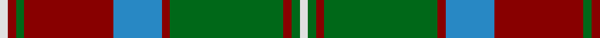

In pattern [WGRGRBRGRW](/stripes/wgrgrbrgrw/).

This was sourced from register-of-tartans.  It is a [10 stripe tartan](/stripes/stripes10/).

Original link https://www.tartanregister.gov.uk/tartanDetails.aspx?ref=1400

## Register references

External register numbers recorded for this tartan.

- Scottish Register of Tartans: [1400](https://www.tartanregister.gov.uk/tartanDetails.aspx?ref=1400)
- Scottish Tartans Authority (ITI): 4758

## Thread count
LN/4 DR4 G4 DR44 B24 DR4 G56 DR4 G4 LN/4

## Palette
Each colour and its ΔE from the base-6 reference it is a variant of.

| Colour | Shade | Base | ΔE (OKLab) |
|---|---|---|---|
| B | <code style="background-color:#2888C4;">#2888C4</code> `#2888C4` | B <code style="background-color:#2A418A;">#2A418A</code> | 0.21 |
| DR | <code style="background-color:#880000;">#880000</code> `#880000` | R <code style="background-color:#CC0000;">#CC0000</code> | 0.15 |
| G | <code style="background-color:#006818;">#006818</code> `#006818` | G <code style="background-color:#006100;">#006100</code> | 0.02 |
| LN | <code style="background-color:#E0E0E0;">#E0E0E0</code> `#E0E0E0` | W <code style="background-color:#F7F7F7;">#F7F7F7</code> | 0.07 |

## Nearest tartans

The nearest existing variants by ΔTartan distance.

1. [Glen Tilt](/setts/s10/w1r1g1r11db6r1g14r1g1w1~x4/) — ΔT 0.67
1. [Cape Breton University](/setts/s10/db4o17db4g4db2g4db4g27db4ly4~x2/) — ΔT 0.92
1. [Unidentified Plaid 6](/setts/s10/r4t3r32db30r4g32r3g32r3g3~x2/) — ΔT 0.96
1. [Georgia, State of](/setts/s8/g36k2g2k2g3k12t10r20~x2/) — ΔT 0.97
1. [Buccleuch (Fashion)](/setts/s8/lo15k1lo2k1lo2k10y14w2~x2/) — ΔT 0.98
1. [Glen Tilt #1](/setts/s10/lb1dr1g1dr11db6dr1g14dr1g1lb1~x4/) — ΔT 0.99
1. [Buccleuch Weavers Tartan Tartan Number: 6009. Earliest known date: pre 2003 A Fashion tartan from Marton Mills See products available Copyright © Blair Urquhart, Comrie, 2015](/setts/s8/lo15k1lo2k1lo2k10dy14w2~x2/) — ΔT 0.99
1. [MacNeish Htg](/setts/s11/r6g3k3o24g4k10g4r2g24r6g2~x2/) — ΔT 1.00
1. [Unidentified Specimen #2](/setts/s10/w1dg1r1dg14r1db6r11dg1r1w1~x4/) — ΔT 1.01
1. [Cape Breton University Chemistry Society](/setts/s10/db4o17db4y4db2y4db4y27db4ly4~x2/) — ΔT 1.06

## Neighbour map

Every grey dot is one of 14299 variants placed by the first two principal components of the ΔTartan feature space (44% of its variance). Red is this tartan; blue dots are its nearest — click one to open its page.

<svg viewBox="0 0 640 380" role="img" style="max-width:100%;height:auto;border:1px solid #e0e0e0;border-radius:4px;display:block" xmlns="http://www.w3.org/2000/svg"><image href="/nn/cloud.v1.png" width="640" height="380"/><a href="/setts/s10/w1r1g1r11db6r1g14r1g1w1~x4/"><circle cx="260.0" cy="144.3" r="4" fill="#3465a4"><title>Glen Tilt</title></circle></a><a href="/setts/s10/db4o17db4g4db2g4db4g27db4ly4~x2/"><circle cx="251.5" cy="159.3" r="4" fill="#3465a4"><title>Cape Breton University</title></circle></a><a href="/setts/s10/r4t3r32db30r4g32r3g32r3g3~x2/"><circle cx="261.3" cy="183.0" r="4" fill="#3465a4"><title>Unidentified Plaid 6</title></circle></a><a href="/setts/s8/g36k2g2k2g3k12t10r20~x2/"><circle cx="273.7" cy="165.5" r="4" fill="#3465a4"><title>Georgia, State of</title></circle></a><a href="/setts/s8/lo15k1lo2k1lo2k10y14w2~x2/"><circle cx="230.3" cy="168.9" r="4" fill="#3465a4"><title>Buccleuch (Fashion)</title></circle></a><a href="/setts/s10/lb1dr1g1dr11db6dr1g14dr1g1lb1~x4/"><circle cx="267.7" cy="160.3" r="4" fill="#3465a4"><title>Glen Tilt #1</title></circle></a><a href="/setts/s8/lo15k1lo2k1lo2k10dy14w2~x2/"><circle cx="229.9" cy="169.1" r="4" fill="#3465a4"><title>Buccleuch Weavers Tartan Tartan Number: 6009. Earliest known date: pre 2003 A Fashion tartan from Marton Mills See products available Copyright © Blair Urquhart, Comrie, 2015</title></circle></a><a href="/setts/s11/r6g3k3o24g4k10g4r2g24r6g2~x2/"><circle cx="234.9" cy="177.7" r="4" fill="#3465a4"><title>MacNeish Htg</title></circle></a><a href="/setts/s10/w1dg1r1dg14r1db6r11dg1r1w1~x4/"><circle cx="260.0" cy="141.9" r="4" fill="#3465a4"><title>Unidentified Specimen #2</title></circle></a><a href="/setts/s10/db4o17db4y4db2y4db4y27db4ly4~x2/"><circle cx="280.9" cy="175.4" r="4" fill="#3465a4"><title>Cape Breton University Chemistry Society</title></circle></a><circle cx="267.0" cy="153.6" r="5" fill="#c00000"/></svg>

ID: /setts/s10/w1r1g1r11t6r1g14r1g1w1~x4/
